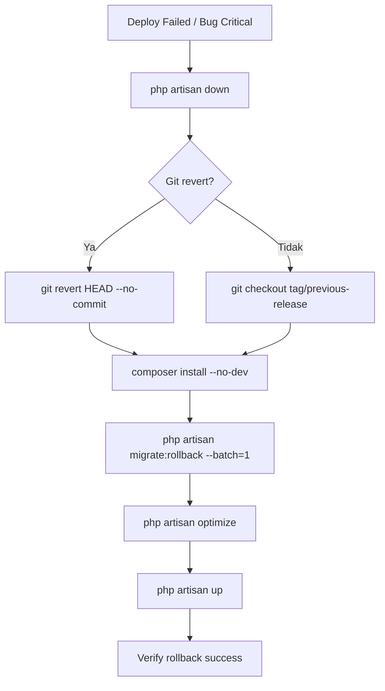

# DEV_DOCS-010: Bagian 6 — Folder Structure Final + Tech Stack Final + Deployment Notes

- **Tanggal:** 2026-06-20 08:30
- **Topik:** Rincian folder structure final, tech stack final dengan versi spesifik, deployment & devops
- **Terhubung ke ADR:** 001–010, DEV_DOCS-001–009
- **Sumber referensi:** D17_Spesifikasi_Teknologi.md, D18_Struktur_Kode_Coding_Standard.md, F25_Deployment_Plan.md

---

## 6.1 Folder Structure Final

```
D:\laragon\www\sisfokolv7\
├── sisfokol-laravel/                    ← ROOT APLIKASI LARAVEL 11
│   ├── app/
│   │   ├── Console/
│   │   │   ├── Commands/
│   │   │   │   ├── Etl/                  ← ETL step classes
│   │   │   │   │   ├── StepInterface.php
│   │   │   │   │   ├── MigrateTahunAjaranStep.php
│   │   │   │   │   ├── MigrateGuruStep.php
│   │   │   │   │   ├── MigrateSiswaStep.php
│   │   │   │   │   ├── MigrateMapelStep.php
│   │   │   │   │   ├── MigrateKelasStep.php
│   │   │   │   │   ├── MigrateKelasSiswaStep.php
│   │   │   │   │   ├── MigrateJadwalStep.php
│   │   │   │   │   ├── MigrateTpLmStep.php
│   │   │   │   │   ├── MigrateAsesmenStep.php
│   │   │   │   │   ├── MigrateRaporStep.php
│   │   │   │   │   ├── MigrateKeuanganStep.php
│   │   │   │   │   ├── MigratePembayaranStep.php
│   │   │   │   │   ├── MigratePresensiStep.php
│   │   │   │   │   ├── MigrateAbsensiIzinStep.php
│   │   │   │   │   └── Cleaners/
│   │   │   │   │       ├── MoneyCleaner.php
│   │   │   │   │       ├── DateCleaner.php
│   │   │   │   │       ├── PhoneCleaner.php
│   │   │   │   │       └── PasswordResetter.php
│   │   │   │   ├── MigrateLegacyDataCommand.php  ← php artisan migrate:legacy-sisfokol
│   │   │   │   ├── EtlVerifyCommand.php           ← php artisan etl:verify
│   │   │   │   ├── TagihanGenerateCommand.php     ← php artisan tagihan:generate
│   │   │   │   └── PluginCacheResetCommand.php    ← php artisan plugin:cache-reset
│   │   │   └── Kernel.php
│   │   │
│   │   ├── Exceptions/
│   │   │   ├── Handler.php
│   │   │   └── InsufficientBalanceException.php
│   │   │
│   │   ├── Http/
│   │   │   ├── Controllers/
│   │   │   │   ├── Controller.php                 ← Base controller
│   │   │   │   └── ... (controllers pindah ke masing-masing Modules/ & Plugins/)
│   │   │   ├── Middleware/
│   │   │   │   ├── ResolveTenant.php              ← Set tenant context from user
│   │   │   │   ├── EnsurePluginEnabled.php        ← middleware plugin:<kode>
│   │   │   │   ├── BlockWhileImpersonating.php    ← Blokir aksi sensitif
│   │   │   │   └── ThrottleLogins.php             ← Rate limiter login
│   │   │   ├── Requests/                          ← FormRequest (dalam module)
│   │   │   └── Resources/                         ← API Resources (Fase 2)
│   │   │
│   │   ├── Models/
│   │   │   ├── User.php                           ← Global model (Spatie)
│   │   │   └── ... (models pindah ke masing-masing Modules/)
│   │   │
│   │   ├── Providers/
│   │   │   ├── AppServiceProvider.php
│   │   │   ├── AuthServiceProvider.php            ← Register policies
│   │   │   ├── EventServiceProvider.php           ← Register observers & subscribers
│   │   │   └── ModuleServiceProvider.php          ← Auto-discover Modules/ & Plugins/
│   │   │
│   │   ├── Services/
│   │   │   ├── TenantContext.php                  ← Singleton binding
│   │   │   ├── IdMapper.php                       ← ETL ID mapping cache
│   │   │   └── ...
│   │   │
│   │   ├── Traits/
│   │   │   ├── BelongsToTenant.php                ← Global scope tenant_id
│   │   │   └── TracksAuditColumns.php             ← created_by/updated_by auto-fill
│   │   │
│   │   ├── View/
│   │   │   ├── Components/                        ← Blade components
│   │   │   │   ├── DataTable.php
│   │   │   │   ├── InfoBox.php
│   │   │   │   ├── Alert.php
│   │   │   │   └── ...
│   │   │   └── Directives/
│   │   │       └── FieldDirective.php             ← @field() Blade directive
│   │   │
│   │   ├── Modules/                               ← CORE MODULES (selalu aktif)
│   │   │   ├── Tenancy/
│   │   │   │   ├── Controllers/
│   │   │   │   │   ├── TenantController.php
│   │   │   │   │   ├── BranchController.php
│   │   │   │   │   └── TenantSettingsController.php
│   │   │   │   ├── Models/
│   │   │   │   │   ├── Tenant.php
│   │   │   │   │   ├── Branch.php
│   │   │   │   │   └── TenantSetting.php
│   │   │   │   ├── Policies/
│   │   │   │   │   └── TenantPolicy.php
│   │   │   │   ├── Database/
│   │   │   │   │   └── Migrations/
│   │   │   │   │       ├── 0001_01_01_000001_create_tenants_table.php
│   │   │   │   │       ├── 0001_01_01_000002_create_branches_table.php
│   │   │   │   │       └── 0001_01_01_000003_create_tenant_settings_table.php
│   │   │   │   ├── Resources/views/
│   │   │   │   │   ├── index.blade.php
│   │   │   │   │   ├── create.blade.php
│   │   │   │   │   └── edit.blade.php
│   │   │   │   ├── routes.php
│   │   │   │   └── TenancyServiceProvider.php
│   │   │   │
│   │   │   ├── Auth/
│   │   │   │   ├── Controllers/
│   │   │   │   │   ├── AuthController.php
│   │   │   │   │   ├── UserController.php
│   │   │   │   │   ├── RoleController.php
│   │   │   │   │   ├── PermissionController.php
│   │   │   │   │   ├── RbacMenuController.php
│   │   │   │   │   ├── RbacFieldController.php
│   │   │   │   │   ├── ImpersonationController.php
│   │   │   │   │   └── AuditLogController.php
│   │   │   │   ├── Models/
│   │   │   │   │   ├── AuditLog.php
│   │   │   │   │   ├── Menu.php
│   │   │   │   │   ├── MenuRoleOverride.php
│   │   │   │   │   ├── Field.php
│   │   │   │   │   └── FieldRoleOverride.php
│   │   │   │   ├── Policies/
│   │   │   │   │   ├── UserPolicy.php
│   │   │   │   │   └── RolePolicy.php
│   │   │   │   ├── Services/
│   │   │   │   │   ├── ImpersonationService.php
│   │   │   │   │   ├── RbacBuilderService.php
│   │   │   │   │   └── FieldAcl.php
│   │   │   │   ├── Requests/
│   │   │   │   │   ├── LoginRequest.php
│   │   │   │   │   └── StoreUserRequest.php
│   │   │   │   ├── Observers/
│   │   │   │   │   ├── UserObserver.php
│   │   │   │   │   └── RoleObserver.php
│   │   │   │   ├── Database/
│   │   │   │   │   └── Migrations/
│   │   │   │   │       ├── 0001_01_01_100001_create_users_table.php
│   │   │   │   │       ├── 0001_01_01_100002_create_permission_tables.php  ← Spatie publish
│   │   │   │   │       ├── 0001_01_01_100003_create_sessions_table.php
│   │   │   │   │       ├── 0001_01_01_100004_create_audit_logs_table.php
│   │   │   │   │       ├── 0001_01_01_100005_create_menus_table.php
│   │   │   │   │       ├── 0001_01_01_100006_create_menu_role_overrides_table.php
│   │   │   │   │       ├── 0001_01_01_100007_create_fields_table.php
│   │   │   │   │       └── 0001_01_01_100008_create_field_role_overrides_table.php
│   │   │   │   ├── Database/Seeders/
│   │   │   │   │   ├── RolePermissionSeeder.php
│   │   │   │   │   ├── MenuSeeder.php
│   │   │   │   │   └── FieldSeeder.php
│   │   │   │   ├── Resources/views/
│   │   │   │   │   ├── auth/
│   │   │   │   │   │   ├── login.blade.php
│   │   │   │   │   │   ├── reset-password.blade.php
│   │   │   │   │   │   └── force-reset.blade.php
│   │   │   │   │   ├── users/
│   │   │   │   │   ├── rbac/
│   │   │   │   │   │   ├── permissions.blade.php
│   │   │   │   │   │   ├── roles.blade.php
│   │   │   │   │   │   ├── menus.blade.php
│   │   │   │   │   │   └── fields.blade.php
│   │   │   │   │   ├── audit-logs/
│   │   │   │   │   └── impersonation/
│   │   │   │   ├── routes.php
│   │   │   │   └── AuthServiceProvider.php
│   │   │   │
│   │   │   ├── Academic/
│   │   │   │   ├── Controllers/
│   │   │   │   │   ├── SiswaController.php
│   │   │   │   │   ├── OrangTuaController.php
│   │   │   │   │   ├── GuruController.php
│   │   │   │   │   ├── TahunAjaranController.php
│   │   │   │   │   ├── SemesterController.php
│   │   │   │   │   ├── KelasController.php
│   │   │   │   │   ├── KelasSiswaController.php
│   │   │   │   │   ├── MapelController.php
│   │   │   │   │   ├── MapelJenisController.php
│   │   │   │   │   └── JadwalController.php
│   │   │   │   ├── Models/
│   │   │   │   │   ├── Siswa.php
│   │   │   │   │   ├── OrangTua.php
│   │   │   │   │   ├── Guru.php
│   │   │   │   │   ├── TahunAjaran.php
│   │   │   │   │   ├── Semester.php
│   │   │   │   │   ├── Kelas.php
│   │   │   │   │   ├── KelasSiswa.php
│   │   │   │   │   ├── Mapel.php
│   │   │   │   │   ├── MapelJenis.php
│   │   │   │   │   └── Jadwal.php
│   │   │   │   ├── Policies/
│   │   │   │   │   ├── SiswaPolicy.php
│   │   │   │   │   ├── GuruPolicy.php
│   │   │   │   │   ├── KelasPolicy.php
│   │   │   │   │   └── JadwalPolicy.php
│   │   │   │   ├── Services/
│   │   │   │   │   ├── SiswaImportService.php
│   │   │   │   │   ├── KelasSiswaPromotionService.php
│   │   │   │   │   └── JadwalConflictChecker.php
│   │   │   │   ├── Requests/
│   │   │   │   │   ├── StoreSiswaRequest.php
│   │   │   │   │   └── UpdateSiswaRequest.php
│   │   │   │   ├── Observers/
│   │   │   │   │   ├── SiswaObserver.php
│   │   │   │   │   ├── GuruObserver.php
│   │   │   │   │   ├── KelasObserver.php
│   │   │   │   │   └── JadwalObserver.php
│   │   │   │   ├── Database/
│   │   │   │   │   └── Migrations/
│   │   │   │   │       ├── 0001_01_02_000001_create_siswa_table.php
│   │   │   │   │       ├── 0001_01_02_000002_create_orang_tua_table.php
│   │   │   │   │       ├── 0001_01_02_000003_create_siswa_orang_tua_table.php
│   │   │   │   │       ├── 0001_01_02_000004_create_guru_table.php
│   │   │   │   │       ├── 0001_01_02_000005_create_tahun_ajaran_table.php
│   │   │   │   │       ├── 0001_01_02_000006_create_semester_table.php
│   │   │   │   │       ├── 0001_01_02_000007_create_kelas_table.php
│   │   │   │   │       ├── 0001_01_02_000008_create_kelas_siswa_table.php
│   │   │   │   │       ├── 0001_01_02_000009_create_mapel_table.php
│   │   │   │   │       ├── 0001_01_02_000010_create_mapel_jenis_table.php
│   │   │   │   │       └── 0001_01_02_000011_create_jadwal_table.php
│   │   │   │   ├── Resources/views/
│   │   │   │   │   ├── siswa/
│   │   │   │   │   ├── guru/
│   │   │   │   │   ├── kelas/
│   │   │   │   │   ├── mapel/
│   │   │   │   │   └── jadwal/
│   │   │   │   ├── routes.php
│   │   │   │   └── AcademicServiceProvider.php
│   │   │   │
│   │   │   ├── Evaluation/
│   │   │   │   ├── Controllers/
│   │   │   │   │   ├── TpController.php
│   │   │   │   │   ├── LmController.php
│   │   │   │   │   ├── AsesmenFormatifController.php
│   │   │   │   │   ├── AsesmenSumatifController.php
│   │   │   │   │   └── RaporController.php
│   │   │   │   ├── Models/
│   │   │   │   │   ├── Tp.php
│   │   │   │   │   ├── Lm.php
│   │   │   │   │   ├── AsesmenFormatifNilai.php
│   │   │   │   │   ├── AsesmenSumatifNilai.php
│   │   │   │   │   ├── RaportCatatan.php
│   │   │   │   │   ├── RaportSikap.php
│   │   │   │   │   └── RaportKenaikan.php
│   │   │   │   ├── Policies/
│   │   │   │   │   ├── AsesmenFormatifPolicy.php
│   │   │   │   │   └── AsesmenSumatifPolicy.php
│   │   │   │   ├── Services/
│   │   │   │   │   ├── RaporService.php
│   │   │   │   │   ├── AsesmenBulkInputService.php
│   │   │   │   │   └── EvaluationFrameworkResolver.php
│   │   │   │   ├── Observers/
│   │   │   │   │   ├── AsesmenFormatifObserver.php
│   │   │   │   │   └── AsesmenSumatifObserver.php
│   │   │   │   ├── Database/
│   │   │   │   │   └── Migrations/
│   │   │   │   │       ├── 0001_01_03_000001_create_tp_table.php
│   │   │   │   │       ├── 0001_01_03_000002_create_lm_table.php
│   │   │   │   │       ├── 0001_01_03_000003_create_asesmen_formatif_nilai_table.php
│   │   │   │   │       ├── 0001_01_03_000004_create_asesmen_sumatif_nilai_table.php
│   │   │   │   │       ├── 0001_01_03_000005_create_raport_catatan_table.php
│   │   │   │   │       ├── 0001_01_03_000006_create_raport_sikap_table.php
│   │   │   │   │       └── 0001_01_03_000007_create_raport_kenaikan_table.php
│   │   │   │   ├── Resources/views/
│   │   │   │   │   ├── tp/
│   │   │   │   │   ├── lm/
│   │   │   │   │   ├── asesmen/
│   │   │   │   │   └── rapor/
│   │   │   │   ├── routes.php
│   │   │   │   └── EvaluationServiceProvider.php
│   │   │   │
│   │   │   ├── Finance/
│   │   │   │   ├── Controllers/
│   │   │   │   │   ├── ItemPembayaranController.php
│   │   │   │   │   ├── TagihanSiswaController.php
│   │   │   │   │   ├── PembayaranController.php
│   │   │   │   │   ├── TabunganSiswaController.php
│   │   │   │   │   └── LaporanKeuanganController.php
│   │   │   │   ├── Models/
│   │   │   │   │   ├── ItemPembayaran.php
│   │   │   │   │   ├── TagihanSiswa.php
│   │   │   │   │   ├── Pembayaran.php
│   │   │   │   │   ├── PembayaranRincian.php
│   │   │   │   │   └── TabunganSiswa.php
│   │   │   │   ├── Policies/
│   │   │   │   │   ├── ItemPembayaranPolicy.php
│   │   │   │   │   ├── PembayaranPolicy.php
│   │   │   │   │   └── TabunganPolicy.php
│   │   │   │   ├── Services/
│   │   │   │   │   ├── TagihanGeneratorService.php
│   │   │   │   │   ├── PembayaranService.php
│   │   │   │   │   ├── TabunganMutasiService.php
│   │   │   │   │   └── KwitansiGenerator.php
│   │   │   │   ├── Requests/
│   │   │   │   │   └── BayarTagihanRequest.php
│   │   │   │   ├── Observers/
│   │   │   │   │   ├── ItemPembayaranObserver.php
│   │   │   │   │   ├── PembayaranObserver.php
│   │   │   │   │   └── TabunganObserver.php
│   │   │   │   ├── Database/
│   │   │   │   │   └── Migrations/
│   │   │   │   │       ├── 0001_01_04_000001_create_item_pembayaran_table.php
│   │   │   │   │       ├── 0001_01_04_000002_create_tagihan_siswa_table.php
│   │   │   │   │       ├── 0001_01_04_000003_create_pembayaran_table.php
│   │   │   │   │       ├── 0001_01_04_000004_create_pembayaran_rincian_table.php
│   │   │   │   │       └── 0001_01_04_000005_create_tabungan_siswa_table.php
│   │   │   │   ├── Resources/views/
│   │   │   │   │   ├── item-pembayaran/
│   │   │   │   │   ├── tagihan/
│   │   │   │   │   ├── pembayaran/
│   │   │   │   │   ├── tabungan/
│   │   │   │   │   └── laporan/
│   │   │   │   ├── routes.php
│   │   │   │   └── FinanceServiceProvider.php
│   │   │   │
│   │   │   └── Presence/
│   │   │       ├── Controllers/
│   │   │       │   ├── PresensiController.php
│   │   │       │   ├── AbsensiController.php
│   │   │       │   ├── IzinController.php
│   │   │       │   └── LaporanPresensiController.php
│   │   │       ├── Models/
│   │   │       │   ├── Presensi.php
│   │   │       │   ├── Absensi.php
│   │   │       │   └── Izin.php
│   │   │       ├── Policies/
│   │   │       │   ├── PresensiPolicy.php
│   │   │       │   ├── AbsensiPolicy.php
│   │   │       │   └── IzinPolicy.php
│   │   │       ├── Services/
│   │   │       │   ├── QrScannerService.php
│   │   │       │   ├── PresensiRuleEngine.php
│   │   │       │   └── IzinApprovalService.php
│   │   │       ├── Observers/
│   │   │       │   ├── PresensiObserver.php
│   │   │       │   └── AbsensiObserver.php
│   │   │       ├── Database/
│   │   │       │   └── Migrations/
│   │   │       │       ├── 0001_01_05_000001_create_presensi_table.php
│   │   │       │       ├── 0001_01_05_000002_create_absensi_table.php
│   │   │       │       └── 0001_01_05_000003_create_izin_table.php
│   │   │       ├── Resources/views/
│   │   │       │   ├── presensi/
│   │   │       │   ├── absensi/
│   │   │       │   └── izin/
│   │   │       ├── routes.php
│   │   │       └── PresenceServiceProvider.php
│   │   │
│   │   ├── Plugins/                              ← PLUGIN MODULES (aktifasi per-tenant)
│   │   │   ├── Kurikulum/                        ← REFERENSI — dibangun penuh
│   │   │   │   ├── KurikulumPlugin.php           ← Manifest (PluginContract)
│   │   │   │   ├── Providers/
│   │   │   │   │   └── KurikulumServiceProvider.php
│   │   │   │   ├── Controllers/
│   │   │   │   │   ├── KurikulumController.php
│   │   │   │   │   ├── StrukturKurikulumController.php
│   │   │   │   │   └── KomponenKompetensiController.php
│   │   │   │   ├── Models/
│   │   │   │   │   ├── Kurikulum.php
│   │   │   │   │   ├── StrukturKurikulum.php
│   │   │   │   │   └── KomponenKompetensi.php
│   │   │   │   ├── Subscribers/
│   │   │   │   │   ├── EvaluationFrameworkSubscriber.php
│   │   │   │   │   └── RaporSectionSubscriber.php
│   │   │   │   ├── Database/
│   │   │   │   │   └── Migrations/
│   │   │   │   │       ├── 0002_01_01_000001_create_kurikulum_table.php
│   │   │   │   │       ├── 0002_01_01_000002_create_struktur_kurikulum_table.php
│   │   │   │   │       └── 0002_01_01_000003_create_komponen_kompetensi_table.php
│   │   │   │   ├── Resources/views/
│   │   │   │   ├── menu.php
│   │   │   │   ├── permissions.php
│   │   │   │   └── routes.php
│   │   │   │
│   │   │   ├── Discipline/                       ← SCAFFOLD
│   │   │   │   ├── DisciplinePlugin.php
│   │   │   │   ├── Providers/
│   │   │   │   │   └── DisciplineServiceProvider.php
│   │   │   │   ├── Database/
│   │   │   │   │   └── Migrations/               ← Struktur dasar
│   │   │   │   ├── menu.php
│   │   │   │   └── permissions.php
│   │   │   │
│   │   │   ├── Inventory/                        ← SCAFFOLD
│   │   │   │   └── ... (sama pattern)
│   │   │   ├── Tahfidz/                          ← SCAFFOLD
│   │   │   ├── HafalanHadist/                    ← SCAFFOLD
│   │   │   ├── BimbinganKonseling/               ← SCAFFOLD
│   │   │   ├── PendidikanKarakter/               ← SCAFFOLD
│   │   │   ├── PelaporanOrtu/                    ← SCAFFOLD
│   │   │   └── PWA/                              ← SCAFFOLD (frontend layer)
│   │   │
│   │   └── Helpers/
│   │       └── FormatHelper.php
│   │
│   ├── bootstrap/
│   ├── config/
│   │   ├── app.php
│   │   ├── database.php
│   │   ├── modules.php                           ← Module/Plugin registration config
│   │   ├── permission.php                        ← Spatie config
│   │   └── impersonate.php                       ← lab404 config
│   │
│   ├── database/
│   │   ├── migrations/                           ← Hanya migration global (Spatie, sessions)
│   │   ├── seeders/
│   │   │   ├── DatabaseSeeder.php
│   │   │   ├── TenantSeeder.php
│   │   │   └── DemoDataSeeder.php
│   │   └── factories/
│   │
│   ├── resources/
│   │   ├── views/
│   │   │   ├── layouts/
│   │   │   │   └── adminlte.blade.php           ← Layout utama AdminLTE
│   │   │   ├── components/                      ← x-* blade components
│   │   │   ├── dashboard/
│   │   │   │   ├── super-admin.blade.php
│   │   │   │   └── admin-sekolah.blade.php
│   │   │   └── errors/
│   │   ├── js/
│   │   │   ├── app.js                           ← Entry Vite
│   │   │   └── bootstrap.js
│   │   ├── css/
│   │   │   └── app.css
│   │   └── lang/
│   │       └── id/                              ← Bahasa Indonesia
│   │           ├── auth.php
│   │           ├── validation.php
│   │           └── messages.php
│   │
│   ├── routes/
│   │   ├── web.php                              ← Route global (login, logout, root redirect)
│   │   ├── api.php                              ← Fase 2
│   │   └── console.php
│   │
│   ├── storage/
│   │   ├── app/
│   │   │   └── public/
│   │   │       ├── qrcodes/{type}/{id}.png
│   │   │       ├── photos/siswa/
│   │   │       ├── photos/guru/
│   │   │       └── raport/
│   │   ├── logs/
│   │   └── framework/
│   │
│   ├── tests/
│   │   ├── Feature/
│   │   │   ├── Auth/
│   │   │   ├── Academic/
│   │   │   ├── Evaluation/
│   │   │   ├── Finance/
│   │   │   └── Presence/
│   │   └── Unit/
│   │       ├── Services/
│   │       └── Helpers/
│   │
│   ├── .env.example
│   ├── .env                                    ← NOT in VCS
│   ├── composer.json
│   ├── package.json
│   ├── vite.config.js
│   ├── artisan
│   ├── phpunit.xml
│   └── README.md
│
├── ADR/                                          ← Architecture Decision Records (existing)
├── DEV_DOCS/                                     ← Dev memory & handoff (existing)
├── DOCS/                                         ← Dokumen proyek & referensi (existing)
├── db/                                           ← Legacy SQL dump
└── ... (folder SISFOKOL legacy)
```

### Migration Prefix Convention

| Prefix | Owner | Contoh |
|--------|-------|--------|
| `0001_01_00_*` | Global Laravel (users default, cache) | `0001_01_00_000000_create_users_table.php` |
| `0001_01_01_*` | Modules: Tenancy | `0001_01_01_000001_create_tenants_table.php` |
| `0001_01_01_1*` | Modules: Auth & RBAC | `0001_01_01_100001_create_audit_logs_table.php` |
| `0001_01_02_*` | Modules: Academic | `0001_01_02_000001_create_siswa_table.php` |
| `0001_01_03_*` | Modules: Evaluation | `0001_01_03_000001_create_tp_table.php` |
| `0001_01_04_*` | Modules: Finance | `0001_01_04_000001_create_item_pembayaran_table.php` |
| `0001_01_05_*` | Modules: Presence | `0001_01_05_000001_create_presensi_table.php` |
| `0002_01_01_*` | Plugin: Kurikulum | `0002_01_01_000001_create_kurikulum_table.php` |
| `0002_02_01_*` | Plugin: Discipline (scaffold) | — |
| `0002_03_01_*` | Plugin: Inventory (scaffold) | — |
| dst | Plugin lain | — |

Prefix `0001` = core (pasti jalan), `0002` = plugin (jalan bila aktif). Urutan numerik menjaga topological sort migration.

---

## 6.2 Tech Stack Final

### Production Stack

| Layer | Teknologi | Versi | Justifikasi |
|-------|-----------|-------|-------------|
| **Backend Framework** | Laravel | 11.x | MVC modern, Eloquent ORM, built-in auth, queue, event, testing. Minimal PHP 8.2 |
| **Language** | PHP | 8.2+ | Match SISFOKOL existing requirement, type safety, performance |
| **Database** | MySQL / MariaDB | 8.0 / 10.6+ | InnoDB, transactional DDL, CTE, window functions. Compatible with school hosting ecosystems |
| **DB Engine** | InnoDB | — | Row-level lock, FK, transaction. **Wajib** untuk Finance module (pessimistic locking) |
| **Charset** | `utf8mb4_unicode_ci` | — | Support emoji, karakter Jawa, simbol. Pengganti latin1 legacy |
| **RBAC Engine** | Spatie `laravel-permission` | 6.x | Teams mode (`team_id` = `tenant_id`), database-driven, caching, blade directives |
| **Impersonation** | `lab404/laravel-impersonate` | 3.x | Env-gated, audit trail, middleware |
| **Frontend (Fase 1)** | Blade + Bootstrap 5 + Alpine.js + Vite | 5.3 / 3.x / 6.x | AdminLTE 3 layout familiar, Bootstrap responsif, Alpine.js interaktivitas ringan tanpa Vue/React, Vite build modern |
| **Frontend (Fase 2+)** | PWA (service worker + manifest + offline route) | — | Scaffold Fase 1, implementasi penuh Fase 2 |
| **Excel Export** | Laravel Excel (Maatwebsite) | 3.x | Import/export siswa, guru, nilai, laporan keuangan |
| **PDF** | DomPDF / Laravel Snappy | 3.x / 2.x | Cetak raport, kwitansi, surat izin, kartu |
| **QR Code** | `simplesoftwareio/simple-qrcode` | 4.x | Generate QR untuk presensi, kartu siswa/guru, surat izin |
| **Cache (Fase 1)** | File cache | — | Sederhana, tanpa Redis dependency di awal |
| **Cache (Fase 2+)** | Redis | 7.x | Session, query cache, queue driver |
| **Queue** | Database (Fase 1) / Redis (Fase 2) | — | Tagihan generate, WA notification, report export background |
| **Web Server** | Nginx + PHP-FPM | 1.24+ | Performa tinggi, concurrent user. Alternatif: Apache (shared hosting) |
| **Server OS** | Ubuntu Server LTS / Debian | 22.04 / 24.04 | Stabil, dukungan Laravel luas |
| **Monitoring** | Laravel Telescope (dev) / Logrotate (prod) | — | Debugging dev, log rotation production |

### Development Stack

| Tool | Versi | Untuk |
|------|-------|-------|
| **Docker / Laravel Sail** | — | Environment development standardized (opsional, Laragon juga cukup) |
| **Node.js + npm** | 20.x+ | Vite build, asset compilation |
| **Git** | 2.x | Version control |
| **Composer** | 2.x | PHP dependency management |
| **PHPUnit** | 11.x | Testing (built-in Laravel) |
| **Laravel Pint** | 1.x | Code style (PSR-12) |
| **PHPStan** | 1.x | Static analysis level 8/9 |

### Package Dependencies (composer.json)

```json
{
    "require": {
        "php": "^8.2",
        "laravel/framework": "^11.0",
        "spatie/laravel-permission": "^6.0",
        "lab404/laravel-impersonate": "^3.0",
        "maatwebsite/laravel-excel": "^3.1",
        "barryvdh/laravel-dompdf": "^3.0",
        "simplesoftwareio/simple-qrcode": "^4.2",
        "owen-it/laravel-auditing": "^13.0"
    },
    "require-dev": {
        "laravel/sail": "^1.0",
        "laravel/pint": "^1.0",
        "phpstan/phpstan": "^1.0",
        "nunomaduro/collision": "^8.0",
        "laravel/telescope": "^5.0"
    }
}
```

### Node Dependencies (package.json)

```json
{
    "devDependencies": {
        "vite": "^6.0",
        "laravel-vite-plugin": "^1.0",
        "alpinejs": "^3.13",
        "bootstrap": "^5.3",
        "sass": "^1.0",
        "axios": "^1.0",
        "chart.js": "^4.0"
    }
}
```

---

## 6.3 Deployment Notes

### 6.3.1 Environment Strategy

| Environment | Tujuan | DB | URL |
|-------------|--------|----|-----|
| **Development** | Local coding & testing | `sisfokol_laravel_dev` (Laragon MySQL) | `http://sisfokol-laravel.test` / `localhost` |
| **Staging** | UAT, integration test | `sisfokol_laravel_staging` | `https://staging.sisfokol.com` |
| **Production** | Live school operations | `sisfokol_laravel` | `https://app.sisfokol.com` |

### 6.3.2 Environment Variables (.env)

```ini
APP_NAME=SISFOKOL
APP_ENV=local
APP_DEBUG=true
APP_URL=http://sisfokol-laravel.test

# Database (target baru)
DB_CONNECTION=mysql
DB_HOST=127.0.0.1
DB_PORT=3306
DB_DATABASE=sisfokol_laravel
DB_USERNAME=root
DB_PASSWORD=

# Legacy database (READ ONLY — untuk ETL)
LEGACY_DB_CONNECTION=mysql
LEGACY_DB_HOST=127.0.0.1
LEGACY_DB_PORT=3306
LEGACY_DB_DATABASE=sisfokol_v7
LEGACY_DB_USERNAME=root
LEGACY_DB_PASSWORD=

# Laravel settings
APP_KEY=
BCRYPT_ROUNDS=12
SESSION_DRIVER=file
SESSION_LIFETIME=30
CACHE_STORE=file
QUEUE_CONNECTION=database
FILESYSTEM_DISK=local

# Impersonation (default false di production!)
IMPERSONATION_ENABLED=true

# Mail (Fase 2)
MAIL_MAILER=smtp
MAIL_HOST=smtp.mailgun.org
MAIL_PORT=587

# WhatsApp Gateway (Fase 2)
WA_API_KEY=
WA_API_URL=
```

### 6.3.3 Production Requirements

| Komponen | Spesifikasi Minimum | Rekomendasi |
|----------|-------------------|-------------|
| **CPU** | 2 core | 4 core |
| **RAM** | 4 GB | 8 GB |
| **Disk** | 50 GB SSD | 100 GB SSD |
| **PHP** | 8.2+ | 8.3+ |
| **MySQL** | 8.0 | 8.0+ / MariaDB 10.6+ |
| **Web Server** | Nginx 1.24+ / Apache 2.4+ | Nginx + PHP-FPM |
| **OS** | Ubuntu 22.04 | Ubuntu 24.04 LTS |
| **SSL** | Let's Encrypt | Wildcard SSL |

### 6.3.4 Server Setup (Nginx)

```nginx
server {
    listen 443 ssl http2;
    server_name app.sisfokol.com;
    root /var/www/sisfokol-laravel/public;

    ssl_certificate /etc/letsencrypt/live/app.sisfokol.com/fullchain.pem;
    ssl_certificate_key /etc/letsencrypt/live/app.sisfokol.com/privkey.pem;

    index index.php;

    location / {
        try_files $uri $uri/ /index.php?$query_string;
    }

    location ~ \.php$ {
        fastcgi_pass unix:/var/run/php/php8.2-fpm.sock;
        fastcgi_param SCRIPT_FILENAME $document_root$fastcgi_script_name;
        include fastcgi_params;
    }

    location ~ /\.ht {
        deny all;
    }

    # Security headers
    add_header X-Frame-Options "SAMEORIGIN";
    add_header X-Content-Type-Options "nosniff";
    add_header X-XSS-Protection "1; mode=block";
    add_header Referrer-Policy "strict-origin-when-cross-origin";

    # Cache static assets
    location ~* \.(jpg|jpeg|png|gif|ico|css|js|svg|woff2)$ {
        expires 30d;
        add_header Cache-Control "public, immutable";
    }
}

# Redirect HTTP → HTTPS
server {
    listen 80;
    server_name app.sisfokol.com;
    return 301 https://$host$request_uri;
}
```

### 6.3.5 CI/CD Pipeline (GitHub Actions)

```yaml
# .github/workflows/deploy.yml
name: Deploy SISFOKOL Laravel

on:
  push:
    branches: [ main ]

jobs:
  test:
    runs-on: ubuntu-latest
    steps:
      - uses: actions/checkout@v4
      - uses: shivammathur/setup-php@v2
        with:
          php-version: '8.2'
          extensions: mbstring, pdo_mysql, gd, imagick
      - run: composer install --no-interaction --prefer-dist
      - run: cp .env.example .env
      - run: php artisan key:generate
      - run: php artisan migrate --force
      - run: php artisan db:seed --class=RolePermissionSeeder
      - run: php artisan test
      - run: vendor/bin/phpstan analyse --level=8 app/
      - run: vendor/bin/pint --test

  deploy:
    needs: test
    runs-on: ubuntu-latest
    steps:
      - uses: actions/checkout@v4
      - name: Deploy to Production
        uses: appleboy/ssh-action@v1.0.3
        with:
          host: ${{ secrets.DEPLOY_HOST }}
          username: ${{ secrets.DEPLOY_USER }}
          key: ${{ secrets.DEPLOY_KEY }}
          script: |
            cd /var/www/sisfokol-laravel
            git pull origin main
            composer install --no-interaction --prefer-dist --no-dev
            php artisan migrate --force
            php artisan optimize
            php artisan config:cache
            php artisan route:cache
            php artisan view:cache
            php artisan queue:restart
            sudo systemctl reload php8.2-fpm
```

### 6.3.6 Runbook Production

#### Deploy Routine
```bash
# 1. Maintenance mode
php artisan down --secret="<SECRET>"

# 2. Pull code
git pull origin main

# 3. Install dependencies (no dev)
composer install --no-interaction --prefer-dist --no-dev

# 4. Run migrations
php artisan migrate --force

# 5. Seed (hanya bila ada seeder baru)
php artisan db:seed --class=RolePermissionSeeder --force

# 6. Cache optimization
php artisan optimize
php artisan config:cache
php artisan route:cache
php artisan view:cache

# 7. Queue restart
php artisan queue:restart

# 8. Permission cache reset
php artisan permission:cache-reset

# 9. Restart PHP-FPM
sudo systemctl reload php8.2-fpm

# 10. Bring up
php artisan up
```

#### Backup Routine (Cron Harian)
```bash
# Database backup
0 2 * * * /usr/bin/mysqldump -u root sisfokol_laravel | gzip > /backup/db/sisfokol_$(date +\%Y\%m\%d).sql.gz

# File storage backup
0 3 * * * /usr/bin/rsync -avz /var/www/sisfokol-laravel/storage/app/ /backup/storage/

# Cleanup backups > 30 days
0 4 * * * find /backup/db/ -name "*.sql.gz" -mtime +30 -delete
```

#### Cron Jobs (Laravel Scheduler)
```cron
* * * * * cd /var/www/sisfokol-laravel && php artisan schedule:run >> /dev/null 2>&1

# php artisan tagihan:generate → dijadwalkan tgl 1 setiap bulan via Laravel scheduler
```

#### Monitoring Check
```bash
# Health check endpoint
curl -f https://app.sisfokol.com/health || alert

# Queue check
php artisan queue:status || php artisan queue:restart

# Disk usage
df -h /var/www/sisfokol-laravel/storage/
```

### 6.3.7 Rollback Plan



### 6.3.8 ETL Cut-Over Procedure

Lihat detail di **DEV_DOCS-009 §5.7** + langkah ringkas:

1. **Freeze** legacy DB (`GRANT SELECT ONLY`)
2. **Backup** legacy (`mysqldump sisfokol_v7 > backup-$(date +%Y%m%d).sql`)
3. **Run migration** di target: `php artisan migrate --force`
4. **Run ETL**: `php artisan migrate:legacy-sisfokol {tenant_id}`
5. **Verify**: `php artisan etl:verify {tenant_id}`
6. Bila **PASS** → switch DNS/app → announce user → password reset wajib
7. Bila **FAIL** → rollback → inspect logs → fix ETL step → re-run

### 6.3.9 Multi-Tenant Go-Live Strategy

| Fase | Tenant | Data |
|------|--------|------|
| **Pilot** | 1 sekolah (SMP IT Demo) | ETL data riil + UAT |
| **Soft Launch** | 2-3 sekolah undangan | Monitoring performa & bug |
| **Full Launch** | Semua tenant baru | Self-register via SuperAdmin |

---

## Status Desain Bagian 6: ✅ FINAL

## Ringkasan Akhir — 6 Fase Desain Selesai

| Fase | DEV_DOCS | Isi | Status |
|------|----------|-----|--------|
| 1 | 001 | Kickoff — scope, stack, arsitektur, multi-tenant, plugin | ✅ |
| 2 | 002 | Tenancy, Auth, Granular RBAC 5 lapis, Impersonation | ✅ |
| 3 | 003 | Skema Database 48 tabel, prinsip normalisasi | ✅ |
| 4 | 004 | Plugin Architecture, PluginContract, event hooks | ✅ |
| 5 | 009 | Core Modules detail (controller/policy/service/observer) + ETL Plan 20 langkah | ✅ |
| 6 | 010 | Folder structure final + Tech stack final + Deployment notes | ✅ |

## Next Steps
1. Kumpulkan semua ADR + DEV_DOCS ke design doc final di `docs/superpowers/specs/`
2. Self-review: kontradiksi, placeholder, scope, ambigu
3. Minta **user review & approval**
4. Setelah approve → transition ke `writing-plans` skill → rencana implementasi step-by-step
5. **BARU** mulai implementasi kode Laravel
