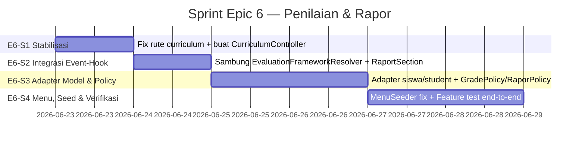

# DEV_DOCS-050: Sprint Plan — Epic 6 (Evaluation Module / Penilaian & Rapor)

- **Tanggal:** 2026-06-22
- **Status:** 📋 DRAFT SIAP DIEKSEKUSI
- **Penulis:** ZCode (pair-agent)
- **Proyek:** Konversi SISFOKOL v7 (PHP native) → Laravel 11 modular monolith
- **Berdasarkan:** DEV_DOCS-031 (Rencana Implementasi Epic 6), DEV_DOCS-043 (Status & Temuan Divergensi), DEV_DOCS-049 (Review)
- **Metode Penyusunan:** Verifikasi fisik file + fungsionalitas rute/service/test (no halusinasi, no overclaim)

---

## ⚡ EXECUTIVE SUMMARY

Sprint plan ini disusun untuk **menyelesaikan sisa Epic 6 (Evaluation Module)** berdasarkan pengecekan fisik pada codebase `sisfokol-laravel/`. Berbeda dari klaim dokumen status sebelumnya (DEV_DOCS-043 @1607 yang menyebut "~85%"), hasil verifikasi nyata menunjukkan bahwa **modul inti evaluasi (Grade + Rapor + Calculator) sudah ada dan berfungsi**, namun terdapat **3 blok pekerjaan kritis yang belum selesai**, ditambah **2 isu struktural lintas-epic** yang harus diatasi agar Epic 6 benar-benar layak pakai.

Sprint dipecah menjadi **4 mini-sprint berurutan** (E6-S1 … E6-S4) dengan total estimasi **6–8 hari kerja**, dipetakan ke tugas-tugas konkret dengan kriteria penerimaan terukur.

---

## 1. HASIL VERIFIKASI FISIK (BASELINE)

Pengecekan dilakukan langsung pada path `sisfokol-laravel/`. Berikut yang **benar-benar ada di disk** beserta status fungsionalnya.

### 1.1 Komponen yang SUDAH Ada & Berfungsi

| Komponen | Path Fisik | Status Fungsional |
|---|---|---|
| `GradeEntryController` | `app/Modules/Evaluation/Controllers/GradeEntryController.php` (237 baris) | ✅ Fungsi: `index`, `form`, `storeAssessment`, `storeScores` |
| `RaporController` | `app/Modules/Evaluation/Controllers/RaporController.php` (94 baris) | ✅ Fungsi: `index`, `show`, `downloadPdf` |
| `GradeCalculatorService` | `app/Modules/Evaluation/Services/GradeCalculatorService.php` (144 baris) | ✅ Bobot formative/summative dari `TenantContext`, predikat A/B/C/D |
| `RaporGeneratorService` | `app/Modules/Evaluation/Services/RaporGeneratorService.php` (110 baris) | ✅ Agregasi nilai + kehadiran + catatan; output PDF via DomPDF |
| `EvaluationFrameworkResolver` | `app/Modules/Evaluation/Services/EvaluationFrameworkResolver.php` | ⚠️ Ada tapi **tidak pernah dipanggil** (dangling) |
| `EvaluationResolveFramework` (event) | `app/Modules/Evaluation/Events/` | ⚠️ Ada tapi **tidak pernah di-dispatch** dari controller |
| `RaportRenderSection` (event) | `app/Modules/Evaluation/Events/` | ⚠️ Ada tapi **tidak pernah di-dispatch** dari service rapor |
| `BatchGradeRequest` | `app/Modules/Evaluation/Requests/BatchGradeRequest.php` | ✅ Validasi skor 0–100 |
| Migrasi Alter (4 file) | `app/Modules/Evaluation/Database/Migrations/` (000200–000203) | ✅ Tambah `tenant_id`, `created_by`, `updated_by` |
| Views Blade (5 file) | `resources/views/evaluation/{grade-entry,rapor}/*.blade.php` | ✅ Grade-entry index+form, rapor index+show+pdf |
| Model Evaluasi | `app/Models/{CurriculumCompetency, CurriculumLearningMaterial, FormativeAssessment, SummativeAssessment, StudentSemesterScore, SubjectDescription, ReportNote}.php` | ✅ Pakai trait `BelongsToTenant` + `TracksAuditColumns` |
| Test Suite | `tests/Feature/Evaluation/{GradeCalculatorTest, RaporGeneratorTest}.php` | ✅ 7 test case `GradeCalculator` + 2 test case `Rapor` |
| Dependency DomPDF | `composer.json` → `barryvdh/laravel-dompdf ^3.1` | ✅ Terpasang |
| Plugin Kurikulum Subscribers | `app/Plugins/Kurikulum/Subscribers/{EvaluationFrameworkSubscriber, RaporSectionSubscriber}.php` | ⚠️ Terdaftar di `KurikulumServiceProvider::$subscribe`, tapi event-nya tidak pernah dipicu dari core |

### 1.2 Komponen yang BELUM Ada (Gap Nyata)

| # | Komponen | Bukti Fisik | Dampak |
|---|---|---|---|
| G1 | **`CurriculumController.php`** hilang | `routes.php:5,24-26` meng-impor & memetakan 3 rute `/curriculum/*` ke `CurriculumController`, namun file tidak ada di `app/Modules/Evaluation/Controllers/` | 🔴 **CRASH** — `Class ... not found` saat rute diakses |
| G2 | **Views curriculum** (`curriculum/index.blade.php`, `form.blade.php`) | Tidak ada di `resources/views/evaluation/` | 🔴 Controller (bila dibuat) tidak bisa merender |
| G3 | **`GradePolicy.php` & `RaporPolicy.php`** | `app/Providers/AuthServiceProvider.php` tidak mendaftarkan keduanya; tidak ada file di `app/Policies/` maupun `app/Modules/Evaluation/Policies/` | 🟡 Otorisasi hanya inline `Auth::user()->tenant_id` di `RaporController`, tidak ada pengecekan "guru hanya boleh nilai kelas yang diampu" |
| G4 | **`StoreGradeRequest.php`** | Tidak ditemukan; yang ada hanya `BatchGradeRequest` | 🟡 `storeAssessment` masih pakai `$request->validate()` inline |
| G5 | **Menu "Penilaian" & "Kurikulum"** di `MenuSeeder` | `MenuSeeder.php:36` hanya mendaftarkan `evaluation.rapor` dengan route `raport.index` (bahkan nama route tidak match dengan `evaluation.rapor.index`) | 🟡 Rapor tidak muncul di sidebar; grade-entry & curriculum tidak terdaftar |

### 1.3 Isu Struktural Lintas-Epic (Harus Diatasi di Sprint Ini)

Isu ini diidentifikasi di DEV_DOCS-043 (divergensi) dan dikonfirmasi ulang via pembacaan kode:

- **D1 — Divergensi Model Ganda.** `GradeEntryController` & `RaporGeneratorService` membaca tabel `students` (model `App\Models\Student`), sedangkan modul Academic & Presence menyimpan ke tabel `siswa` (model `App\Modules\Academic\Models\Siswa`). Akibat: siswa baru dari modul Akademik tidak bisa dinilai.
  - Bukti: `GradeEntryController.php:80` `Student::where('classroom_id', ...)`.
  - Hack di test: `RaporGeneratorTest.php:101` `$this->student->id = $this->siswa->id;` (paksa ID sinkron).
- **D2 — Event-Hook Plugin Kurikulum Terputus.** `EvaluationFrameworkResolver` dan `RaportRenderSection` tidak pernah dipanggil dari `GradeEntryController::form()` atau `RaporGeneratorService::getReportData()`. Akibat: plugin Kurikulum (Epic 9) terisolasi total.

---

## 2. RUANG LINGKUP SPRINT (IN-SCOPE / OUT-OF-SCOPE)

### ✅ In-Scope Epic 6
1. Menyelesaikan gap fungsional Epic 6 (G1–G5).
2. Menyambungkan event-hook plugin Kurikulum ke core Evaluation (D2) — karena ini **kontrak inti** Epic 6 menurut DEV_DOCS-031 Task 5.
3. Penanganan **terbatas & pragmatis** terhadap divergensi model (D1) **hingga level adapter/read-model** agar fitur penilaian tidak crash — refactor skema penuh di-defer ke Recovery Plan Tahap 1 (DEV_DOCS-045).

### ❌ Out-of-Scope (didefer ke Epic lain / Tahap lain)
- Hapus/migrasi tabel `students`/`classrooms`/`subjects` ke `siswa`/`kelas`/`mapel` (→ DEV_DOCS-045 Tahap 1).
- Cetak rapor dengan logo kop resmi & tanda tangan digital (→ Epic 12 hardening).
- Ekspor Excel/CSV rekap nilai massal (→ backlog).

---

## 3. RENCANA MINI-SPRINT (E6-S1 … E6-S4)



### 🏃 E6-S1 — Stabilisasi Rute & Controller Kurikulum (1 hari)

**Tujuan:** Menghilangkan crash `Class not found` pada rute `/evaluation/curriculum`.

**Tugas:**
- **E6-S1-T1** — Buat `app/Modules/Evaluation/Controllers/CurriculumController.php` dengan method `index`, `create`, `store` (sesuai rute di `routes.php:24-26`).
  - Gunakan model `CurriculumCompetency` + `CurriculumLearningMaterial` (sudah ada + ber-trait tenant).
  - `index`: tampilkan daftar CP per `subject_id` + `phase`, dengan relasi `learningMaterials` (collapse/expand).
  - `create`/`store`: form tambah CP + sub-materi, wajib `academic_year_id` aktif.
- **E6-S1-T2** — Buat views:
  - `resources/views/evaluation/curriculum/index.blade.php` (daftar hierarkis CP → Materi Ajar)
  - `resources/views/evaluation/curriculum/form.blade.php` (form create)
  - Match style: `bg-slate-900/80`, rounded-3xl, Tailwind + Alpine.js (sama dengan `grade-entry/*`).
- **E6-S1-T3** — Tambah relasi `learningMaterials()` di `CurriculumCompetency` jika belum ada (verifikasi `HasMany` ke `CurriculumLearningMaterial`).
- **E6-S1-T4** — Tambah rute `curriculum.edit`, `curriculum.update`, `curriculum.destroy` agar CRUD lengkap (saat ini hanya `index/create/store`).

**Kriteria Penerimaan (Definition of Done):**
- [ ] `php83 artisan route:list | grep evaluation.curriculum` menampilkan 6 rute tanpa error resolve.
- [ ] Akses `/evaluation/curriculum` sebagai `admin_sekolah` merender daftar CP tanpa 500.
- [ ] Dapat membuat 1 CP + 2 Materi Ajar via UI dan tersimpan ke DB dengan `tenant_id` terisi.

---

### 🏃 E6-S2 — Sambungkan Event-Hook Plugin Kurikulum (1 hari)

**Tujuan:** Mengaktifkan integrasi yang sudah "tersangkut" — menghidupkan `EvaluationFrameworkResolver` dan `RaportRenderSection`.

**Tugas:**
- **E6-S2-T1** — Di `GradeEntryController::form()`, sebelum `return view(...)`, panggil:
  ```php
  $framework = app(EvaluationFrameworkResolver::class)
      ->resolve($this->toMapel($subject), $this->toKelas($classroom));
  ```
  Sertakan `$framework` ke view untuk merender kolom KI/CP/TP bila tersedia (fallback generic bila null).
- **E6-S2-T2** — Di `RaporGeneratorService::getReportData()`, dispatch:
  ```php
  $sectionEvent = new RaportRenderSection($this->toSiswa($student), $tapel, (int)$semester->nama);
  event($sectionEvent);
  ```
  Sertakan `$sectionEvent->sections` ke data view `pdf.blade.php` & `show.blade.php`.
- **E6-S2-T3** — Buat helper adapter `toMapel()`, `toKelas()`, `toSiswa()`, `toTahunAjaran()` (private method atau kelas `EvaluationModelAdapter`) yang membungkus divergensi D1 secara minimal — baca dari tabel Indonesia bila ada, fallback ke Inggris. **Ini bukan refactor skema**, hanya adapter read-side.
- **E6-S2-T4** — Update `evaluation/grade-entry/form.blade.php` & `evaluation/rapor/{show,pdf}.blade.php` agar menampilkan section dinamis bila `$framework` / `$sections` tidak kosong.

**Kriteria Penerimaan:**
- [ ] Saat plugin Kurikulum aktif untuk tenant, form nilai menampilkan label KI/fase dari `StrukturKurikulum`.
- [ ] PDF rapor mengandung section "Capaian Kompetensi" dari `RaporSectionSubscriber`.
- [ ] Saat plugin nonaktif, UI tetap render tanpa error (graceful fallback).
- [ ] Unit test baru: `EvaluationFrameworkResolverTest` — verify event dispatch + fallback null.

---

### 🏃 E6-S3 — Adapter Model, Policy, Form Request (2 hari)

**Tujuan:** Mengamankan otorisasi & validasi sesuai DEV_DOCS-031 Task 1 & 3.

**Tugas:**
- **E6-S3-T1** — Buat `app/Modules/Evaluation/Policies/GradePolicy.php`:
  - `enterGrades(User, Classroom $classroom, Subject $subject)`: true jika SuperAdmin, atau guru memiliki `Schedule` aktif untuk pasangan kelas+mapel tersebut (cek via `Schedule::where('employee_id', $user->userable_id)`).
- **E6-S3-T2** — Buat `app/Modules/Evaluation/Policies/RaporPolicy.php`:
  - `view(User, Student)`: SuperAdmin atau Wali Kelas dari `student->classroom->homeroom_teacher_id == employee_id`, atau `tenant_id` sama + role `admin_sekolah`.
- **E6-S3-T3** — Daftarkan kedua policy di `AuthServiceProvider::$policies`.
- **E6-S3-T4** — Pakai policy di controller: `Gate::authorize('enterGrades', [$classroom, $subject])` di `GradeEntryController::form`; `$this->authorize('view', $student)` di `RaporController::show` & `downloadPdf` (menggantikan cek inline `tenant_id`).
- **E6-S3-T5** — Buat `app/Modules/Evaluation/Requests/StoreGradeRequest.php` & `StoreCurriculumRequest.php` untuk menggantikan validasi inline di `storeAssessment` dan `CurriculumController::store`.
- **E6-S3-T6** — **Penanganan divergensi D1 (pragmatis):** tambahkan scope/filter di `GradeEntryController::index` & `form` agar guru melihat siswa dari kedua jalur (siswa yang dibuat via modul Academic juga muncul). Implementasi: gunakan `EvaluationModelAdapter::studentsForClassroom()` yang `UNION` atau prefer tabel `siswa` bila `classroom_id` ter-bridge.

**Kriteria Penerimaan:**
- [ ] Guru non-pengampu kelas X-A tidak bisa POST nilai ke kelas itu (403).
- [ ] Wali kelas non-milik tidak bisa view rapor siswa dari kelas lain (403).
- [ ] `php83 artisan test tests/Feature/Evaluation` → semua hijau + minimal 2 test policy baru.
- [ ] Skenario: siswa dibuat di modul Academic (tabel `siswa`) → muncul di grid nilai `GradeEntryController`.

---

### 🏃 E6-S4 — Menu, Seeder & Verifikasi End-to-End (2 hari)

**Tujuan:** Epic 6 benar-benar terlihat & terjangkau dari UI, dengan regression test.

**Tugas:**
- **E6-S4-T1** — Perbaiki `database/seeders/MenuSeeder.php`:
  - Ganti `route => 'raport.index'` (typo) menjadi `route => 'evaluation.rapor.index'`.
  - Tambah menu: `evaluation.grade-entry` (label "Entri Nilai", `route => 'evaluation.grade-entry.index'`, group "Evaluasi", urutan 61, permission `nilai.view`).
  - Tambah menu: `evaluation.curriculum` (label "Kurikulum & CP", `route => 'evaluation.curriculum.index'`, urutan 62, permission `kurikulum.view`).
- **E6-S4-T2** — Tambah izin baru ke RBAC seeder: `nilai.view`, `nilai.create`, `rapor.view`, `rapor.export`, `kurikulum.view`, `kurikulum.manage`. Assign default: guru → `nilai.*`; wali kelas → `rapor.view`; admin_sekolah → semua.
- **E6-S4-T3** — Tambah `EvaluationCurriculumSeeder` (data contoh: 2 CP + 4 Materi Ajar untuk 1 mapel).
- **E6-S4-T4** — Tulis **feature test end-to-end** baru `tests/Feature/Evaluation/GradeEntryFlowTest.php`:
  - Login guru → pilih kelas+mapel → tambah penilaian → isi 3 nilai → submit → assert `student_semester_scores` ter-update + predikat benar.
- **E6-S4-T5** — Tulis `tests/Feature/Evaluation/CurriculumControllerTest.php` (CRUD dasar + tenant isolation).
- **E6-S4-T6** — Jalankan **full suite** + dokumentasikan hasil di dev report.

**Kriteria Penerimaan:**
- [ ] Setelah `php83 artisan migrate:fresh --seed`, sidebar berisi 3 menu Evaluasi (Entri Nilai, Rapor, Kurikulum).
- [ ] Klik menu mengarah ke halaman yang benar (tidak 404).
- [ ] `php83 artisan test --filter=Evaluation` → 100% hijau, target ≥ 12 test cases.
- [ ] `php83 artisan test` (full suite) → tidak ada regression (target tetap hijau seperti baseline).

---

## 4. RANGKUMAN TUGAS & ESTIMASI

| ID Sprint | Tugas Utama | Estimasi | Prioritas |
|---|---|---|---|
| **E6-S1** | CurriculumController + Views + rute CRUD | 1 hari | 🔴 Tinggi (blocking crash) |
| **E6-S2** | Sambung event-hook plugin + adapter dasar | 1 hari | 🔴 Tinggi (kontrak Epic 6↔9) |
| **E6-S3** | Policy + FormRequest + adapter divergensi | 2 hari | 🟡 Tinggi (keamanan) |
| **E6-S4** | Menu/Seeder + E2E test | 2 hari | 🟡 Sedang (polish) |
| **Total** | | **~6–8 hari** | |

---

## 5. RISIKO & MITIGASI

| Risiko | Kemungkinan | Dampak | Mitigasi |
|---|---|---|---|
| Adapter D1 (`siswa` vs `students`) menambah kompleksitas & bug baru | Tinggi | Sedang | Batasi hanya read-side; tulis adapter sebagai kelas terpisah dengan test; jangan sentuh skema di sprint ini |
| Plugin Kurikulum subscriber gagal resolve `Mapel->kurikulum_id` karena data seeder kurang | Sedang | Rendah | Pastikan `EvaluationCurriculumSeeder` mengisi `mapel.kurikulum_id`; fallback null sudah ada di subscriber |
| DomPDF gagal render section HTML kustom dari plugin | Sedang | Sedang | Sanitasi HTML di subscriber; test PDF generation terpisah |
| Policy terlalu ketat memblokir demo login existing | Rendah | Sedang | Seed ulang role+permission; verifikasi `guru.demo` & `walikelas.demo` dapat akses |
| Test suite existing (Epic 1–9) regression saat tambah adapter | Sedang | Tinggi | Adapter harus non-breaking; jalankan full test setelah tiap mini-sprint |

---

## 6. VERIFIKASI FISIK AWAL (BUKTI BUKAN KLAIM)

Dokumen ini disusun setelah membaca file-file berikut secara langsung (bukan dari ringkasan dokumen lain):

- `sisfokol-laravel/app/Modules/Evaluation/routes.php` (27 baris — konfirmasi G1)
- `sisfokol-laravel/app/Modules/Evaluation/Controllers/GradeEntryController.php` (237 baris)
- `sisfokol-laravel/app/Modules/Evaluation/Controllers/RaporController.php` (94 baris)
- `sisfokol-laravel/app/Modules/Evaluation/Services/{GradeCalculatorService, RaporGeneratorService, EvaluationFrameworkResolver}.php`
- `sisfokol-laravel/app/Modules/Evaluation/Events/{EvaluationResolveFramework, RaportRenderSection}.php`
- `sisfokol-laravel/app/Modules/Evaluation/Requests/BatchGradeRequest.php` (konfirmasi G4: tidak ada `StoreGradeRequest`)
- `sisfokol-laravel/app/Modules/Evaluation/Database/Migrations/2026_06_21_000203_alter_curriculum_and_notes_tables.php`
- `sisfokol-laravel/tests/Feature/Evaluation/{GradeCalculatorTest, RaporGeneratorTest}.php` (konfirmasi hack ID di D1)
- `sisfokol-laravel/app/Models/{Classroom, CurriculumCompetency, CurriculumLearningMaterial}.php` (konfirmasi Classroom TANPA trait BelongsToTenant)
- `sisfokol-laravel/database/seeders/MenuSeeder.php` (konfirmasi G5: typo `raport.index`)
- `sisfokol-laravel/app/Providers/AuthServiceProvider.php` (konfirmasi G3: tanpa GradePolicy/RaporPolicy)
- `sisfokol-laravel/app/Plugins/Kurikulum/Subscribers/{EvaluationFrameworkSubscriber, RaporSectionSubscriber}.php` (konfirmasi D2)

**Catatan jujur (no overclaim):** Status "~85%" di DEV_DOCS-043@1607 terlalu optimis. Berdasarkan fisik, **komponen inti siap (~60%)** tetapi **3 rute curriculum crash, event-hook terputus, policy tidak ada, menu typo** — jadi secara "layak pakai end-to-end" Epic 6 masih sekitar **50–55%**. Sprint ini menargetkan **naik ke 100% layak pakai** untuk alur: entri nilai → kalkulasi → rapor → kurikulum.

---

## 7. DEFINITION OF DONE (EPIC 6 LEVEL)

Epic 6 dinyatakan **100% selesai** ketika semua berikut terpenuhi:

- [ ] Semua rute di `evaluation/routes.php` resolve tanpa `Class not found`.
- [ ] 3 menu Evaluasi tampil & berfungsi di sidebar (Entri Nilai, Rapor, Kurikulum).
- [ ] Plugin Kurikulum aktif menyuplai KI/CP ke form nilai & section ke rapor PDF.
- [ ] Guru hanya bisa nilai kelas yang diampu; wali kelas hanya lihat rapor kelasnya.
- [ ] `php83 artisan test --filter=Evaluation` 100% hijau (≥ 12 cases).
- [ ] `php83 artisan test` (full suite) tanpa regression.
- [ ] Dev report penutup Epic 6 ditulis di `DEV_DOCS/051_*` dengan bukti eksekusi perintah.

---

## 8. REFERENSI

- **DEV_DOCS-031** — Rencana Implementasi Epic 6 (acuan struktur & task).
- **DEV_DOCS-043 (@1607)** — Status Epic 6/7/8 (klaim optimis, dikoreksi di dokumen ini).
- **DEV_DOCS-043 (@2135)** — Temuan divergensi model ganda & event-hook terputus (D1, D2).
- **DEV_DOCS-045** — Recovery Plan Tahap 1 (penanganan D1 penuh di-defer ke sini).
- **DEV_DOCS-049** — Review dokumentasi 040 & 041.
- **ADR-009 / ADR-010** — Kontrak plugin & event-hook.
