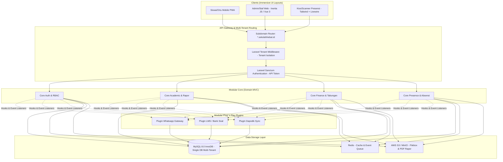

# Index Dokumen Proyek & Arsitektur Modern
## Cetak Biru Sistem Informasi Sekolah SMP Islam Terpadu (SIS SMP IT)
### Multi-Tenant SaaS, Modular MVC, API-Driven (Sanctum), & Immersive Frontend (Inertia JS / Livewire)

---

## 1. Pengantar Transformasi Arsitektur

Dokumen ini merekonstruksi arsitektur monolitik prosedural dari **SISFOKOL v7.00** menjadi sistem **Multi-Tenant SaaS (Software as a Service) Enterprise** berbasis **Modular MVC** menggunakan **Laravel 11**, **Laravel Sanctum** untuk API, dan **Inertia.js + Vue 3 / Livewire** untuk antarmuka pengguna yang imersif dan responsif.

Cetak biru ini dirancang sebagai pelengkap komprehensif pada folder `REF_DOCS/` untuk memastikan pengembang memiliki panduan lengkap mengenai tata kelola kode, mekanisme isolasi data antar sekolah (tenants), dan sistem plugin dinamis (plug-and-play).

---

## 2. Peta Dokumen Cetak Biru & Alur Kerja (Workflow)

Berikut adalah daftar dokumen yang telah diperbarui untuk mendukung arsitektur modern:

| No | Dokumen Pelengkap | File | Detail & Cakupan Teknologi Baru |
| --- | --- | --- | --- |
| 1 | **Master Architectural Index** | [001_analisis-sisfokol-v7.md](001_analisis-sisfokol-v7.md) | Gambaran umum arsitektur SaaS, modul MVC, alur integrasi API Sanctum, dan plugin. |
| 2 | **Modular Navigation Blueprint** | [002_menu_extract.md](002_menu_extract.md) | Ekstraksi menu legacy yang ditransformasikan menjadi komponen navigasi responsif, imersif, dan ter-injeksi plugin secara dinamis. |
| 3 | **Multi-Tenant DB Schema** | [003a_schema_sisfokol_v7.md](003a_schema_sisfokol_v7.md) | Skema database ter-normalisasi penuh (InnoDB, 3NF) dengan isolasi `tenant_id` dan tabel pendukung plugin plug-and-play. |

---

## 3. Desain Arsitektur Modern (High-Level Blueprint)



---

## 4. Spesifikasi Teknis Pilar Arsitektur Target

### 4.1. Arsitektur Multi-Tenant SaaS (Single Database Isolation)
Sistem menggunakan pendekatan **Single Database dengan Shared Schema** dipandu kolom `tenant_id` pada setiap tabel relasional.
- **Identifikasi Tenant:** Sekolah diidentifikasi berdasarkan subdomain yang diakses (misalnya `smpitislam.sekolahhebat.id` akan memicu resolver tenant `smpitislam`).
- **Isolasi Data (Tenant Isolation):**
  Menggunakan global query scope bawaan Laravel (`BelongsToTenant`). Setiap kali model database di-query, sistem secara otomatis menambahkan constraint `WHERE tenant_id = current_tenant_id()`.
  ```php
  // app/Traits/BelongsToTenant.php
  namespace App\Traits;
  use App\Models\Tenant;
  use Illuminate\Database\Eloquent\Builder;

  trait BelongsToTenant {
      protected static function bootBelongsToTenant() {
          static::creating(function ($model) {
              if (session()->has('tenant_id')) {
                  $model->tenant_id = session()->get('tenant_id');
              }
          });

          static::addGlobalScope('tenant', function (Builder $builder) {
              if (session()->has('tenant_id')) {
                  $builder->where('tenant_id', session()->get('tenant_id'));
              }
          });
      }
  }
  ```

### 4.2. Arsitektur Modular MVC (Domain-Driven Structure)
Struktur folder Laravel dirancang modular (Modular Monolith) untuk membagi domain fungsional agar mudah dikembangkan secara terisolasi tanpa mengganggu modul lainnya.
```
sisfokol-laravel11/
├── app/
│   ├── Modules/              # Folder Domain Modular
│   │   ├── Academic/         # Modul Kelas, Mapel, Rapor
│   │   ├── Finance/          # Modul SPP, Tabungan, Transaksi
│   │   ├── Discipline/       # Modul BK, Poin Pelanggaran, Pembinaan
│   │   └── Presence/         # Modul Absensi, QR Code, Izin
│   └── Plugins/              # Folder Plugin Plug-and-Play
│       ├── WhatsappGateway/  # Modul Plugin opsional WA
│       └── LmsLearning/      # Modul Plugin opsional E-learning
```

### 4.3. API-Driven dengan Laravel Sanctum
Semua transaksi data diproses melalui RESTful API endpoints yang aman menggunakan **Laravel Sanctum**.
- **Autentikasi Token-Based:** Pengguna mobile (PWA) login melalui API endpoint `/api/v1/login`, mengembalikan Bearer Token Sanctum yang disimpan di secure storage client.
- **Stateful Cookies:** Untuk frontend web berbasis Inertia.js, Sanctum menggunakan cookie berbasis sesi (stateful session) yang kebal terhadap serangan XSS/CSRF.

### 4.4. Immersive Frontend (Inertia.js + Vue 3 / Livewire)
Menghilangkan reload halaman sepenuhnya (*Single Page Application experience*).
- **Inertia.js + Vue 3:** Digunakan untuk dashboard manajemen utama (Admin, KS, Bendahara) yang kompleks. Inertia mengirimkan data JSON dari Laravel secara langsung ke komponen Vue 3, menjaga performa tetap cepat.
- **Livewire + Blade:** Digunakan untuk portal presensi cepat (Kios/Scanner) dan antarmuka interaktif yang membutuhkan interaksi server-side instan tanpa menulis file JS terpisah.
- **Responsive & Immersive UI:** Desain memanfaatkan komponen Tailwind CSS responsif, mendukung *Dark Mode*, animasi transisi yang halus, serta tata letak sidebar adaptif untuk smartphone guru maupun komputer kasir bendahara.

### 4.5. Sistem Plugin Plug-and-Play (Hooks & Event-Driven)
Sekolah dapat mengaktifkan atau menonaktifkan fitur tertentu secara mandiri (misalnya: Sekolah A menyewa modul WhatsApp Gateway, Sekolah B menyewa modul LMS).
- **Tabel `plugins`:** Menyimpan daftar plugin terinstal beserta status keaktifannya per tenant (`tenant_plugins` pivot table).
- **Sistem Event Hooks:** Sistem core menyediakan Event Hook. Contoh: Saat transaksi pembayaran sukses dicatat, core memicu event `PaymentSuccessful`. Jika plugin WhatsApp Gateway aktif, ia akan menangkap (*listen*) event tersebut dan mengirimkan pesan konfirmasi pembayaran ke orang tua secara otomatis.

---

## 5. Rencana Go-Live & Pengembangan Berkelanjutan

Cetak biru ini memastikan transisi dari sistem lama yang rentan peretasan dan lambat, menuju platform SaaS modern yang tangguh. Dengan mengandalkan standarisasi ini, pengembangan dapat dilanjutkan secara modular, aman, dan siap dipasarkan secara massal sebagai solusi SaaS terpadu untuk ratusan sekolah Islam di Indonesia.
