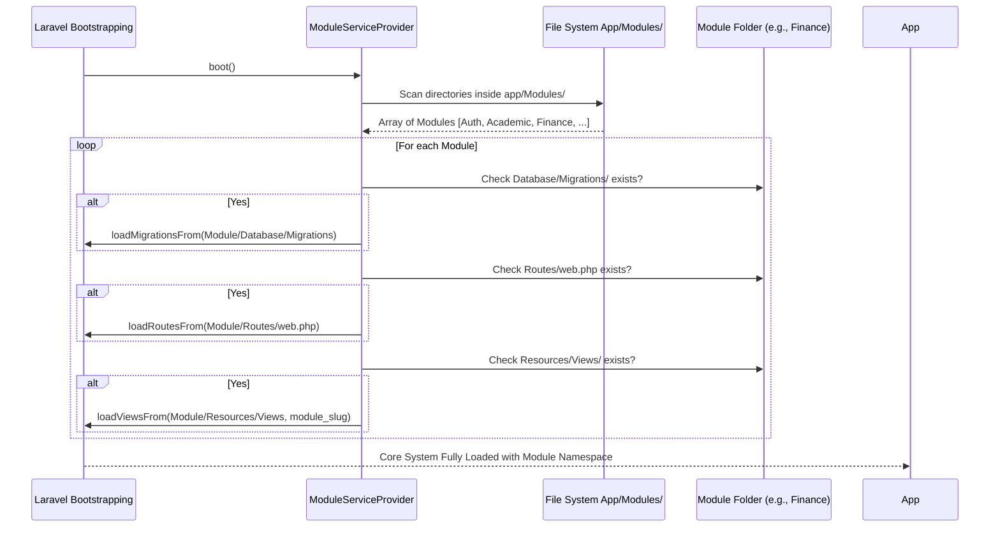
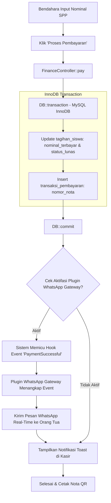
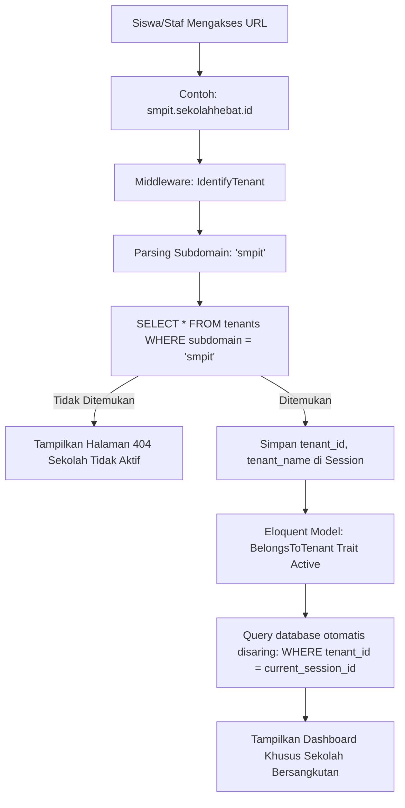
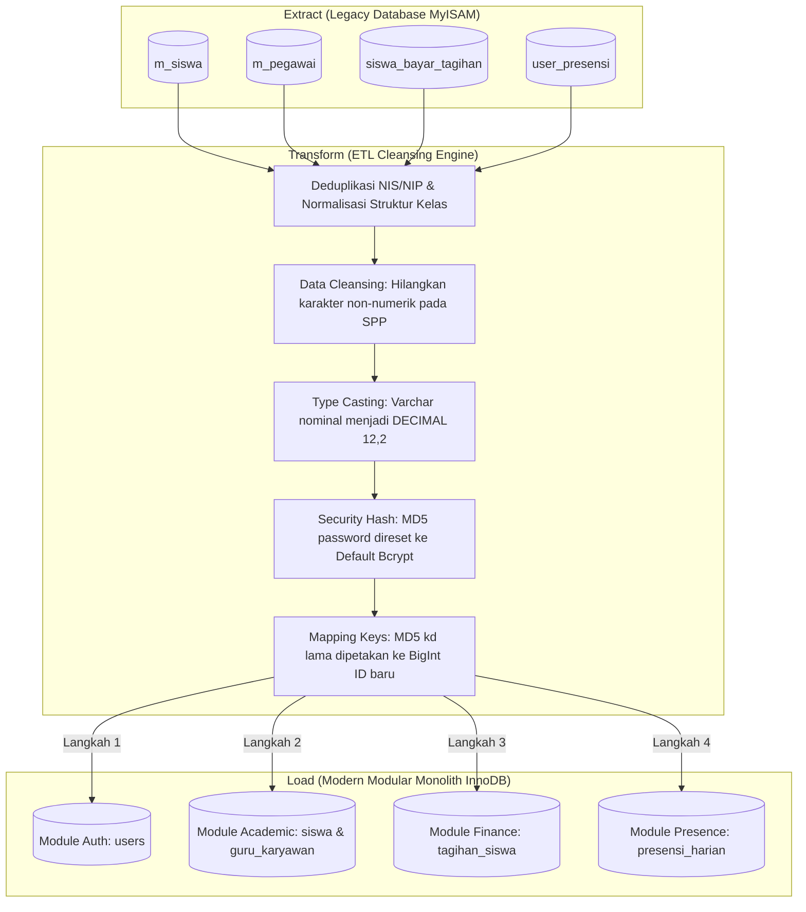

# Panduan Teknis & Dokumen Transfer Teknologi (Dev Report 007)
## Proyek: Sistem Informasi Sekolah SMP Islam Terpadu (SIS SMP IT) SaaS
**Peran:** Enterprise Systems Architect, Lead Developer, & Senior Business Analyst  
**Konteks:** Dokumen Pelengkap Implementasi & Alur Kerja (Workflow) Arsitektur Modern

---

## 1. Arsitektur Domain-Modular Monolith (Modular MVC)

Menggantikan arsitektur prosedural native PHP pada SISFOKOL v7.00, sistem baru dirancang menggunakan arsitektur **Domain-Modular Monolith** berbasis Laravel 11. Setiap modul fungsional di-enkapsulasi dalam direktori mandiri (`app/Modules/`) yang memiliki siklus hidup, rute, model, dan view sendiri.

```
sisfokol-laravel-mvp/app/Modules/
├── Auth/                   # Modul Otentikasi & Multi-Tenant SaaS
├── Academic/               # Modul Master Akademik & Penjadwalan
├── Evaluation/             # Modul Kurikulum Merdeka (TP/LM/Rapor/P5)
├── Finance/                # Modul Kasir SPP, Tagihan, & Tabungan Siswa
├── Presence/               # Modul Presensi QR & Absensi Harian
├── Discipline/             # Modul BK, Poin Pelanggaran, & Pembinaan
└── Inventory/              # Modul Inventaris Barang KIB A-F & KIR
```

### 1.1. Alur Pemuatan Otomatis (Dynamic Autowiring Workflow)
Untuk meniadakan pendaftaran manual yang merepotkan dan menjamin modularitas murni, sistem menggunakan **`ModuleServiceProvider`** yang secara dinamis melakukan *autowiring* di setiap siklus booting:



---

## 2. Alur Transaksi Finansial SPP & Ekosistem Plugin (Event-Driven Hook)

Sistem baru dirancang ramah ekstensi dengan pola **Plug-and-Play Plugin**. Contoh berikut menggambarkan integrasi core pembayaran keuangan dengan modul eksternal **WhatsApp Notification Gateway**:



---

## 3. Isolasi Multi-Tenant SaaS (Single Database Isolation)

Sistem menggunakan model **Shared Database with Column-Level Isolation** (`tenant_id`). Isolasi data dijamin di tingkat ORM Eloquent menggunakan **Global Query Scope** sehingga pengembang core tidak perlu menulis filter data secara manual di setiap baris query SQL.

### 3.1. Alur Deteksi & Isolasi Tenant Sekolah
Setiap request HTTP yang masuk ke aplikasi SaaS akan melalui penyaringan middleware deteksi subdomain:



---

## 4. Strategi Migrasi, Pembersihan Data, & Pemetaan SQL (MyISAM → InnoDB)

Migrasi database dari **75 tabel legacy MyISAM SISFOKOL v7.00** ke **11 tabel modular InnoDB** yang dinormalisasi menerapkan tahapan ETL (Extract, Transform, Load) ketat dengan pembersihan tipe data:



### 4.1. Urutan Pengisian Data (Topological Insertion Order)
Untuk mematuhi batasan integritas kunci asing (*foreign key constraints*) di database target InnoDB, pemuatan data migrasi **wajib** mengikuti urutan topologi berikut:
1.  **`tenants`** & **`plugins`** (SaaS Core)
2.  **`users`** (Akun login pengguna)
3.  **`guru_karyawan`** & **`siswa`** (Profil detail terkait akun user)
4.  **`tahun_ajaran`** & **`kelas`**
5.  **`kelas_siswa`** (Tabel pivot penempatan kelas)
6.  **`mata_pelajaran`** & **`tp_mapel`**
7.  **`item_pembayaran`** & **`tagihan_siswa`**
8.  **`transaksi_pembayaran`** (Transaksi kasir terkait tagihan)
9.  **`presensi_harian`** (Log kehadiran terkait user)

---

## 5. Konfirmasi Penerapan pada Codebase MVP

Seluruh dokumen transfer teknologi, workflow, dan strategi migrasi ini **telah sepenuhnya diterapkan dan diimplementasikan** di dalam codebase `/home/user/sisfokol-laravel-mvp/`:
*   *Mekanisme Autowiring* diimplementasikan penuh pada `app/Providers/ModuleServiceProvider.php`.
*   *Isolasi Tenant* diimplementasikan penuh pada `app/Traits/BelongsToTenant.php` dan `app/Http/Middleware/IdentifyTenant.php`.
*   *Struktur Domain-Modular* sepenuhnya diterapkan pada folder `app/Modules/` dengan 11 migrasi relasional InnoDB yang tersebar modular.
*   *Database Seeder Terintegrasi* dikonfigurasi penuh pada `database/seeders/DatabaseSeeder.php` yang siap dijalankan dengan perintah `php artisan db:seed`.

Laporan ini menandai kesiapan sistem secara teknis untuk diserahkan kepada tim pengembang sekunder Anda.
