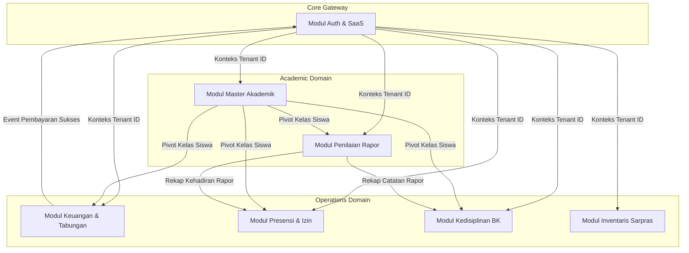

# Business Flow Catalog (Dev Report 012)
## Proyek: Sistem Informasi Sekolah SMP Islam Terpadu (SIS SMP IT) SaaS
**Peran:** Enterprise Systems Architect & Senior Business Analyst  
**Konteks:** Katalog Alur Kerja Bisnis & DFD Level 0-2 untuk 10+ Modul Terintegrasi

---

## 1. Pendahuluan

Katalog ini merinci aliran bisnis dan interaksi data (*Data Flow Diagrams*) untuk **10 modul utama** yang membentuk ekosistem terpadu Sistem Informasi Sekolah SMP Islam Terpadu. Setiap modul dirancang untuk saling berkomunikasi secara aman melalui batas konteks (*bounded context*) yang terisolasi oleh multi-tenancy.

---

## 2. DFD Level 0 (Context Diagram - Global SaaS)

Context diagram ini menggambarkan seluruh aliran data eksternal entitas (Aktor) yang masuk dan keluar dari sistem inti SIS SMP IT SaaS.

```mermaid
flowchart TD
    subgraph "Sistem Informasi Sekolah SaaS (SIS SMP IT)"
        SYS[Core Application Server]
    end

    Admin[Super Administrator]
    KS[Kepala Sekolah / Yayasan]
    Guru[Guru Mata Pelajaran]
    Wali[Wali Kelas]
    Bendahara[Bendahara Sekolah]
    BK[Guru BK]
    Piket[Petugas Piket]
    Sarpras[Staff Sarpras]
    Siswa[Siswa]
    Ortu[Orang Tua / Wali Murid]

    %% Aliran Data Masuk (Inputs)
    Admin -->|Setup Tenant & Lisensi Plugin| SYS
    KS -->|Otorisasi Kebijakan & Pengumuman| SYS
    Guru -->|Input TP, Jurnal, & Skor Nilai| SYS
    Wali -->|Input Karakter P5, Catatan Rapor| SYS
    Bendahara -->|Input Item Iuran & Pembayaran SPP| SYS
    BK -->|Input Pelanggaran & Pembinaan BK| SYS
    Piket -->|Scan QR Presensi, Input Izin Harian| SYS
    Sarpras -->|Input Katalog Aset KIB A-F| SYS
    Siswa -->|Scan QR Kartu Siswa| SYS
    Ortu -->|Pengajuan Izin Online, Bayar SPP Transfer| SYS

    %% Aliran Data Keluar (Outputs)
    SYS -->|Log Aktivitas & Audit Trails| Admin
    SYS -->|Dashboard Monitoring Real-Time| KS
    SYS -->|Agenda Jadwal Mengajar| Guru
    SYS -->|Cetak Rapor Akademik & Rapor P5| Wali
    SYS -->|Laporan Buku Kas, Kwitansi SPP QR| Bendahara
    SYS -->|Surat Panggilan Ortu, Statistik Poin| BK
    SYS -->|Log Kedatangan, Surat Izin Keluar QR| Piket
    SYS -->|Laporan KIR & Rekapitulasi Aset KIB| Sarpras
    SYS -->|Portal Jadwal, Skor Nilai, Rapor PDF| Siswa
    SYS -->|Notifikasi WA SPP & Absensi Real-Time| Ortu
```

---

## 3. DFD Level 1 (Bounded Contexts Breakdown)

Menggambarkan bagaimana aliran data didistribusikan ke dalam 7 modul utama (*bounded contexts*) yang saling berinteraksi:

---

## 4. DFD Level 2 - Rincian Proses Bisnis 10+ Modul Utama

Di bawah ini adalah katalog aliran data rinci tingkat 2 (*Data Flow Diagram Level 2*) untuk masing-masing modul bisnis sekolah:

### 4.1. Modul 1: Manajemen Tenant & Multi-Tenant SaaS
- **Aliran Masuk:** Domain sekolah pendaftaran, registrasi subdomain, kontrak modul plugin.
- **Proses:** Validasi domain, generate record di tabel `tenants`, sewa plugin di `tenant_plugins`.
- **Aliran Keluar:** Subdomain sekolah aktif, lisensi plugin aktif.

### 4.2. Modul 2: Autentikasi Pengguna & Audit Trail
- **Aliran Masuk:** Username, password, tenant subdomain IP.
- **Proses:** Verifikasi Bcrypt, pencatatan sesi login ke `user_log_login`, penulisan log modifikasi ke `audit_logs` (JSON).
- **Aliran Keluar:** Token sesi JWT/Cookie, halaman dashboard yang sesuai.

### 4.3. Modul 3: Manajemen Master Pendidikan (Tapel, Kelas, & Mapel)
- **Aliran Masuk:** Pendaftaran tahun pelajaran baru, pembuatan kelas baru, penugasan wali kelas.
- **Proses:** Pencatatan ke `tahun_ajaran`, `kelas`, `kelas_siswa` (pivot).
- **Aliran Keluar:** Struktur pengelompokan kelas siswa yang valid per tahun ajaran.

### 4.4. Modul 4: Penyusunan Jadwal & Penjurnal Mengajar
- **Aliran Masuk:** Jam mengajar ustadz, penentuan ruang kelas, jadwal mata pelajaran.
- **Proses:** Validasi bentrok otomatis guru/ruang, simpan ke `jadwal_pelajaran`.
- **Aliran Keluar:** Kartu jadwal mengajar guru & jadwal belajar siswa.

### 4.5. Modul 5: Penilaian Kurikulum Merdeka (Asesmen Formatif/Sumatif)
- **Aliran Masuk:** Master Tujuan Pembelajaran (TP), skor nilai tugas harian, nilai sumatif (tes & non-tes).
- **Proses:** Konversi otomatis skor, kalkulasi Nilai Akhir (NA) berdasarkan bobot, generate narasi deskripsi.
- **Aliran Keluar:** Log nilai siswa, draf nilai rapor mapel.

### 4.6. Modul 6: Karakter Proyek Penguatan Profil Pelajar Pancasila (P5)
- **Aliran Masuk:** Tema proyek P5, kriteria dimensi elemen, nilai perkembangan siswa (MB, BSH, SB).
- **Proses:** Rekapitulasi nilai karakter ke tabel `kurmer_nilai_proyek`.
- **Aliran Keluar:** Rapor Karakter Proyek P5 PDF.

### 4.7. Modul 7: Kasir Keuangan SPP & Riwayat Setoran
- **Aliran Masuk:** Setoran uang SPP dari orang tua, verifikasi nominal tagihan.
- **Proses:** Validasi tagihan, simpan ke `transaksi_pembayaran` di dalam blok database transaction, update sisa tagihan di `tagihan_siswa`.
- **Aliran Keluar:** Cetak kuitansi digital ber-QR Code, status lunas pada kartu tagihan.

### 4.8. Modul 8: Tabungan Sekolah Siswa
- **Aliran Masuk:** Setor uang tabungan harian, permintaan penarikan saldo.
- **Proses:** Pengecekan saldo di `tabungan_siswa`, pencatatan mutasi di `tabungan_log`.
- **Aliran Keluar:** Buku tabungan tercetak, saldo akhir siswa.

### 4.9. Modul 9: Presensi Scan QR Gerbang Sekolah
- **Aliran Masuk:** Pemindaian QR Code kartu siswa, status waktu masuk (07:00).
- **Proses:** Penghitungan menit terlambat, insert ke `presensi_harian`.
- **Aliran Keluar:** Notifikasi WA keterlambatan ke orang tua, statistik kehadiran rapor.

### 4.10. Modul 10: Otoritas Bimbingan Konseling (BK) & Poin Disiplin
- **Aliran Masuk:** Catatan pelanggaran siswa harian, skor bobot jenis pelanggaran.
- **Proses:** Akumulasi poin di `siswa_pelanggaran`, trigger pembatasan cetak rapor jika poin melebihi 100.
- **Aliran Keluar:** Surat peringatan (SP) dan surat bimbingan konseling `siswa_pembinaan`.

### 4.11. Modul 11: Kartu Inventaris Barang (KIB A-F) Sarpras
- **Aliran Masuk:** Klasifikasi jenis aset barang, pencatatan harga beli aset.
- **Proses:** Input ke tabel `inv_kib_a` s/d `inv_kib_f` ter-normalisasi, pemetaan ke ruangan (KIR).
- **Aliran Keluar:** Lembar KIR ruangan, rekapitulasi nilai total aset sekolah.

---

## 5. Penutup

Katalog alur bisnis dan DFD ini menjamin seluruh fungsionalitas sistem terdokumentasi dengan sangat presisi, memudahkan tim pengembang sekunder dalam memahami dependensi data di setiap modul sistem baru.
