# A7. Proses Bisnis (As-Is & To-Be)

---

## 1. Pendaftaran Siswa Baru

### As-Is
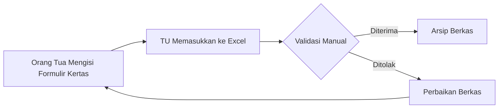

### To-Be
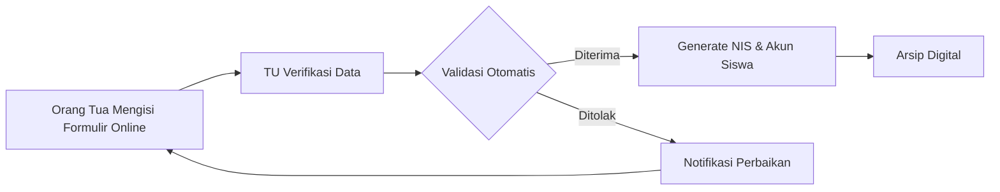

## 2. Input Nilai

### As-Is
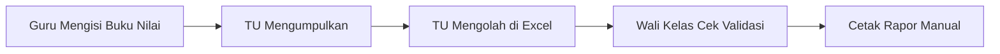

### To-Be
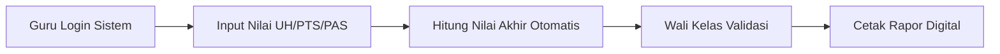

## 3. Cetak Rapor

### As-Is
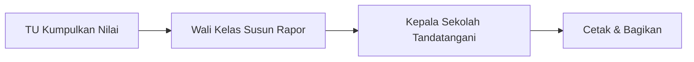

### To-Be
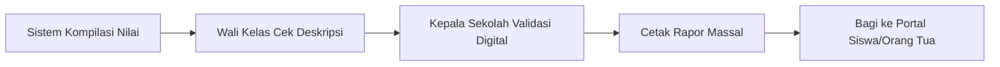

## 4. Absensi Harian

### As-Is
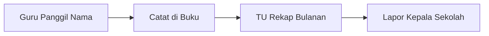

### To-Be
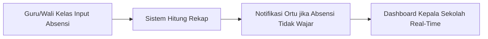

## 5. Pembayaran SPP

### As-Is
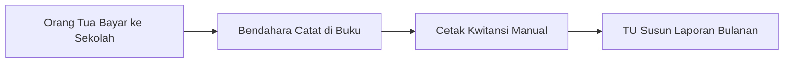

### To-Be
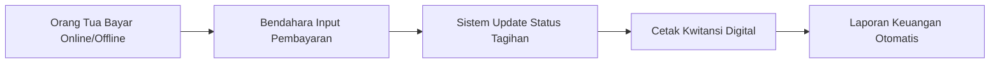

## 6. Monitoring Kepala Sekolah

### As-Is
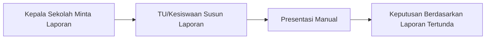

### To-Be
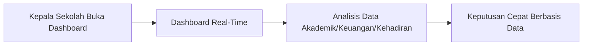
