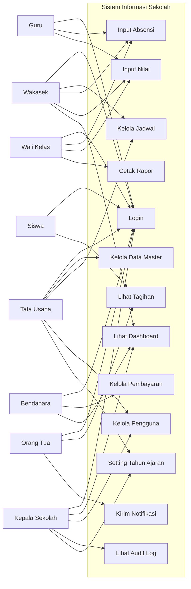

# A8. Use Case / User Story

---

## Use Case Diagram

## Daftar Use Case

| Kode | Use Case | Aktor Utama | Deskripsi Singkat |
| --- | --- | --- | --- |
| UC-001 | Login | Semua aktor | Autentikasi ke sistem berdasarkan role. |
| UC-002 | Kelola Data Master | TU | CRUD data siswa, guru, kelas, mapel, tahun ajaran. |
| UC-003 | Kelola Jadwal | TU / Wakasek | Membuat dan mengubah jadwal pelajaran. |
| UC-004 | Input Absensi | Guru / Wali Kelas | Mencatat kehadiran siswa harian. |
| UC-005 | Input Nilai | Guru | Memasukkan nilai UH, PTS, PAS, dan sikap. |
| UC-006 | Cetak Rapor | Wali Kelas | Menyusun dan mencetak rapor semester. |
| UC-007 | Kelola Pembayaran | Bendahara | Mencatat SPP, infaq, dan mencetak kwitansi. |
| UC-008 | Lihat Tagihan | Siswa / Orang Tua | Melihat riwayat tagihan dan pembayaran. |
| UC-009 | Lihat Dashboard | Kepala Sekolah / Bendahara / TU | Menampilkan ringkasan data dan laporan. |
| UC-010 | Kelola Pengguna | Kepala Sekolah / TU | Mengatur role, password, dan aktivasi akun. |
| UC-011 | Kirim Notifikasi | Orang Tua (terima) / Sistem | Mengirim notifikasi tagihan dan pengumuman. |
| UC-012 | Lihat Audit Log | Kepala Sekolah | Melihat riwayat aktivitas pengguna. |
| UC-013 | Setting Tahun Ajaran | Kepala Sekolah / TU | Mengaktifkan tahun ajaran dan semester. |

## User Story (Contoh Prioritas Tinggi)

| ID | Sebagai | Saya ingin | Agar | Prioritas |
| --- | --- | --- | --- | --- |
| US-001 | Guru | input nilai siswa per kelas dan mapel | nilai tersimpan dengan aman | High |
| US-002 | Wali Kelas | mencetak rapor semester | rapor cepat jadi | High |
| US-003 | Orang Tua | melihat tagihan SPP anak | transparansi keuangan | High |
| US-004 | Bendahara | mencatat pembayaran dengan kwitansi | arsip keuangan rapi | High |
| US-005 | Kepala Sekolah | melihat dashboard jumlah siswa, guru, dan keuangan | pengambilan keputusan cepat | High |
| US-006 | Siswa | melihat jadwal dan nilai | memantau perkembangan belajar | High |
| US-007 | TU | mengelola data master | data tidak duplikat | High |
| US-008 | Wakasek | melihat rekap absensi | monitoring kedisiplinan | Medium |
