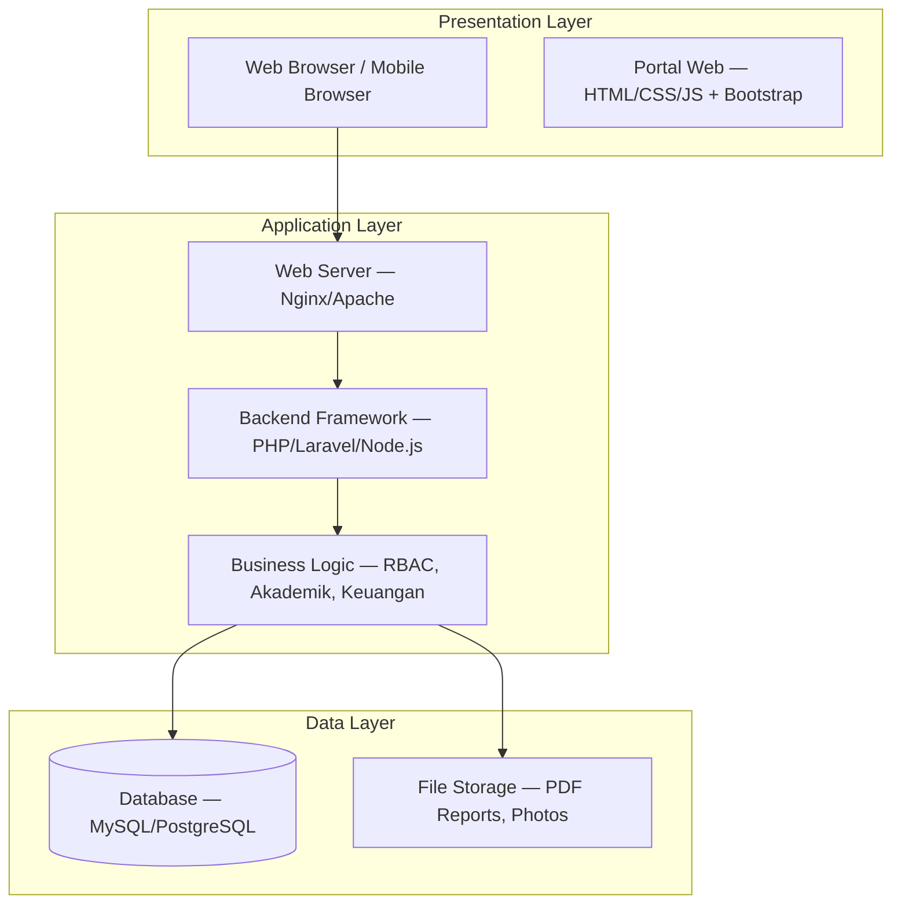
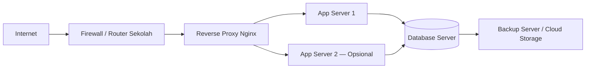

# B11. Arsitektur Sistem

---

## Arsitektur 3-Tier

## Penjelasan Layer

| Layer | Teknologi | Fungsi |
| --- | --- | --- |
| Presentation | Browser, HTML5, CSS3, JavaScript, Bootstrap | Menampilkan antarmuka pengguna, responsif desktop & mobile. |
| Application | Nginx/Apache, PHP 8.x / Laravel / Node.js | Menangani logika bisnis, autentikasi, RBAC, dan API. |
| Data | MySQL 8 / MariaDB 10 / PostgreSQL 13 | Menyimpan data master, transaksi, log, dan laporan. |
| External | SMTP, WhatsApp Gateway (opsional) | Mengirim notifikasi dan pengumuman. |

## Deployment Model

## Keunggulan Arsitektur

- **Pemisahan concerns**: Mudah dikembangkan dan diuji.
- **Skalabilitas**: App server dapat ditambah jika jumlah pengguna meningkat.
- **Keamanan**: Database tidak terpapar langsung ke internet.
- **Maintainability**: Modul dapat diperbarui tanpa mengganggu layer lain.
