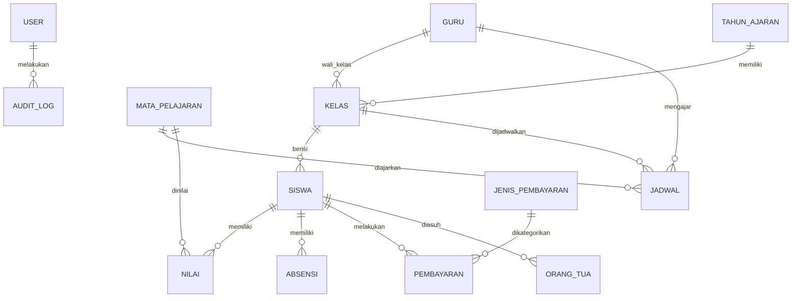

# B12. Desain Database

---

## Entity Relationship Diagram (ERD)

## Daftar Entitas / Tabel

| No | Nama Tabel | Deskripsi | Jumlah Field Estimasi |
| --- | --- | --- | --- |
| 1 | users | Data pengguna login dan role | 8 |
| 2 | tahun_ajaran | Tahun ajaran aktif | 5 |
| 3 | kelas | Data kelas, tingkat, jurusan | 6 |
| 4 | siswa | Data pribadi siswa | 25 |
| 5 | guru | Data pribadi dan kepegawaian guru | 18 |
| 6 | mata_pelajaran | Daftar mata pelajaran | 7 |
| 7 | jadwal | Jadwal pelajaran per kelas | 9 |
| 8 | nilai | Nilai UH, PTS, PAS, sikap | 12 |
| 9 | absensi | Presensi harian siswa | 8 |
| 10 | pembayaran | Transaksi SPP, infaq, dll. | 11 |
| 11 | jenis_pembayaran | Kategori pembayaran | 5 |
| 12 | orang_tua | Data wali murid | 12 |
| 13 | audit_log | Log aktivitas pengguna | 7 |
| 14 | pengumuman | Informasi sekolah | 6 |
| 15 | setting | Konfigurasi aplikasi | 4 |

## Relasi Kunci

- `siswa.kelas_id` → `kelas.id`
- `kelas.wali_kelas_id` → `guru.id`
- `nilai.siswa_id` → `siswa.id`, `nilai.mapel_id` → `mata_pelajaran.id`
- `absensi.siswa_id` → `siswa.id`
- `pembayaran.siswa_id` → `siswa.id`, `pembayaran.jenis_id` → `jenis_pembayaran.id`
- `jadwal.kelas_id` → `kelas.id`, `jadwal.guru_id` → `guru.id`, `jadwal.mapel_id` → `mata_pelajaran.id`
- `audit_log.user_id` → `users.id`

## Aturan Integritas

- Setiap siswa harus terikat pada satu kelas dalam tahun ajaran aktif.
- NIS dan NIP harus unik.
- Tahun ajaran aktif hanya boleh satu.
- Data nilai tidak dapat dihapus jika sudah dicetak rapor; hanya dapat diperbarui dengan catatan revisi.
