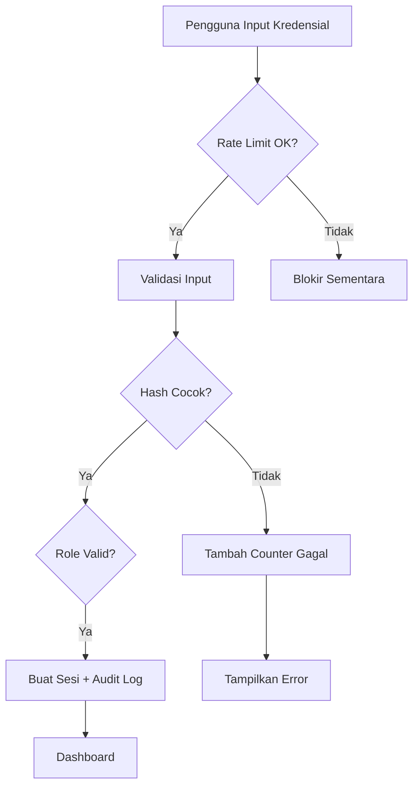

# D20. Keamanan Sistem

---

## Tabel Mekanisme Keamanan

| No | Aspek | Mekanisme | Implementasi | PIC |
| --- | --- | --- | --- | --- |
| 1 | Autentikasi | Login berbasis username/password + sesi | Laravel Auth / Sanctum | Tim IT |
| 2 | Autorisasi | RBAC per role dan ownership data | Middleware role + Gate/Policy | Tim IT |
| 3 | Enkripsi Password | Hash bcrypt/Argon2 | Laravel Hash | Tim IT |
| 4 | Enkripsi Transport | HTTPS/TLS | SSL Let's Encrypt / Cloudflare | Tim IT |
| 5 | Validasi Input | Server-side validation | Laravel Form Request | Developer |
| 6 | Proteksi SQL Injection | Query Builder / Eloquent | Parameterized query | Developer |
| 7 | Proteksi XSS | Output escaping | Blade `{{ }}` | Developer |
| 8 | Proteksi CSRF | Token CSRF | Laravel CSRF Middleware | Developer |
| 9 | Audit Log | Pencatatan aksi CRUD | Middleware + AuditLogService | Tim IT |
| 10 | Rate Limiting | Batasi percobaan login | Laravel Throttle | Tim IT |
| 11 | Backup & Recovery | Backup otomatis database | Cron + mysqldump/cloud | Tim IT |
| 12 | Patch Management | Update framework & OS | Jadwal bulanan | Tim IT |
| 13 | Password Policy | Minimal 8 karakter, kombinasi | Validasi registrasi | Developer |
| 14 | Session Security | Session di Redis, timeout 30 menit | Laravel session config | Tim IT |
| 15 | File Upload Security | Validasi tipe & ukuran file | Storage validation | Developer |

## Alur Keamanan Login

## Kebijakan Keamanan Data

- Data siswa dan keuangan bersifat rahasia; tidak boleh dibagikan tanpa izin.
- Export data hanya dapat dilakukan oleh role yang berwenang.
- Log akses disimpan selama minimal 12 bulan.
- Penanganan insiden keamanan mengikuti SOP yang ditetapkan sekolah.
