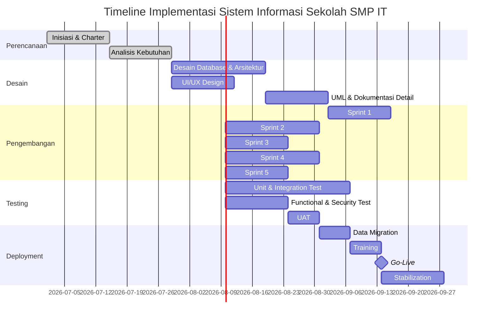

# F25. Deployment Plan

---

## Timeline / Gantt Chart Implementasi

## Milestone Utama

| Milestone | Target Tanggal | Deliverable |
| --- | --- | --- |
| Project Kick-off | 1 Juli 2026 | Project Charter, Tim Terbentuk |
| Desain Selesai | 11 September 2026 | SRS, ERD, UI/UX, UML |
| Pengembangan Selesai | 11 Desember 2026 | Semua modul High priority |
| QA Selesai | 18 Desember 2026 | Test report, bug closed |
| UAT Approved | 26 Desember 2026 | Tanda tangan UAT |
| Go-Live | 1 Januari 2027 | Sistem live untuk semester genap |

## Rencana Deployment

1. **Persiapan Infrastruktur**: Siapkan server production, database, SSL, dan domain.
2. **Deployment Aplikasi**: Clone/pull code dari repository production, jalankan migration, seed data minimal.
3. **Data Migration**: Import data siswa, guru, kelas dari Excel/manual.
4. **Konfigurasi**: Atur environment, cron job, backup, dan monitoring.
5. **Training**: Pelatihan pengguna per role.
6. **Soft Launch**: Akses terbatas selama 1 minggu untuk stabilisasi.
7. **Full Go-Live**: Semua pengguna aktif.

## Rollback Plan

Jika terjadi kegagalan kritis pada go-live:
- Aktifkan maintenance mode.
- Pulihkan database dari backup terakhir.
- Kembalikan ke versi stabil sebelumnya.
- Komunikasikan ke seluruh pengguna via pengumuman resmi.
