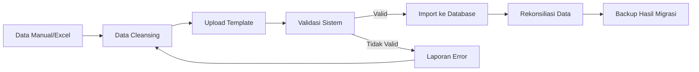

# F26. Migrasi Data

---

## Data yang Dimigrasikan

| No | Data Sumber | Format Asal | Tujuan di Sistem | Metode | PIC | Catatan |
| --- | --- | --- | --- | --- | --- | --- |
| 1 | Data Siswa | Excel/CSV | Tabel `siswa` | Import bulk | TU | Validasi NIS unik |
| 2 | Data Guru | Excel/CSV | Tabel `guru` | Import bulk | TU | Validasi NIP |
| 3 | Data Kelas | Excel/CSV | Tabel `kelas` | Import bulk | TU | Cocokkan wali kelas |
| 4 | Mata Pelajaran | Excel/CSV | Tabel `mata_pelajaran` | Import bulk | Wakasek | Cocokkan kurikulum |
| 5 | Jadwal | Excel/CSV | Tabel `jadwal` | Import bulk | Wakasek | Cek bentrok |
| 6 | Histori Nilai | Excel | Tabel `nilai` | Import bulk | Guru | Mapping mapel & siswa |
| 7 | Data Absensi | Buku manual / Excel | Tabel `absensi` | Entry manual/impor | Wali Kelas | Per semester |
| 8 | Tagihan SPP | Buku bendahara | Tabel `pembayaran` | Entry manual | Bendahara | Saldo awal |
| 9 | Data Orang Tua | Excel/Formulir | Tabel `orang_tua` | Import bulk | TU | Relasi ke siswa |
| 10 | Akun Pengguna | Hasil generate | Tabel `users` | Generate otomatis | Tim IT | NIS/NIP sebagai username |

## Strategi Migrasi

1. **Data Cleansing**: Bersihkan data duplikat, format tanggal, dan NIS/NIP yang tidak valid.
2. **Template Standar**: Buat template Excel sesuai struktur tabel untuk memudahkan import.
3. **Staging Import**: Jalankan import di environment staging terlebih dahulu.
4. **Validasi Otomatis**: Sistem menolak data yang tidak valid dengan laporan error.
5. **Rekonsiliasi**: Bandingkan jumlah data sumber dan data tujuan.
6. **Backup Sebelum Migrasi**: Backup database kosong sebelum import.
7. **Pilot**: Migrasi untuk satu kelas/kelas kecil terlebih dahulu.
8. **Dukungan Tim IT**: Tim IT siap standby selama proses migrasi.

## Alur Migrasi

## Risiko & Mitigasi Migrasi

| Risiko | Mitigasi |
| --- | --- |
| Data tidak lengkap | Susun daftar check data sebelum migrasi |
| Format tidak cocok | Sediakan template resmi dan validator |
| Duplikasi NIS | Validasi unik otomatis |
| Kesalahan relasi | Verifikasi manual oleh TU dan Wakasek |
