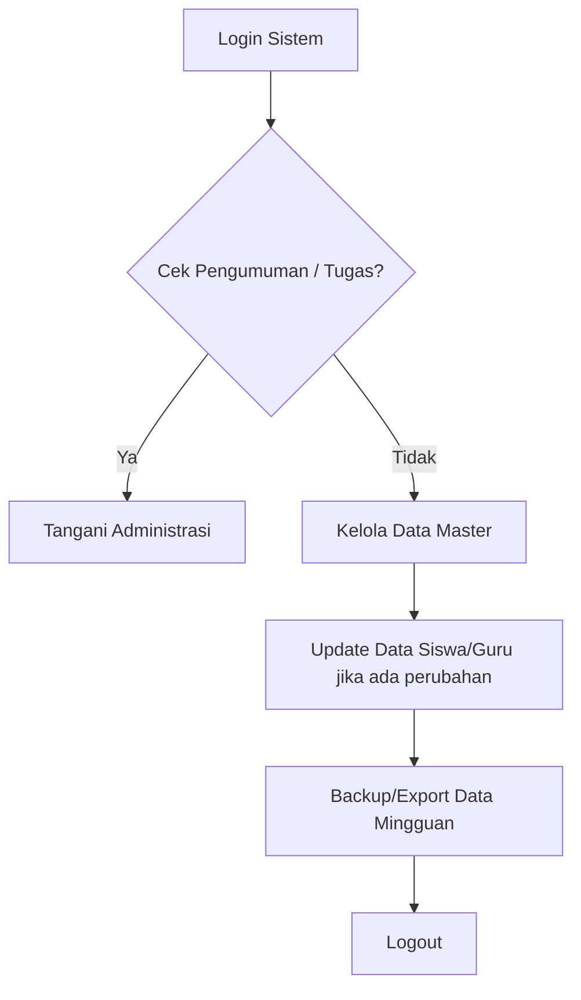
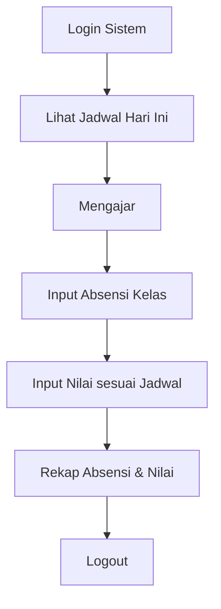
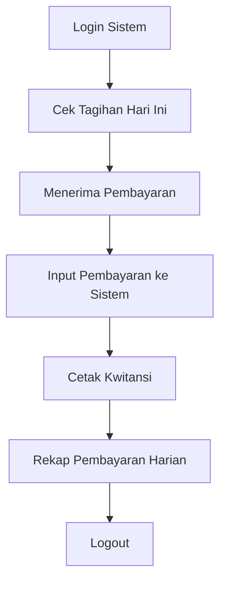
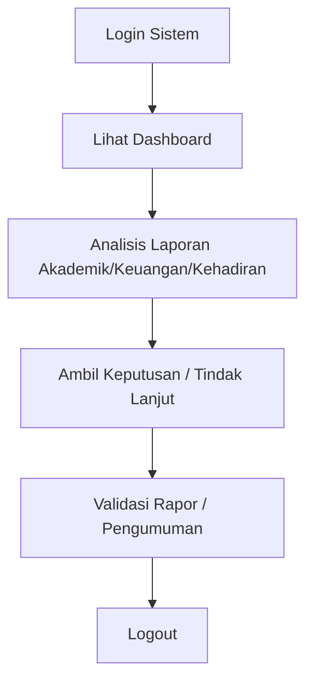
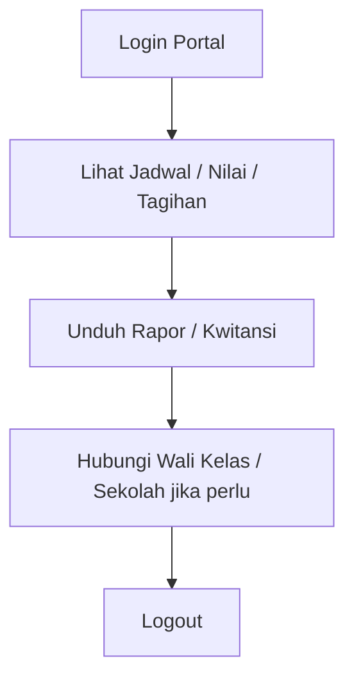

# F27. SOP Operasional Sistem

---

## SOP Harian Penggunaan Sistem

### 1. Tata Usaha (TU)

Tugas harian:
- Login setiap pagi.
- Memverifikasi data siswa baru yang masuk.
- Memastikan data master tetap akurat.
- Melakukan export cadangan data setiap akhir pekan.

### 2. Guru / Wali Kelas

Tugas harian:
- Input absensi setelah jam pelajaran selesai.
- Input nilai setelah ujian/penilaian.
- Wali kelas memantau rekap absensi dan nilai kelas.

### 3. Bendahara

Tugas harian:
- Mencatat pembayaran SPP/infaq setiap transaksi.
- Mencetak kwitansi.
- Membuat rekap harian dan laporan mingguan.

### 4. Kepala Sekolah / Wakasek

Tugas harian:
- Memantau dashboard setiap pagi.
- Memvalidasi rapor dan kebijakan penting.
- Mengeluarkan pengumuman jika diperlukan.

### 5. Siswa / Orang Tua

Tugas harian:
- Siswa memantau jadwal dan nilai.
- Orang tua memantau tagihan dan perkembangan anak.

## Prosedur Jika Terjadi Kendala

1. Coba logout dan login kembali.
2. Clear cache browser atau gunakan browser lain.
3. Hubungi admin IT sekolah melalui channel resmi.
4. Jika data penting salah, ajukan perbaikan melalui TU/Wali Kelas.
