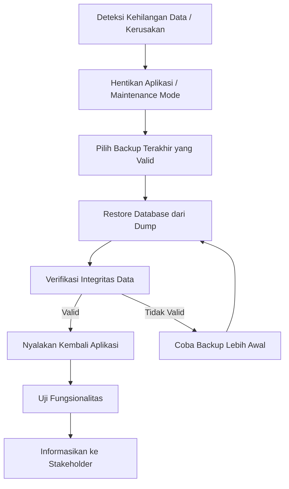

# F28. Backup dan Recovery

---

## Jadwal Backup

| Jenis Backup | Frekuensi | Waktu | Retensi | Tools | Penyimpanan |
| --- | --- | --- | --- | --- | --- |
| Database Full | Harian | 02:00 WIB | 30 hari | mysqldump + cron | Local + Cloud Storage |
| Database Incremental | Setiap 6 jam | 06:00, 12:00, 18:00, 00:00 | 7 hari | Binary log / tool | Cloud Storage |
| File Aplikasi & Report | Mingguan | Minggu, 03:00 WIB | 12 minggu | rsync / tar | Cloud Storage |
| Konfigurasi Server | Setiap perubahan | On-demand | 10 versi | Git / rsync | Git repo private |

## Prosedur Backup

1. Cron job menjalankan `mysqldump` pada jam 02:00.
2. Hasil dump dikompresi dan diberi nama berdasarkan tanggal.
3. File backup diupload ke cloud storage (Google Drive / S3 / NAS).
4. Log backup dicatat dan dicek keberhasilannya.
5. Backup mingguan file aplikasi dijalankan setiap Minggu dini hari.

## Prosedur Restore

## RTO & RPO

| Metrik | Target |
| --- | --- |
| Recovery Time Objective (RTO) | < 4 jam |
| Recovery Point Objective (RPO) | < 24 jam |

## Rencana Business Continuity

- Jika server utama down, aktifkan server cadangan dengan data backup terakhir.
- Gunakan failover DNS jika ada server secondary.
- Komunikasikan status kepada kepala sekolah dan pengguna melalui channel resmi.
