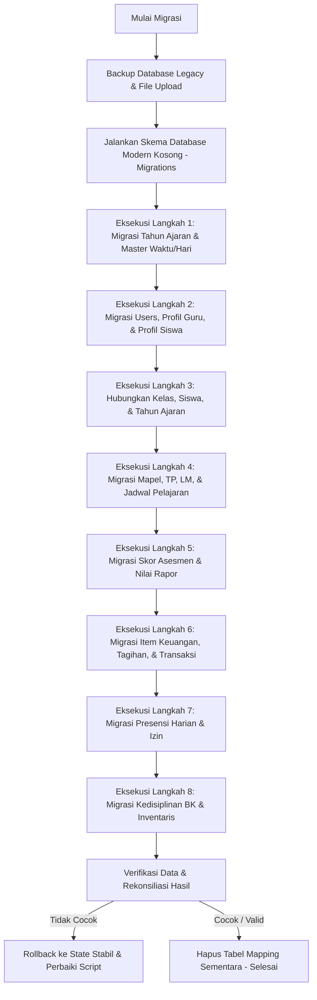

# Rencana Migrasi Data Konkret
## Dari SISFOKOL v7.00 (Code:SmartOffice) ke Skema Database Modern (InnoDB)
**Konteks:** Migrasi 75 Tabel Legacy Berbasis MyISAM ke Database Relasional Normal 3NF  
**Peran:** Senior Software Engineer & Database Administrator

---

## 1. Tantangan Utama & Strategi Penyelesaian

Melakukan migrasi data dari **SISFOKOL v7.00** ke skema database modern memiliki kompleksitas tinggi karena buruknya desain database warisan. Berikut adalah analisis tantangan teknis beserta strategi penyelesaian konkretnya:

### 1.1. Tantangan 1: Perbedaan Primary Key (Varchar MD5 vs BigInt Auto-Increment)
- **Tantangan:** Seluruh primary key tabel legacy (`kd`) menggunakan hash MD5 string (varchar 50). Skema modern menggunakan `BIGINT UNSIGNED AUTO_INCREMENT` atau `UUID` untuk performa query dan integritas relasi.
- **Solusi:** Selama proses ETL (Extract, Transform, Load), kita membuat **Tabel Pembantu Sementara (Mapping Table)** di memory atau database staging bernama `legacy_id_mappings`. Tabel ini memetakan: `nama_tabel_legacy`, `legacy_md5_kd`, and `new_bigint_id`. Setiap kali record baru dimasukkan ke skema baru, kita mencatat ID barunya ke tabel pemetaan ini untuk meresolusi foreign key di tabel-tabel transaksi berikutnya.

### 1.2. Tantangan 2: Denormalisasi Ekstrim (Duplikasi Data Berlebih)
- **Tantangan:** Tabel transaksi legacy (seperti `user_presensi` atau `siswa_bayar_tagihan`) menyimpan data redundant secara langsung sebagai string (`siswa_nama`, `siswa_kode`, `siswa_kelas`, `siswa_tapel`).
- **Solusi:** Kita melakukan normalisasi dengan membuang duplikasi string tersebut. Kita mengambil referensi aslinya menggunakan `siswa_kd` (MD5) dan mencocokkannya ke tabel `legacy_id_mappings` untuk mendapatkan `siswa_id` (BigInt) yang baru pada database modern.

### 1.3. Tantangan 3: Ketidakcocokan Tipe Data (Varchar untuk Angka/Uang)
- **Tantangan:** Kolom finansial (`nominal`, `nominal_bayar` pada tabel `siswa_bayar_tagihan`) dan nilai akademik (`nilai`, `score`) disimpan sebagai tipe data `varchar`. Ini mengakibatkan anomali data (misal karakter non-numerik, spasi, atau format acak).
- **Solusi:** ETL Script wajib menyertakan fungsi **Data Cleansing & Type Casting** yang membersihkan karakter non-numerik (seperti simbol mata uang `Rp.`, titik ribuan, atau spasi), mengonversinya menjadi angka bersih (`floatval` atau `intval`), dan mengonversinya ke tipe `DECIMAL(12,2)` untuk uang atau `TINYINT` untuk nilai.

### 1.4. Tantangan 4: Keamanan Sandi yang Sangat Lemah (MD5 Tanpa Salt)
- **Tantangan:** Sandi guru dan siswa pada tabel `m_siswa` dan `m_pegawai` di-hash menggunakan algoritma MD5 tanpa salt yang sangat rentan diretas menggunakan Rainbow Table.
- **Solusi:** 
  1. Pada saat migrasi, password lama **tidak boleh dimasukkan mentah-mentah**.
  2. Sistem baru menggunakan **Bcrypt** atau **Argon2id**. Strategi terbaik adalah meng-generate password default yang kuat (misal kombinasi NIS/NIP + Tanggal Lahir) dan meng-hash-nya dengan Bcrypt, lalu memaksa pengguna untuk langsung **mereset password saat login pertama kali (Force Password Reset flag)**.
  3. Alternatif kedua adalah melakukan double-hashing (Bcrypt dari MD5 password lama), namun ini mempersulit integrasi masa depan. Pendekatan default reset adalah yang paling aman dan direkomendasikan secara profesional.

---

## 2. Matriks Pemetaan Tabel (75 Tabel Legacy → Skema Modern)

Berikut adalah pemetaan konkret 75 tabel legacy SISFOKOL v7 ke dalam tabel-tabel terintegrasi pada skema database modern:

| Kelompok Modul | Nama Tabel Legacy SISFOKOL v7 (MyISAM) | Nama Tabel Target Modern (InnoDB) | Logika Transformasi & Catatan Cleansing |
| --- | --- | --- | --- |
| **Profil & Autentikasi** | `adminx`<br>`m_user` | `users` | Gabungkan seluruh data pengguna login. Buat record dengan status `role` sesuai kode tipe legacy (`tp06`=Admin, `tp02`=Siswa, dll.). |
| **Master Akademik** | `m_tapel`<br>`m_kelas`<br>`m_ruang`<br>`m_hari`<br>`m_jam`<br>`m_waktu_jadwal` | `tahun_ajaran`<br>`kelas`<br>`ruang_kelas` | - Normalisasi relasi `kelas` ke `tahun_ajaran` melalui `tahun_ajaran_id` (BigInt).<br>- Bersihkan string spasi tak beraturan pada `nama_kelas`. |
| **Sumber Daya Manusia** | `m_siswa`<br>`m_pegawai` | `siswa`<br>`guru_karyawan` | - Pisahkan profile data pribadi ke tabel `siswa` dan `guru_karyawan`.<br>- Hubungkan ke tabel `users` via `user_id` (One-to-One).<br>- Nomor telepon/HP dikonversi ke format standar internasional WA (misal: `0812...` menjadi `62812...`). |
| **Struktur Organisasi** | `m_walikelas`<br>`m_gurubk`<br>`m_bendahara`<br>`m_sarpras`<br>`m_ks`<br>`m_piket` | `kelas`<br>`guru_karyawan` | - Atribut peran khusus (`wali_kelas_id`) direlasikan langsung sebagai FK di tabel `kelas`. <br>- Jabatan struktural lainnya dikelola menggunakan tabel pivot atau permission Spatie. |
| **Kurikulum & Jadwal** | `m_mapel`<br>`m_mapel_jns`<br>`m_mapel_deskripsi`<br>`jadwal` | `mata_pelajaran`<br>`jadwal_pelajaran` | - Normalisasi `jadwal`: ganti kolom string `mapel_kode`, `mapel_nama` dengan `mapel_id` (BigInt FK).<br>- Konversi string rentang waktu `waktu` menjadi tipe data `TIME` (`jam_mulai` & `jam_selesai`). |
| **Evaluasi Kurmer** | `kurmer_mapel_tp`<br>`kurmer_mapel_lm`<br>`kurmer_asesmen_formatif`<br>`kurmer_nilai_asesmen_formatif`<br>`kurmer_nilai_asesmen_formatif_detail`<br>`kurmer_nilai_asesmen_sumatif`<br>`kurmer_nilai_asesmen_sumatif_detail` | `tp_mapel`<br>`lm_mapel`<br>`asesmen_formatif_score`<br>`asesmen_sumatif_score` | - Normalisasi relasi: Hubungkan skor langsung ke tabel pivot `kelas_siswa` (bukan duplikasi profile siswa di setiap baris).<br>- Lakukan konversi data nilai dari varchar ke integer (0-100). |
| **Proyek & Karakter** | `kurmer_proyek`<br>`kurmer_proyek_detail`<br>`kurmer_nilai_proyek`<br>`kurmer_nilai_proyek_proses` | `kurmer_proyek`<br>`kurmer_proyek_detail`<br>`kurmer_nilai_proyek`<br>`kurmer_nilai_proyek_proses` | - Migrasi struktur proyek P5 ke skema InnoDB dengan foreign key yang ketat.<br>- Konversi skor huruf (MB, SB, BSH, SAB) menjadi enum/id referensi. |
| **Keuangan Siswa** | `m_keu_siswa`<br>`siswa_bayar_tagihan`<br>`siswa_bayar`<br>`siswa_bayar_rincian` | `item_pembayaran`<br>`tagihan_siswa`<br>`transaksi_pembayaran` | - **Kritis:** Bersihkan kolom `nominal` and `nominal_bayar` dari karakter non-numerik, ubah tipe data menjadi `DECIMAL(12,2)`.<br>- Relasikan nota pembayaran langsung ke `tagihan_siswa_id`. |
| **BK & Kedisiplinan** | `m_bk_point_jenis`<br>`m_bk_point`<br>`m_bk_prestasi`<br>`siswa_pelanggaran`<br>`siswa_prestasi` | `bk_pelanggaran_master`<br>`bk_prestasi_master`<br>`siswa_pelanggaran`<br>`siswa_prestasi` | - Normalisasi tabel `siswa_pelanggaran`: gantikan kolom string `point_nilai` dengan relasi FK ke `bk_pelanggaran_master.id`.<br>- Validasi field tanggal `tgl` dari format string tidak rapi menjadi tipe `DATE` standar SQL. |
| **Presensi & Harian** | `m_waktu`<br>`user_presensi`<br>`user_absensi`<br>`user_ijin`<br>`user_piket` | `presensi_harian`<br>`ijin_meninggalkan_kelas` | - Konsolidasikan tabel `user_presensi` dan `user_absensi` ke dalam satu tabel terpadu `presensi_harian`.<br>- Konversi durasi terlambat string menjadi integer menit (`menit_terlambat`). |
| **Inventaris & Aset** | `m_kib_jenis`<br>`m_kib_kode`<br>`inv_kib_a` s/d `inv_kib_f` | `m_kib_kode`<br>`aset_kib_a` s/d `aset_kib_f` | - Ganti format nominal harga aset dari varchar string menjadi `DECIMAL(15,2)` untuk pelaporan kekayaan daerah/sekolah yang akurat.<br>- Sediakan FK yang mengikat aset ke ruangan kelas tertentu (`ruang_id` di tabel `kelas`). |
| **Ekstrakurikuler** | `m_ekstra`<br>`siswa_ekstra` | `siswa_ekstra` | - Buat tabel pivot `siswa_ekstra` dengan foreign key ke `siswa` dan `m_ekstra`. |

---

## 3. Alur & Prosedur Eksekusi ETL (Extract, Transform, Load)

Proses migrasi wajib dieksekusi secara berurutan sesuai arah ketergantungan data (topological order) untuk menghindari kegagalan foreign key constraint pada database target.



---

## 4. Contoh Script ETL Konkret (Laravel Console Command)

Di bawah ini adalah script PHP/Laravel Console Command konkret yang mengimplementasikan proses ETL dari database legacy ke database baru secara aman menggunakan transaksi database dan pemetaan foreign key.

Simpan file ini dengan nama `MigrateLegacyDataCommand.php` di dalam proyek baru.

```php
<?php

namespace App\Console\Commands;

use Illuminate\Console\Command;
use Illuminate\Support\Facades\DB;
use Illuminate\Support\Facades\Hash;
use Illuminate\Support\Str;

class MigrateLegacyDataCommand extends Command
{
    protected $signature = 'migrate:legacy-sisfokol';
    protected $description = 'Melakukan ETL data dari database legacy SISFOKOL v7 ke skema database modern SMP IT';

    // Array sementara untuk memetakan MD5 lama ke BigInt Auto-Increment Baru
    private $userIdMappings = [];
    private $siswaIdMappings = [];
    private $guruIdMappings = [];
    private $tapelIdMappings = [];
    private $kelasIdMappings = [];
    private $mapelIdMappings = [];

    public function handle()
    {
        $this->info("=== MEMULAI PROSES MIGRASI DATA SISFOKOL v7.00 ===");
        
        // Memastikan koneksi database legacy tersedia di config database
        try {
            DB::connection('legacy_mysql')->getPdo();
        } catch (\Exception $e) {
            $this->error("Gagal terhubung ke database legacy ('legacy_mysql'). Pastikan konfigurasi .env benar.");
            return 1;
        }

        DB::beginTransaction();

        try {
            // 1. MIGRASI TAHUN AJARAN (m_tapel)
            $this->migrateTahunAjaran();

            // 2. MIGRASI GURU & KARYAWAN (m_pegawai)
            $this->migrateGuruKaryawan();

            // 3. MIGRASI SISWA & ORANG TUA (m_siswa)
            $this->migrateSiswa();

            // 4. MIGRASI KELAS & WALIKELAS (m_kelas + m_walikelas)
            $this->migrateKelas();

            // 5. HUBUNGKAN SISWA KE KELAS (m_siswa.kelas)
            $this->associateSiswaToKelas();

            // 6. MIGRASI MATA PELAJARAN (m_mapel)
            $this->migrateMataPelajaran();

            // 7. MIGRASI TRANSAKSI KEUANGAN (m_keu_siswa + siswa_bayar_tagihan)
            $this->migrateKeuangan();

            DB::commit();
            $this->info("=== MIGRASI SELESAI DENGAN SUKSES! ===");
            $this->info("Catatan: Silakan lakukan verifikasi dan rekonsiliasi data keuangan.");
        } catch (\Exception $e) {
            DB::rollBack();
            $this->error("Terjadi kesalahan kritis saat migrasi. Seluruh transaksi di-rollback.");
            $this->error("Pesan Error: " . $e->getMessage());
            $this->error("File: " . $e->getFile() . " (Line: " . $e->getLine() . ")");
            return 1;
        }

        return 0;
    }

    private function migrateTahunAjaran()
    {
        $this->info("Menjalankan migrasi data Tahun Ajaran...");
        $legacyTapels = DB::connection('legacy_mysql')->table('m_tapel')->get();

        foreach ($legacyTapels as $tapel) {
            // Bersihkan nama tahun pelajaran, misal "2026/2027"
            $namaTapel = trim($tapel->nama);
            $isActive = $tapel->aktif === 'true' ? 1 : 0;

            // Masukkan ke database baru
            $newTapelId = DB::table('tahun_ajaran')->insertGetId([
                'tahun_pelajaran' => $namaTapel,
                'semester' => 'Ganjil', // Default awal, nanti bisa disesuaikan
                'is_active' => $isActive,
                'created_at' => now(),
            ]);

            // Catat mapping ID MD5 lama ke BigInt baru
            $this->tapelIdMappings[$tapel->kd] = $newTapelId;
        }
        $this->info("Berhasil memigrasikan " . count($this->tapelIdMappings) . " record Tahun Ajaran.");
    }

    private function migrateGuruKaryawan()
    {
        $this->info("Menjalankan migrasi Guru & Pegawai...");
        $legacyPegawais = DB::connection('legacy_mysql')->table('m_pegawai')->get();

        foreach ($legacyPegawais as $pegawai) {
            // 1. Buat User Login di tabel users
            $username = trim($pegawai->kode) ?: 'peg_' . Str::random(6);
            $rawPassword = $pegawai->kode ?: 'SandiGuru123!'; // Default password menggunakan NIP/kode

            $newUserId = DB::table('users')->insertGetId([
                'username' => $username,
                'email' => $username . '@smpit.sch.id',
                'password' => Hash::make($rawPassword), // Hash Bcrypt aman
                'role' => 'Guru_Mapel',
                'is_active' => 1,
                'created_at' => now(),
            ]);

            // 2. Buat profil detail guru
            $cleanNoWa = $this->cleanPhoneNumber($pegawai->nowa);

            $newGuruId = DB::table('guru_karyawan')->insertGetId([
                'user_id' => $newUserId,
                'nip' => trim($pegawai->kode),
                'nama_lengkap' => trim($pegawai->nama),
                'no_wa' => $cleanNoWa,
                'is_active' => 1,
            ]);

            // Simpan pemetaan ID
            $this->userIdMappings[$pegawai->kd] = $newUserId;
            $this->guruIdMappings[$pegawai->kd] = $newGuruId;
        }
        $this->info("Berhasil memigrasikan " . count($this->guruIdMappings) . " record Guru/Pegawai.");
    }

    private function migrateSiswa()
    {
        $this->info("Menjalankan migrasi data Siswa & Orang Tua...");
        $legacySiswa = DB::connection('legacy_mysql')->table('m_siswa')->get();

        foreach ($legacySiswa as $siswa) {
            // 1. Buat User Login Siswa
            $username = trim($siswa->kode) ?: 'nis_' . Str::random(6);
            $rawPassword = $siswa->kode ?: 'SandiSiswa123!';

            $newSiswaUserId = DB::table('users')->insertGetId([
                'username' => $username,
                'email' => $username . '@siswa.smpit.sch.id',
                'password' => Hash::make($rawPassword),
                'role' => 'Siswa',
                'is_active' => 1,
                'created_at' => now(),
            ]);

            // 2. Buat Profil Detail Siswa
            $cleanNoWa = $this->cleanPhoneNumber($siswa->nowa);

            $newSiswaId = DB::table('siswa')->insertGetId([
                'user_id' => $newSiswaUserId,
                'nisn' => trim($siswa->kode), // Jika kode di legacy adalah NIS/NISN
                'nis' => trim($siswa->kode),
                'nama_lengkap' => trim($siswa->nama),
                'jenis_kelamin' => 'L', // Default karena legacy tidak mencatat JK di m_siswa
                'tempat_lahir' => 'Kota Asal',
                'tanggal_lahir' => '2013-01-01', // Default, perlu rekonsiliasi manual
                'alamat' => 'Alamat Sekolah',
                'no_wa_siswa' => $cleanNoWa,
            ]);

            // 3. Buat Profil Orang Tua Wali (passwordx_ortu ada di legacy)
            if ($siswa->passwordx_ortu) {
                $newOrtuUserId = DB::table('users')->insertGetId([
                    'username' => 'ortu_' . $username,
                    'email' => 'ortu_' . $username . '@ortu.smpit.sch.id',
                    'password' => Hash::make('SandiOrtu123!'), // Gunakan password standar
                    'role' => 'Orang_Tua',
                    'is_active' => 1,
                    'created_at' => now(),
                ]);

                $newOrtuId = DB::table('orang_tua')->insertGetId([
                    'user_id' => $newOrtuUserId,
                    'nama_ayah' => 'Ayah dari ' . trim($siswa->nama),
                    'nama_ibu' => 'Ibu dari ' . trim($siswa->nama),
                    'no_wa_ortu' => $cleanNoWa, // Default gunakan no WA siswa jika ortu kosong
                ]);

                // Hubungkan Siswa ke Orang Tua
                DB::table('siswa_orang_tua')->insert([
                    'siswa_id' => $newSiswaId,
                    'orang_tua_id' => $newOrtuId,
                    'status_wali' => 'Kandung_Wali',
                ]);
            }

            // Simpan pemetaan ID
            $this->siswaIdMappings[$siswa->kd] = $newSiswaId;
        }
        $this->info("Berhasil memigrasikan " . count($this->siswaIdMappings) . " record Siswa.");
    }

    private function migrateKelas()
    {
        $this->info("Menjalankan migrasi Kelas...");
        $legacyKelas = DB::connection('legacy_mysql')->table('m_kelas')->get();

        foreach ($legacyKelas as $kelas) {
            // Cari wali kelas di tabel legacy_walikelas jika ada
            $legacyWali = DB::connection('legacy_mysql')
                ->table('m_walikelas')
                ->where('kelas_nama', $kelas->nama)
                ->first();

            $newWaliId = null;
            if ($legacyWali && isset($this->guruIdMappings[$legacyWali->peg_kd])) {
                $newWaliId = $this->guruIdMappings[$legacyWali->peg_kd];
            }

            // Dapatkan tahun ajaran pertama yang ada sebagai default relasi
            $defaultTapelId = reset($this->tapelIdMappings) ?: null;

            $newKelasId = DB::table('kelas')->insertGetId([
                'tahun_ajaran_id' => $defaultTapelId,
                'wali_kelas_id' => $newWaliId,
                'nama_kelas' => trim($kelas->nama),
                'tingkat' => intval(substr(trim($kelas->nama), 0, 1)) ?: 7, // Ekstrak tingkat, misal "7-A" -> 7
                'kapasitas' => 32,
            ]);

            $this->kelasIdMappings[$kelas->kd] = $newKelasId;
        }
        $this->info("Berhasil memigrasikan " . count($this->kelasIdMappings) . " record Kelas.");
    }

    private function associateSiswaToKelas()
    {
        $this->info("Menghubungkan Siswa ke Kelas masing-masing...");
        $legacySiswa = DB::connection('legacy_mysql')->table('m_siswa')->get();
        $counter = 0;

        foreach ($legacySiswa as $siswa) {
            // Cari kelas berdasarkan nama string kelas di tabel legacy m_siswa
            $newSiswaId = $this->siswaIdMappings[$siswa->kd] ?? null;
            if (!$newSiswaId) continue;

            $newKelasId = null;
            // Cari ID kelas modern berdasarkan nama kelas di legacy
            $kelasModern = DB::table('kelas')->where('nama_kelas', trim($siswa->kelas))->first();
            if ($kelasModern) {
                $newKelasId = $kelasModern->id;
            }

            if ($newKelasId && $newSiswaId) {
                DB::table('kelas_siswa')->insert([
                    'kelas_id' => $newKelasId,
                    'siswa_id' => $newSiswaId,
                    'no_urut' => intval($siswa->nourut) ?: 1,
                ]);
                $counter++;
            }
        }
        $this->info("Berhasil mengaitkan " . $counter . " siswa ke dalam kelas.");
    }

    private function migrateMataPelajaran()
    {
        $this->info("Menjalankan migrasi Mata Pelajaran...");
        $legacyMapels = DB::connection('legacy_mysql')->table('m_mapel')->get();

        foreach ($legacyMapels as $mapel) {
            // Menghindari duplikasi mata pelajaran dengan nama yang sama di database modern
            $exists = DB::table('mata_pelajaran')->where('kode_mapel', trim($mapel->kode))->first();
            if ($exists) {
                $this->mapelIdMappings[$mapel->kd] = $exists->id;
                continue;
            }

            $kkm = intval($mapel->kkm) ?: 75;

            $newMapelId = DB::table('mata_pelajaran')->insertGetId([
                'kode_mapel' => trim($mapel->kode),
                'nama_mapel' => trim($mapel->nama),
                'kkm' => $kkm,
            ]);

            $this->mapelIdMappings[$mapel->kd] = $newMapelId;
        }
        $this->info("Berhasil memigrasikan " . count($this->mapelIdMappings) . " record Mata Pelajaran.");
    }

    private function migrateKeuangan()
    {
        $this->info("Menjalankan migrasi Item & Riwayat Keuangan SPP...");
        
        // 1. Ambil item pembayaran legacy
        $legacyKeuSiswa = DB::connection('legacy_mysql')->table('m_keu_siswa')->get();
        $itemIdMappings = [];

        foreach ($legacyKeuSiswa as $item) {
            $defaultTapelId = reset($this->tapelIdMappings) ?: null;
            
            // Bersihkan nominal dari varchar legacy ke decimal
            $cleanNominal = floatval(preg_replace('/[^0-9]/', '', $item->nominal)) ?: 250000.00;

            $newItemId = DB::table('item_pembayaran')->insertGetId([
                'tahun_ajaran_id' => $defaultTapelId,
                'nama_item' => trim($item->nama) ?: 'SPP Bulanan',
                'nominal' => $cleanNominal,
                'tipe_pembayaran' => 'Bulanan',
            ]);

            $itemIdMappings[$item->kd] = $newItemId;
        }

        // 2. Ambil tagihan siswa legacy
        $legacyTagihans = DB::connection('legacy_mysql')->table('siswa_bayar_tagihan')->get();
        $counterTagihan = 0;

        foreach ($legacyTagihans as $tagihan) {
            $newSiswaId = $this->siswaIdMappings[$tagihan->siswa_kd] ?? null;
            $newItemId = $itemIdMappings[$tagihan->item_kd] ?? null;

            if ($newSiswaId && $newItemId) {
                $nomTagihan = floatval(preg_replace('/[^0-9]/', '', $tagihan->item_nominal)) ?: 0;
                $nomBayar = floatval(preg_replace('/[^0-9]/', '', $tagihan->nominal_bayar)) ?: 0;
                $nomKurang = floatval(preg_replace('/[^0-9]/', '', $tagihan->nominal_kurang)) ?: 0;
                
                $statusLunas = $tagihan->lunas_status === 'true' ? 'Lunas' : 'Belum';

                DB::table('tagihan_siswa')->insert([
                    'siswa_id' => $newSiswaId,
                    'item_id' => $newItemId,
                    'bulan_ke' => intval($tagihan->item_bln) ?: 1,
                    'nominal_tagihan' => $nomTagihan,
                    'nominal_terbayar' => $nomBayar,
                    'status_lunas' => $statusLunas,
                ]);
                $counterTagihan++;
            }
        }
        $this->info("Berhasil mengimpor " . $counterTagihan . " record Tagihan Keuangan.");
    }

    // Helper untuk membersihkan nomor telepon agar kompatibel dengan WhatsApp API internasional
    private function cleanPhoneNumber($number)
    {
        $clean = preg_replace('/[^0-9]/', '', trim($number));
        if (substr($clean, 0, 1) === '0') {
            $clean = '62' . substr($clean, 1);
        }
        return $clean ?: null;
    }
}
```

---

## 5. Rencana Rekonsiliasi & Uji Validasi Pasca Migrasi

Sebelum melakukan cut-over (go-live), tim QA wajib melakukan verifikasi integritas data menggunakan script SQL berikut untuk memastikan tidak ada data yang hilang:

### 5.1. Rekonsiliasi Jumlah Siswa & Pegawai
Bandingkan jumlah record antara database legacy dan database modern:

```sql
-- Cek Jumlah Siswa di DB Legacy
SELECT COUNT(*) FROM legacy_sisfokol.m_siswa;

-- Cek Jumlah Siswa di DB Modern
SELECT COUNT(*) FROM modern_smpit.siswa;
```

### 5.2. Rekonsiliasi Nominal Keuangan (SPP)
Memastikan akumulasi seluruh transaksi SPP yang lunas cocok sempurna:

```sql
-- Total Uang Terbayar di DB Legacy
SELECT SUM(CAST(nominal_bayar AS UNSIGNED)) FROM legacy_sisfokol.siswa_bayar_tagihan;

-- Total Uang Terbayar di DB Modern
SELECT SUM(nominal_terbayar) FROM modern_smpit.tagihan_siswa;
```

Jika angka hasil query di atas menunjukkan **perbedaan 0 (nol)**, maka data migrasi keuangan dinyatakan **RECONCILED / VALID** dan sistem siap digunakan secara langsung.
