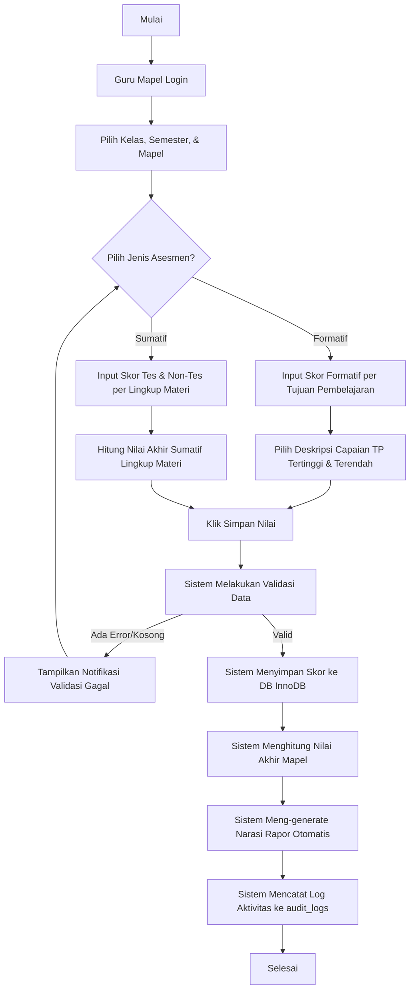
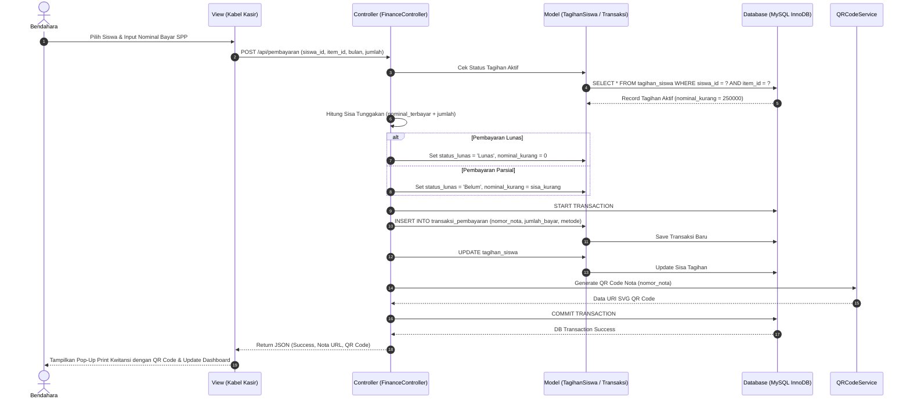

# 1. Software Requirements Specification (SRS) & Blueprint Detail
## Proyek: Sistem Informasi Sekolah SMP Islam Terpadu (SIS SMP IT)
**Konteks:** Transformasi Arsitektur SISFOKOL v7.00 (Code:SmartOffice) ke Blueprint Modern  
**Peran:** Senior Business Analyst, Software Engineer, & Kepala Sekolah/Guru

---

## 1. Pendahuluan & Lingkup Sistem

Sistem Informasi Sekolah (SIS) SMP Islam Terpadu dirancang untuk mendigitalkan seluruh operasional sekolah berbasis kurikulum nasional (Kurikulum Merdeka) dan nilai-nilai keislaman (Sistem IT - Islam Terpadu). Sistem ini merekonstruksi total kode warisan **SISFOKOL v7.00** menjadi arsitektur modern berbasis API, relasi database yang ketat (InnoDB), dan standar keamanan tinggi.

Sistem baru ini mencakup **10 peran pengguna (Roles)** dengan hak akses yang terisolasi secara aman menggunakan RBAC (Role-Based Access Control) berbasis Spatie Laravel Permission.

---

## 2. Kebutuhan Fungsional (Functional Requirements)

Berikut adalah daftar kebutuhan fungsional sistem baru yang dikelompokkan berdasarkan modul utama:

### 2.1. Modul Autentikasi & Akun (AUTH)
- **FR-AUTH-01 (Multi-Role Login):** Pengguna dapat login menggunakan satu pintu masuk (Single Sign-On) dengan username (NIP/NIS/Email) dan password. Sistem akan mengarahkan pengguna ke dashboard yang sesuai dengan role-nya.
- **FR-AUTH-02 (Enkripsi Kuat):** Sandi pengguna di-hash menggunakan algoritma **bcrypt** (minimum cost 10) atau **Argon2id**. Penggunaan hash MD5 (warisan SISFOKOL v7) sepenuhnya dilarang.
- **FR-AUTH-03 (Lupa Password):** Pengguna dapat mereset password secara mandiri melalui email verifikasi atau OTP WhatsApp resmi sekolah.
- **FR-AUTH-04 (Audit Trail/Log):** Setiap aktivitas krusial (login, tambah/edit/hapus data, perubahan nilai, cetak transaksi) harus dicatat ke dalam tabel `audit_logs` dengan informasi: User ID, IP Address, User Agent, Endpoint, Aksi, dan Payload sebelum/sesudah perubahan.

### 2.2. Modul Data Master & Akademik (ACAD)
- **FR-ACAD-01 (Tahun Ajaran & Semester):** Administrator dapat mengatur Tahun Pelajaran (Tapel) aktif dan Semester (Ganjil/Genap) aktif. Hanya ada satu Tapel-Semester yang aktif dalam satu waktu transaksi.
- **FR-ACAD-02 (Data Kelas & Wali):** Sistem mengelola data Kelas (nama, tingkat, daya tampung) yang terelasi secara unik dengan Wali Kelas (Guru) dan Tahun Ajaran.
- **FR-ACAD-03 (Data Guru & Siswa):** Sistem mencatat data profil lengkap siswa (NISN, Nama, Tempat Tanggal Lahir, Alamat, Orang Tua/Wali) dan profil guru (NIP/NUPTK, Jabatan, Golongan, Status Keaktifan).
- **FR-ACAD-04 (Mata Pelajaran & Kurikulum):** Sistem mengelola Mata Pelajaran (Mapel) berdasarkan Kurikulum Merdeka, mencakup struktur Tujuan Pembelajaran (TP) dan Lingkup Materi (LM) yang diinput oleh Guru Mapel.
- **FR-ACAD-05 (Jadwal Pelajaran):** Sistem menyediakan penyusunan jadwal pelajaran mingguan per kelas dengan deteksi bentrok otomatis untuk Guru, Ruang Kelas, dan Jam Pelajaran.

### 2.3. Modul Penilaian Kurikulum Merdeka (EVAL)
- **FR-EVAL-01 (Asesmen Formatif):** Guru Mapel dapat menginput skor Asesmen Formatif per siswa berdasarkan Tujuan Pembelajaran (TP) yang diampu.
- **FR-EVAL-02 (Asesmen Sumatif):** Guru Mapel dapat menginput skor Asesmen Sumatif Lingkup Materi (ASLM) dan Asesmen Sumatif Akhir Semester (ASAS).
- **FR-EVAL-03 (Nilai Akhir Rapor):** Sistem secara otomatis menghitung Nilai Akhir (NA) mata pelajaran dengan bobot formulasi yang dapat dikonfigurasi (misal: 60% Formatif + 40% Sumatif) dan menyusun narasi deskripsi capaian kompetensi secara otomatis berdasarkan nilai tertinggi dan terendah siswa.
- **FR-EVAL-04 (Proyek Penguatan Profil Pelajar Pancasila - P5):** Wali Kelas dapat membuat proyek P5 (tema, deskripsi, sub-elemen) dan menginput nilai perkembangan karakter siswa (Mulai Berkembang, Sedang Berkembang, Berkembang Sesuai Harapan, Sangat Berkembang).
- **FR-EVAL-05 (Cetak Rapor):** Wali Kelas dan Kepala Sekolah dapat mencetak Rapor Asesmen Akademik dan Rapor Proyek P5 dalam format PDF standar resmi Kemendikbudristek RI.

### 2.4. Modul Keuangan & Tabungan Siswa (FIN)
- **FR-FIN-01 (Item Pembayaran):** Bendahara dapat mendefinisikan item tagihan pembayaran siswa (SPP bulanan, Uang Gedung/Infaq pembangunan, Kegiatan) per siswa atau per angkatan/kelas.
- **FR-FIN-02 (Sistem Tagihan):** Sistem secara otomatis meng-generate tagihan SPP setiap tanggal 1 awal bulan bagi siswa yang aktif.
- **FR-FIN-03 (Transaksi SPP & Cetak Nota):** Bendahara dapat menginput pembayaran tunai/transfer, meng-update sisa tunggakan secara real-time, dan mencetak Kwitansi Pembayaran resmi berkode QR unik.
- **FR-FIN-04 (Tabungan Siswa):** Sistem menyediakan fitur Tabungan Sekolah (Setor, Tarik, Saldo) bagi siswa dengan log riwayat yang tidak bisa dimanipulasi (immutable ledger).

### 2.5. Modul Kedisiplinan & BK (DISC)
- **FR-DISC-01 (Sistem Poin Pelanggaran):** Guru BK dan Petugas Piket dapat mencatat pelanggaran siswa berdasarkan tabel master jenis pelanggaran dan skor poin pelanggaran (misalnya: terlambat = 5 poin, merokok = 50 poin).
- **FR-DISC-02 (Pembinaan & Surat Panggilan):** Jika poin pelanggaran siswa mencapai ambang batas tertentu (misalnya 100 poin), sistem otomatis meng-generate surat pembinaan/panggilan orang tua (PDF) dan memberikan notifikasi peringatan.
- **FR-DISC-03 (Pencatatan Prestasi):** Guru BK dapat mencatat prestasi akademik dan non-akademik siswa yang memberikan poin penghargaan (poin negatif pelanggaran) untuk menyeimbangkan skor kedisiplinan siswa.

### 2.6. Modul Presensi & Izin (PRES)
- **FR-PRES-01 (Presensi QR Code):** Siswa dan Guru melakukan scan QR Code kartu tanda anggota di gerbang sekolah melalui kamera tablet/PC petugas piket. Sistem mencatat jam kedatangan secara presisi.
- **FR-PRES-02 (Deteksi Terlambat):** Sistem membandingkan jam kedatangan dengan batas waktu masuk (misal 07:00 WIB) dan secara otomatis mencatat status keterlambatan beserta durasinya.
- **FR-PRES-03 (Absensi Harian):** Petugas Piket atau Wali Kelas menginput status ketidakhadiran siswa (Sakit, Izin, Alpha) yang terintegrasi langsung dengan rekap kehadiran di rapor akhir.
- **FR-PRES-04 (Izin Meninggalkan Kelas):** Petugas Piket dapat menginput "Izin Meninggalkan Sekolah" bagi siswa yang pulang lebih awal (karena sakit/keperluan mendesak) dengan persetujuan digital wali kelas dan mencetak Surat Izin Keluar ber-QR Code untuk verifikasi satpam.

### 2.7. Modul Inventaris & Sarpras (INV)
- **FR-INV-01 (Kartu Inventaris Barang - KIB):** Sarpras mengelola aset sekolah yang dikelompokkan sesuai standar pelaporan pemerintah: KIB A (Tanah), KIB B (Peralatan & Mesin), KIB C (Gedung & Bangunan), KIB D (Jalan, Irigasi & Jaringan), KIB E (Aset Tetap Lainnya/Buku), KIB F (Konstruksi Dalam Pengerjaan).
- **FR-INV-02 (Kartu Inventaris Ruangan - KIR):** Sarpras dapat menetapkan penempatan aset barang (KIB B) ke ruangan tertentu (misal: AC dan komputer di Laboratorium Komputer) dan mencetak lembar KIR untuk ditempel di pintu ruangan.

---

## 3. Kebutuhan Non-Fungsional (Non-Functional Requirements)

| Kode NFR | Kategori | Parameter Kebutuhan | Target Implementasi |
| --- | --- | --- | --- |
| **NFR-SEC-01** | Keamanan | Enkripsi Data Sensitif | Sandi wajib menggunakan `bcrypt` dengan work factor ≥ 10. Pengiriman data melalui internet wajib dilindungi SSL/TLS (HTTPS). |
| **NFR-SEC-02** | Keamanan | SQL Injection & XSS | Cegah SQL Injection menggunakan query binding (Prepared Statements) melalui ORM Eloquent. Output HTML wajib di-escape untuk mencegah XSS. |
| **NFR-SEC-03** | Keamanan | CSRF Protection | Setiap request POST/PUT/DELETE wajib menyertakan token CSRF yang valid untuk mencegah serangan session hijacking. |
| **NFR-PER-01** | Kinerja | Response Time | Waktu muat halaman dashboard (TTFB) tidak boleh melebihi 2.0 detik pada kondisi jaringan internet standar (3G/4G). |
| **NFR-PER-02** | Kinerja | Database Optimasi | Query pencarian siswa wajib dioptimasi menggunakan indeks komposit pada kolom pencarian (`nisn`, `nama`, `kelas_id`). Engine tabel wajib menggunakan **InnoDB** untuk mendukung row-level locking dan transaksi ACID. |
| **NFR-AVA-01** | Ketersediaan| Sistem Uptime | Layanan aplikasi harus memiliki ketersediaan minimum 99.5% per bulan, di luar jadwal maintenance terencana yang diumumkan sebelumnya. |
| **NFR-USA-01** | Usabilitas | Desain Responsif | Antarmuka pengguna wajib responsif menggunakan grid Bootstrap 5 atau Tailwind CSS agar dapat diakses secara optimal melalui smartphone, tablet, maupun PC. |
| **NFR-USA-02** | Lokalisasi | Bahasa & Waktu | Sistem menggunakan Bahasa Indonesia secara default dengan zona waktu Asia/Jakarta (WIB) dan format tanggal standar nasional (DD-MM-YYYY). |
| **NFR-USA-03** | Kompatibilitas| Browser Modern | Kompatibel penuh dengan Google Chrome, Mozilla Firefox, Apple Safari, dan Microsoft Edge versi terbaru. |
| **NFR-MAI-01** | Pemeliharaan| Struktur Kode & Git | Kode sumber wajib ditulis dengan arsitektur MVC (Model-View-Controller) menggunakan Framework Laravel 11. Setiap fungsionalitas utama wajib memiliki Unit & Feature Test untuk mencegah regresi saat update. |

---

## 4. Matriks Peran & Hak Akses (RBAC Matrix)

Berikut adalah pembagian hak akses (Permissions) untuk 10 peran dalam Sistem Informasi Sekolah Baru:

| Modul / Fitur | Admin | KS | Bendahara | Guru BK | Guru Mapel | Wali Kelas | Piket | Sarpras | Siswa | Orang Tua |
| --- | :---: | :---: | :---: | :---: | :---: | :---: | :---: | :---: | :---: | :---: |
| **Konfigurasi Sistem** | ⚙️ CRUD | 👁️ View | ❌ | ❌ | ❌ | ❌ | ❌ | ❌ | ❌ | ❌ |
| **Master Data Guru/Siswa** | ⚙️ CRUD | 👁️ View | ❌ | ❌ | ❌ | ❌ | ❌ | ❌ | ❌ | ❌ |
| **Jadwal Pelajaran** | ⚙️ CRUD | 👁️ View | ❌ | ❌ | 👁️ View | 👁️ View | ❌ | ❌ | 👁️ View | ❌ |
| **Presensi Harian Siswa** | 👁️ View | 👁️ View | ❌ | 👁️ View | ❌ | ⚙️ CRUD | ⚙️ CRUD | ❌ | ❌ | ❌ |
| **Izin Keluar/Masuk** | ❌ | 👁️ View | ❌ | 👁️ View | ❌ | 👁️ View | ⚙️ CRUD | ❌ | ❌ | ❌ |
| **Tujuan Pembelajaran (TP)** | ❌ | ❌ | ❌ | ❌ | ⚙️ CRUD | ❌ | ❌ | ❌ | ❌ | ❌ |
| **Input Nilai Akademik** | ❌ | ❌ | ❌ | ❌ | ⚙️ CRUD | ❌ | ❌ | ❌ | ❌ | ❌ |
| **Nilai Karakter P5** | ❌ | ❌ | ❌ | ❌ | ❌ | ⚙️ CRUD | ❌ | ❌ | ❌ | ❌ |
| **Cetak Rapor Semester** | ❌ | 👁️ View | ❌ | ❌ | ❌ | ⚙️ CRUD | ❌ | ❌ | 👁️ View | 👁️ View |
| **Item Tagihan Keuangan** | ⚙️ CRUD | 👁️ View | ⚙️ CRUD | ❌ | ❌ | ❌ | ❌ | ❌ | ❌ | ❌ |
| **Transaksi SPP & Tabungan**| ❌ | ❌ | ⚙️ CRUD | ❌ | ❌ | ❌ | ❌ | ❌ | ❌ | ❌ |
| **Laporan Tunggakan** | ❌ | 👁️ View | ⚙️ CRUD | ❌ | ❌ | 👁️ View | ❌ | ❌ | 👁️ View | 👁️ View |
| **Poin Pelanggaran** | ❌ | 👁️ View | ❌ | ⚙️ CRUD | ❌ | 👁️ View | ⚙️ CRUD | ❌ | 👁️ View | 👁️ View |
| **Pembinaan & Panggilan** | ❌ | 👁️ View | ❌ | ⚙️ CRUD | ❌ | 👁️ View | ❌ | ❌ | 👁️ View | 👁️ View |
| **Prestasi Siswa** | ❌ | 👁️ View | ❌ | ⚙️ CRUD | ❌ | 👁️ View | ⚙️ CRUD | ❌ | 👁️ View | 👁️ View |
| **Aset Inventaris KIB/KIR** | ❌ | 👁️ View | ❌ | ❌ | ❌ | ❌ | ❌ | ⚙️ CRUD | ❌ | ❌ |
| **Audit Logs & Keamanan** | 👁️ View | 👁️ View | ❌ | ❌ | ❌ | ❌ | ❌ | ❌ | ❌ | ❌ |

*Legenda:*
- **⚙️ CRUD:** Hak akses penuh membuat, membaca, memperbarui, dan menghapus data.
- **👁️ View:** Hanya dapat melihat data atau laporan tanpa hak memodifikasi.
- **❌:** Tidak memiliki akses sama sekali ke modul/fitur tersebut (ditolak di tingkat routing/API).

---

## 5. Entity Relationship Diagram (ERD) Visual - Model Normalisasi Modern

Database warisan SISFOKOL v7 menggunakan engine MyISAM tanpa foreign key dan banyak terjadi redudansi data (denormalisasi berlebihan). Di bawah ini adalah rancangan **ERD Relasional Normal (3NF) berbasis InnoDB** yang menjamin integritas referensial dan performa database yang tinggi.

```mermaid
erDiagram
    users {
        bigint id PK
        string username UK
        string email UK
        string password
        string role
        boolean is_active
        timestamp created_at
        timestamp updated_at
        timestamp deleted_at
    }

    tahun_ajaran {
        bigint id PK
        string tahun_pelajaran "2026/2027"
        enum semester "Ganjil_Genap"
        boolean is_active
        timestamp created_at
    }

    guru_karyawan {
        bigint id PK
        bigint user_id FK
        string nip UK
        string nama_lengkap
        string no_wa
        boolean is_active
    }

    siswa {
        bigint id PK
        bigint user_id FK
        string nisn UK
        string nis UK
        string nama_lengkap
        enum jenis_kelamin "L_P"
        string tempat_lahir
        date tanggal_lahir
        text alamat
        string no_wa_siswa
        timestamp deleted_at
    }

    orang_tua {
        bigint id PK
        bigint user_id FK
        string nama_ayah
        string nama_ibu
        string no_wa_ortu
    }

    siswa_orang_tua {
        bigint id PK
        bigint siswa_id FK
        bigint orang_tua_id FK
        string status_wali "Kandung_Wali"
    }

    kelas {
        bigint id PK
        bigint tahun_ajaran_id FK
        bigint wali_kelas_id FK "guru_karyawan_id"
        string nama_kelas "7-A_8-B"
        integer tingkat "7_8_9"
        integer kapasitas
    }

    kelas_siswa {
        bigint id PK
        bigint kelas_id FK
        bigint siswa_id FK
        integer no_urut
    }

    mata_pelajaran {
        bigint id PK
        string kode_mapel UK
        string nama_mapel
        integer kkm "Default KKM"
    }

    tp_mapel {
        bigint id PK
        bigint mapel_id FK
        string kode_tp "TP-01"
        text deskripsi_tp
        bigint tahun_ajaran_id FK
    }

    lm_mapel {
        bigint id PK
        bigint mapel_id FK
        string kode_lm "LM-01"
        text deskripsi_lm
        bigint tahun_ajaran_id FK
    }

    jadwal_pelajaran {
        bigint id PK
        bigint kelas_id FK
        bigint mapel_id FK
        bigint guru_id FK
        integer hari_no "1=Senin_6=Sabtu"
        time jam_mulai
        time jam_selesai
    }

    asesmen_formatif_score {
        bigint id PK
        bigint kelas_siswa_id FK
        bigint tp_id FK
        integer score "0-100"
        boolean is_achieved
        bigint guru_id FK
        timestamp updated_at
    }

    asesmen_sumatif_score {
        bigint id PK
        bigint kelas_siswa_id FK
        bigint lm_id FK
        integer score_non_tes "0-100"
        integer score_tes "0-100"
        integer score_akhir "Bobot NA"
        bigint guru_id FK
        timestamp updated_at
    }

    item_pembayaran {
        bigint id PK
        bigint tahun_ajaran_id FK
        string nama_item "SPP_Infaq"
        decimal nominal "12_2"
        enum tipe_pembayaran "Bulanan_Sekali"
    }

    tagihan_siswa {
        bigint id PK
        bigint siswa_id FK
        bigint item_id FK
        integer bulan_ke "1-12"
        decimal nominal_tagihan "12_2"
        decimal nominal_terbayar "12_2"
        decimal nominal_kurang "12_2"
        enum status_lunas "Lunas_Belum"
    }

    transaksi_pembayaran {
        bigint id PK
        bigint tagihan_id FK
        bigint bendahara_id FK "guru_karyawan_id"
        string nomor_nota UK
        date tanggal_bayar
        decimal jumlah_bayar "12_2"
        enum metode_bayar "Tunai_Transfer"
        string qrcode_nota
        timestamp created_at
    }

    tabungan_siswa {
        bigint id PK
        bigint siswa_id FK
        decimal saldo "12_2"
        timestamp updated_at
    }

    tabungan_log {
        bigint id PK
        bigint tabungan_id FK
        enum jenis_transaksi "Setor_Tarik"
        decimal nominal "12_2"
        decimal saldo_akhir "12_2"
        bigint operator_id FK "guru_karyawan_id"
        timestamp created_at
    }

    bk_pelanggaran_master {
        bigint id PK
        string kode_pelanggaran UK
        text nama_pelanggaran
        integer poin_nilai
        text sanksi_default
    }

    bk_prestasi_master {
        bigint id PK
        string kode_prestasi UK
        text nama_prestasi
        integer poin_penghargaan
    }

    siswa_pelanggaran {
        bigint id PK
        bigint siswa_id FK
        bigint pelanggaran_id FK
        date tanggal_kejadian
        text catatan_kejadian
        bigint petugas_id FK "guru_karyawan_id"
        boolean is_validated
        timestamp created_at
    }

    siswa_pembinaan {
        bigint id PK
        bigint siswa_id FK
        text deskripsi_pembinaan
        date tanggal_pembinaan
        bigint guru_bk_id FK "guru_karyawan_id"
        text status_perkembangan
    }

    presensi_harian {
        bigint id PK
        bigint user_id FK "Siswa/Guru"
        date tanggal
        time jam_masuk
        time jam_pulang
        enum status_kehadiran "Hadir_Sakit_Izin_Alpha_Terlambat"
        integer menit_terlambat
        text keterangan
    }

    ijin_meninggalkan_kelas {
        bigint id PK
        bigint siswa_id FK
        date tanggal
        time jam_keluar
        time jam_kembali
        text alasan
        bigint petugas_piket_id FK "guru_karyawan_id"
        boolean is_approved_wali_kelas
        string qrcode_surat_ijin
    }

    audit_logs {
        bigint id PK
        bigint user_id FK
        string ip_address
        string user_agent
        string action "INSERT_UPDATE_DELETE"
        string table_name
        text old_values
        text new_values
        timestamp created_at
    }

    users ||--|| guru_karyawan : "has one profile"
    users ||--|| siswa : "has one profile"
    users ||--|| orang_tua : "has one profile"
    siswa ||--o{ siswa_orang_tua : "has parents"
    orang_tua ||--o{ siswa_orang_tua : "has children"
    tahun_ajaran ||--o{ kelas : "memiliki"
    guru_karyawan ||--o{ kelas : "wali kelas"
    kelas ||--o{ kelas_siswa : "memiliki"
    siswa ||--o{ kelas_siswa : "terdaftar"
    mata_pelajaran ||--o{ tp_mapel : "memiliki TP"
    mata_pelajaran ||--o{ lm_mapel : "memiliki LM"
    kelas ||--o{ jadwal_pelajaran : "dijadwalkan"
    mata_pelajaran ||--o{ jadwal_pelajaran : "diajarkan"
    guru_karyawan ||--o{ jadwal_pelajaran : "mengajar"
    kelas_siswa ||--o{ asesmen_formatif_score : "dinilai"
    tp_mapel ||--o{ asesmen_formatif_score : "berdasarkan TP"
    kelas_siswa ||--o{ asesmen_sumatif_score : "dinilai"
    lm_mapel ||--o{ asesmen_sumatif_score : "berdasarkan LM"
    tahun_ajaran ||--o{ item_pembayaran : "memiliki"
    siswa ||--o{ tagihan_siswa : "memiliki"
    item_pembayaran ||--o{ tagihan_siswa : "berdasarkan item"
    tagihan_siswa ||--o{ transaksi_pembayaran : "dibayar"
    guru_karyawan ||--o{ transaksi_pembayaran : "bendahara penerima"
    siswa ||--|| tabungan_siswa : "memiliki"
    tabungan_siswa ||--o{ tabungan_log : "riwayat"
    siswa ||--o{ siswa_pelanggaran : "melanggar"
    bk_pelanggaran_master ||--o{ siswa_pelanggaran : "jenis"
    siswa ||--o{ siswa_pembinaan : "dibina"
    users ||--o{ presensi_harian : "melakukan"
    siswa ||--o{ ijin_meninggalkan_kelas : "mengajukan"
    users ||--o{ audit_logs : "mencatat aksi"
```



---

## 6. UML Diagram - Alur Proses Bisnis Krusial (Mermaid)

### 6.1. Use Case Diagram
Menggambarkan interaksi aktor-aktor kunci dengan batasan sistem baru.

```mermaid
useCaseDiagram
    rect "SIS SMP IT System Boundary"
        usecase UC_Login as "Login Multi-Role"
        usecase UC_Master as "Kelola Data Master (Admin)"
        usecase UC_Jadwal as "Kelola Jadwal & Ruang"
        usecase UC_TP_LM as "Kelola TP & Lingkup Materi (Guru)"
        usecase UC_Nilai as "Input Skor Asesmen Formatif/Sumatif"
        usecase UC_Proyek as "Input Nilai Karakter P5"
        usecase UC_Rapor as "Generate & Cetak Rapor (PDF)"
        usecase UC_Presensi as "Scan QR Presensi Kehadiran"
        usecase UC_Tagihan as "Generate Tagihan SPP Bulanan"
        usecase UC_Bayar as "Transaksi Keuangan SPP & Cetak Nota"
        usecase UC_BK as "Catat Pelanggaran & Poin (BK/Piket)"
        usecase UC_Pembinaan as "Proses Pembinaan & Surat Panggilan"
        usecase UC_Tabungan as "Kelola Tabungan Siswa"
        usecase UC_Audit as "Lihat Log Audit & Keamanan"
    end

    actor Admin as "Administrator"
    actor KS as "Kepala Sekolah"
    actor Guru as "Guru Mata Pelajaran"
    actor Wali as "Wali Kelas"
    actor Piket as "Petugas Piket"
    actor Bendahara as "Bendahara Sekolah"
    actor BK as "Guru BK"
    actor Siswa as "Siswa / Wali Murid"

    Admin --> UC_Login
    Admin --> UC_Master
    Admin --> UC_Audit

    KS --> UC_Login
    KS --> UC_Rapor
    KS --> UC_Audit

    Guru --> UC_Login
    Guru --> UC_TP_LM
    Guru --> UC_Nilai

    Wali --> UC_Login
    Wali --> UC_Proyek
    Wali --> UC_Rapor

    Piket --> UC_Login
    Piket --> UC_Presensi
    Piket --> UC_BK

    Bendahara --> UC_Login
    Bendahara --> UC_Tagihan
    Bendahara --> UC_Bayar
    Bendahara --> UC_Tabungan

    BK --> UC_Login
    BK --> UC_BK
    BK --> UC_Pembinaan

    Siswa --> UC_Login
    Siswa --> UC_Rapor
    Siswa --> UC_Bayar
```

### 6.2. Activity Diagram: Input Nilai Kurikulum Merdeka (Formatif & Sumatif)
Menggambarkan alur aktivitas guru saat melakukan input nilai dan bagaimana sistem mengolah narasi deskripsi capaian rapor secara otomatis.



### 6.3. Sequence Diagram: Transaksi Pembayaran SPP & Cetak Kwitansi QR
Menjelaskan interaksi objek waktu nyata (real-time) saat bendahara menginput pembayaran SPP bulanan siswa.



---

## 7. Desain Database Detail (Data Dictionary Blueprint Baru)

Berikut adalah kamus data untuk 5 tabel inti dari skema database baru yang dinormalisasi:

### 7.1. Tabel `users`
Menyimpan kredensial autentikasi terpusat untuk semua peran pengguna.

| Nama Kolom | Tipe Data | Constraint | Keterangan |
| --- | --- | --- | --- |
| `id` | bigint | PRIMARY KEY, AUTO_INCREMENT | Identifier unik pengguna. |
| `username` | varchar(100) | UNIQUE, NOT NULL | Digunakan untuk login (NIP, NISN, atau email). |
| `email` | varchar(100) | UNIQUE, NULLABLE | Alamat email pemulihan/kontak. |
| `password` | varchar(255) | NOT NULL | Password terenkripsi menggunakan `bcrypt`. |
| `role` | enum | NOT NULL | Enum: 'Admin', 'Kepala_Sekolah', 'Bendahara', 'Guru_BK', 'Guru_Mapel', 'Wali_Kelas', 'Piket', 'Sarpras', 'Siswa', 'Orang_Tua'. |
| `is_active` | boolean | DEFAULT true | Status keaktifan akun pengguna. |
| `created_at` | timestamp | NULLABLE | Waktu pendaftaran akun. |
| `deleted_at` | timestamp | NULLABLE | Digunakan untuk mekanisme soft delete. |

### 7.2. Tabel `siswa`
Menyimpan profil detail siswa secara terpisah dari kredensial login.

| Nama Kolom | Tipe Data | Constraint | Keterangan |
| --- | --- | --- | --- |
| `id` | bigint | PRIMARY KEY, AUTO_INCREMENT | ID internal unik siswa. |
| `user_id` | bigint | FOREIGN KEY -> `users.id` | Relasi satu-ke-satu ke akun login siswa. |
| `nisn` | varchar(10) | UNIQUE, NOT NULL | Nomor Induk Siswa Nasional standar Kemendikbud. |
| `nis` | varchar(20) | UNIQUE, NOT NULL | Nomor Induk Siswa lokal sekolah. |
| `nama_lengkap`| varchar(150) | NOT NULL | Nama lengkap siswa sesuai ijazah. |
| `jenis_kelamin`| enum | NOT NULL | Enum: 'L' (Laki-laki), 'P' (Perempuan). |
| `tempat_lahir`| varchar(100) | NOT NULL | Kota/Kabupaten kelahiran siswa. |
| `tanggal_lahir`| date | NOT NULL | Tanggal lahir siswa. |
| `alamat` | text | NOT NULL | Alamat tempat tinggal lengkap siswa. |
| `no_wa_siswa` | varchar(20) | NULLABLE | Nomor WhatsApp aktif siswa (jika ada). |

### 7.3. Tabel `tagihan_siswa`
Menyimpan status keuangan detail kewajiban pembayaran siswa.

| Nama Kolom | Tipe Data | Constraint | Keterangan |
| --- | --- | --- | --- |
| `id` | bigint | PRIMARY KEY, AUTO_INCREMENT | ID internal tagihan. |
| `siswa_id` | bigint | FOREIGN KEY -> `siswa.id` | Relasi ke siswa pemilik tagihan. |
| `item_id` | bigint | FOREIGN KEY -> `item_pembayaran.id` | Relasi ke master item pembayaran (SPP/Infaq). |
| `bulan_ke` | integer | CHECK (bulan_ke BETWEEN 1 AND 12) | Representasi bulan tagihan (1=Juli, 12=Juni). |
| `nominal_tagihan`| decimal(12,2)| NOT NULL | Jumlah tagihan yang harus dibayar. |
| `nominal_terbayar`| decimal(12,2)| DEFAULT 0.00 | Total dana yang sudah disetorkan. |
| `nominal_kurang`| decimal(12,2)| GENERATED ALWAYS AS (nominal_tagihan - nominal_terbayar) | Kolom kalkulasi otomatis sisa kekurangan. |
| `status_lunas`| enum | DEFAULT 'Belum' | Enum: 'Lunas', 'Belum'. |

### 7.4. Tabel `asesmen_formatif_score`
Menyimpan hasil evaluasi formatif berbasis Tujuan Pembelajaran (TP) Kurikulum Merdeka.

| Nama Kolom | Tipe Data | Constraint | Keterangan |
| --- | --- | --- | --- |
| `id` | bigint | PRIMARY KEY, AUTO_INCREMENT | ID internal skor formatif. |
| `kelas_siswa_id`| bigint | FOREIGN KEY -> `kelas_siswa.id` | Relasi ke siswa terdaftar di kelas bersangkutan. |
| `tp_id` | bigint | FOREIGN KEY -> `tp_mapel.id` | Relasi ke Tujuan Pembelajaran (TP) yang dinilai. |
| `score` | integer | CHECK (score BETWEEN 0 AND 100) | Skor formatif siswa (0 - 100). |
| `is_achieved` | boolean | GENERATED ALWAYS AS (score >= 75) | Penanda ketuntasan otomatis berdasarkan KKM/KKTP. |
| `guru_id` | bigint | FOREIGN KEY -> `guru_karyawan.id` | Guru yang menginput/menilai. |
| `updated_at` | timestamp | NOT NULL | Waktu pembaruan nilai terakhir. |

### 7.5. Tabel `audit_logs`
Mencatat seluruh rekam jejak transaksi data krusial untuk mencegah kecurangan (fraud) nilai/keuangan.

| Nama Kolom | Tipe Data | Constraint | Keterangan |
| --- | --- | --- | --- |
| `id` | bigint | PRIMARY KEY, AUTO_INCREMENT | ID log keamanan. |
| `user_id` | bigint | FOREIGN KEY -> `users.id` | Pengguna yang melakukan perubahan data. |
| `ip_address` | varchar(45) | NOT NULL | Alamat IP komputer pelaku (IPv4/IPv6). |
| `user_agent` | string | NOT NULL | Detail browser/perangkat yang digunakan. |
| `action` | enum | NOT NULL | Enum: 'INSERT', 'UPDATE', 'DELETE'. |
| `table_name` | varchar(100) | NOT NULL | Nama tabel database yang diubah nilainya. |
| `old_values` | json | NULLABLE | Snapshot data lama sebelum diubah (format JSON). |
| `new_values` | json | NULLABLE | Snapshot data baru setelah diubah (format JSON). |
| `created_at` | timestamp | NOT NULL | Waktu terjadinya transaksi data. |
