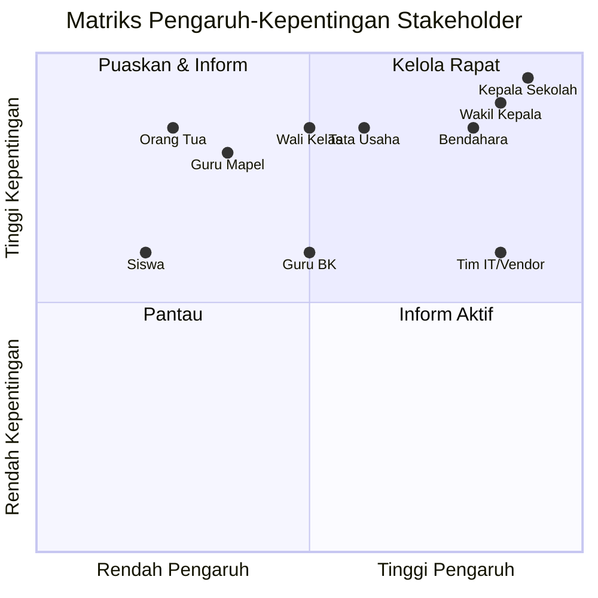

# 03 — Identifikasi Stakeholder
### Proyek: Sistem Informasi Sekolah SMP Islam Terpadu

## 1. Pendahuluan

Dokumen ini mengidentifikasi seluruh pihak yang berkepentingan (*stakeholder*) dengan proyek Sistem Informasi Sekolah SMP Islam Terpadu beserta kebutuhan, ekspektasi, dan strategi pengelolaannya. Identifikasi ini mengacu pada struktur 9 modul peran yang ada pada SISFOKOL v7.00 serta pemegang kepentingan eksternal.

## 2. Matriks Pengaruh vs Kepentingan

> **Cara membaca:** Kuadran kiri-atas (kelola rapat) dan kanan-bawah (inform aktif) menjadi prioritas komunikasi tertinggi.

## 3. Tabel Stakeholder + Kebutuhan

| ID | Stakeholder | Jabatan/Peran | Modul SISFOKOL | Kebutuhan Utama | Ekspektasi | Pengaruh | Kepentingan | Strategi Komunikasi |
|----|-------------|---------------|----------------|-----------------|------------|----------|-------------|---------------------|
| SH-01 | **Kepala Sekolah** | Pemimpin tertinggi, sponsor | `admks` | Dashboard rekap sekolah, approval rapor, monitoring tunggakan & BK | Laporan real-time, transparansi total | Tinggi | Tinggi | Rapat mingguan, dashboard |
| SH-02 | **Wakil Kepala Sekolah** | PM, bid. kurikulum | `admks`/`admwk` | Monitoring akademik, jadwal, jurnal guru | Akurasi data kurikulum | Tinggi | Tinggi | Rapat mingguan |
| SH-03 | **Tata Usaha (TU)** | Admin master data | `adm` | Input master siswa/pegawai/kelas/mapel, cetak kartu | Kemudahan input & impor Excel | Sedang | Tinggi | Konsultasi rutin |
| SH-04 | **Bendahara** | Keuangan siswa | `admbdh` | Tagihan, pembayaran, tunggakan, tabungan, kuitansi | Pelacakan piutang akurat | Tinggi | Tinggi | Rapat mingguan |
| SH-05 | **Guru Mapel** | Pengajar | `admgr` | Input nilai Kurmer, jurnal mengajar, filebox RPP | Input nilai cepat & mobile | Rendah | Tinggi | Sosialisasi + pelatihan |
| SH-06 | **Wali Kelas** | Pembina kelas | `admwk` | Input nilai, rekap absensi, cetak rapor, sikap siswa | Rapor otomatis & cepat | Sedang | Tinggi | Pelatihan intensif |
| SH-07 | **Guru BK** | Bimbingan konseling | `admbk` | Catatan pelanggaran, poin, prestasi, pembinaan | Histori perilaku lengkap | Sedang | Sedang | Konsultasi |
| SH-08 | **Siswa** | Peserta didik | `admsw` | Lihat nilai, jadwal, tagihan, tabungan, QR presensi | Akses mudah via HP | Rendah | Sedang | Sosialisasi |
| SH-09 | **Orang Tua/Wali** | Wali siswa | portal ortu (`passwordx_ortu`) | Pantau nilai, kehadiran, tagihan SPP | Transparansi & notifikasi | Rendah | Tinggi | WA + portal |
| SH-10 | **Tim IT / Vendor** | Implementasi | semua modul | Akses teknis, dokumentasi, server | Spesifikasi yang jelas | Tinggi | Sedang | Rapat teknis |

## 4. RACI Ringkas Pengambilan Keputusan

| Aktivitas | Kepsek | Wakil | TU | Bendahara | IT/Vendor |
|-----------|:------:|:-----:|:--:|:---------:|:---------:|
| Persetujuan anggaran | **A** | C | I | I | C |
| Persetujuan ruang lingkup | **A** | **R** | C | C | C |
| Kustomisasi kode | I | A | I | I | **R** |
| Migrasi data siswa | I | A | **R** | C | C |
| Validasi modul keuangan | I | C | I | **R/A** | I |
| UAT & persetujuan go-live | **A** | **R** | C | C | C |

> **R** = Responsible, **A** = Accountable, **C** = Consulted, **I** = Informed

## 5. Strategi Komunikasi

| Stakeholder | Saluran | Frekuensi | Format |
|-------------|---------|-----------|--------|
| Kepsek & Wakil | Rapat tatap muka | Mingguan | Dashboard + laporan |
| Bendahara/TU | Rapat + WA grup | Mingguan | Progress & demo |
| Guru & Wali Kelas | Pelatihan + WA grup | Per fase | Sesi praktik |
| Siswa & Ortu | WA Broadcast + portal | Saat go-live | Panduan singkat |
| Tim IT | Rapat teknis | 2× minggu | Log teknis |

## 6. Penutup

Sepuluh stakeholder di atas mencakup seluruh pihak yang terdampak langsung. Setiap modul SISFOKOL dipetakan ke stakeholder penanggung jawab sehingga akuntabilitas pengelolaan fitur menjadi jelas sejak fase perencanaan.
