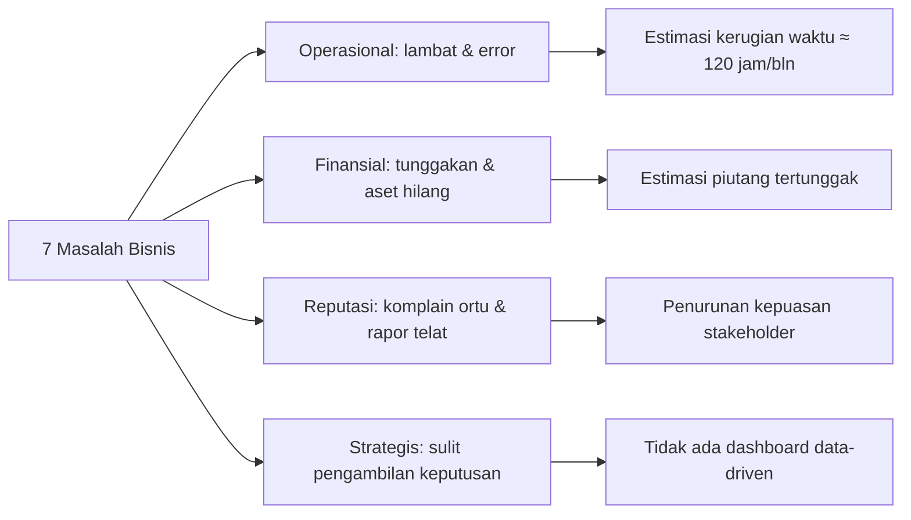

# 04 — Analisis Kebutuhan Bisnis
### Proyek: Sistem Informasi Sekolah SMP Islam Terpadu

## 1. Latar Belakang Bisnis

SMP Islam Terpadu mengelola administrasi dengan kombinasi Excel, buku catatan, dan fotokopi manual. Seiring pertumbuhan jumlah siswa, proses manual ini menimbulkan inefisiensi, risiko kesalahan, dan ketidaktransparanan. Analisis kebutuhan bisnis ini mengidentifikasi 7 masalah utama beserta dampak, solusi yang ditawarkan SIS, dan prioritasnya.

## 2. Analisis SWOT Ringkas

| **Kekuatan (Strength)** | **Kelemahan (Weakness)** |
|------------------------|--------------------------|
| SDM guru kompeten; yayasan mendukung digitalisasi | Data terpencar di Excel; minim integrasi |
| **Peluang (Opportunity)** | **Ancaman (Threat)** |
| Tren Smart School; dukungan SISFOKOL open-source | Resistensi perubahan; keterbatasan anggaran |

## 3. Tabel Masalah Bisnis + Dampak

| ID | Masalah Bisnis | Dampak Saat Ini | Kategori | Penyebab Akar | Solusi SIS (Modul) | Prioritas |
|----|----------------|-----------------|----------|---------------|--------------------|-----------|
| PB-01 | **Penilaian & rapor lambat dan rentan salah hitung** | Rapor sering terlambat >3 hari; kesalahan rekap nilai manual | Akademik | Input nilai di Excel per mapel lalu direkap manual; tidak ada rumus KKM/Kurmer baku | Modul Penilaian Kurikulum Merdeka + Cetak Rapor otomatis (`admgr/kurmer`, `admwk/nil`) | **Tinggi** |
| PB-02 | **Tunggakan SPP tidak terlacak dengan baik** | Piutang tertunggak; arus kas yayasan terganggu | Keuangan | Pencatatan pembayaran manual di buku; tidak ada notifikasi otomatis | Modul Tagihan/Pembayaran/Tunggakan + WA notifikasi (`admbdh/keu`, `wa_tagihan_siswa`) | **Tinggi** |
| PB-03 | **Presensi siswa mudah dimanipulasi & rekap lambat** | Data kehadiran tidak akurat; sulit pantau siswa bermasalah | Kesiswaan | Absen manual di buku kelas; tidak ada verifikasi kehadiran fisik | Presensi QR Code + rekap otomatis (`adm/ab`, `admpiket/ab`) | **Tinggi** |
| PB-04 | **Data siswa & pegawai terpencar dan duplikatif** | Layanan lambat; data tidak konsisten antar bagian | Master Data | Tiap bagian (TU, BK, Bendahara) pegang Excel sendiri | Master data tunggal + impor Excel (`adm`, `m_siswa`, `m_pegawai`) | **Tinggi** |
| PB-05 | **Pembinaan BK tidak terdokumentasi terstruktur** | Sulit evaluasi tren perilaku; laporan BK lemah | Kesiswaan/BK | Pencatatan pelanggaran di buku terpisah, tanpa sistem poin | Modul BK: poin, pelanggaran, prestasi, pembinaan (`admbk`) | **Sedang** |
| PB-06 | **Inventaris sarana prasarana tidak terdata rapi** | Aset hilang/tidak terlacak; laporan BOS sulit | Inventaris | Daftar aset manual; tidak ada kategori KIB | Modul Inventaris KIB A–F (`adminv/inv`, `adm/inv`) | **Sedang** |
| PB-07 | **Orang tua kurang terlibat & tidak transparan** | Komplain tagihan & nilai; kepercayaan rendah | Komunikasi | Tidak ada portal/akses bagi orang tua | Portal Orang Tua (akun ortu) + notifikasi WA (`admsw`, `passwordx_ortu`) | **Sedang** |

## 4. Dampak Bisnis (Business Impact) per Masalah

## 5. Analisis GAP

| Aspek | Kondisi Saat Ini (As-Is) | Kondisi Harapan (To-Be) | GAP |
|-------|--------------------------|--------------------------|-----|
| Input nilai | Excel per guru, rekap manual | Input langsung di sistem, terhitung otomatis | Proses + alat |
| Presensi | Buku manual | QR Code + rekap otomatis | Alat + metode |
| Keuangan | Buku kas & kuitansi tulis tangan | Sistem tagihan, pembayaran, kuitansi cetak | Proses + alat |
| Data induk | Excel per bagian | Database tunggal, terintegrasi | Arsitektur |
| Laporan | Disusun manual berkala | Real-time dashboard + cetak on-demand | Alat + akses |
| Komunikasi ortu | Lembar pengumuman/rapat terbatas | Portal + notifikasi WA | Saluran |

## 6. Kebutuhan Bisnis Tingkat Tinggi (Business Requirements)

| Kode | Kebutuhan Bisnis | Pemilik | Indikator |
|------|------------------|---------|-----------|
| BR-01 | Pemusatan data induk siswa & pegawai | TU | 1 sumber data tunggal |
| BR-02 | Otomatisasi penilaian & rapor Kurmer | Guru/Wali Kelas | Rapor ≤ 1 hari kerja |
| BR-03 | Pelacakan keuangan & tunggakan real-time | Bendahara | Rekap otomatis harian |
| BR-04 | Presensi akurat berbasis QR | Piket/Wali Kelas | Selisih ≤ 1% |
| BR-05 | Dokumentasi BK terstruktur | Guru BK | Histori poin lengkap |
| BR-06 | Inventaris aset terkategori KIB | Sarpras | Aset 100% terdata |
| BR-07 | Transparansi & keterlibatan orang tua | Kepsek/Ortu | Portal + WA aktif |

## 7. Prioritisasi Masalah (Metode MoSCoW)

| Prioritas | Masalah |
|-----------|---------|
| **Must Have** | PB-01, PB-02, PB-03, PB-04 |
| **Should Have** | PB-05, PB-07 |
| **Could Have** | PB-06 |
| **Won't Have (Fase 1)** | Integrasi payment gateway otomatis |

## 8. Kesimpulan

Tujuh masalah bisnis utama teridentifikasi, empat di antaranya berprioritas tinggi (penilaian/rapor, tunggakan, presensi, data induk). Platform SISFOKOL v7.00 telah memiliki modul untuk menjawab seluruh masalah tersebut. Implementasi yang tepat diproyeksikan menghemat ≥120 jam kerja/bulan dan meningkatkan akurasi serta transparansi layanan sekolah.
