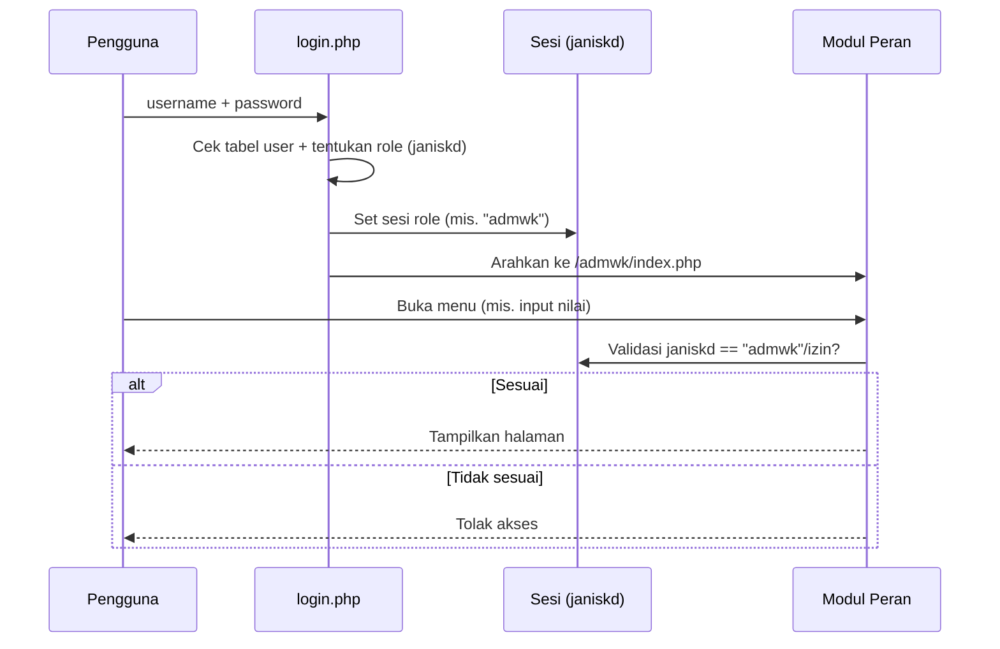

# 06 — User Role dan Hak Akses (RBAC)
### Proyek: Sistem Informasi Sekolah SMP Islam Terpadu

## 1. Pendahuluan

Dokumen ini mendefinisikan model **Role-Based Access Control (RBAC)** sistem. SISFOKOL v7.00 mengimplementasikan RBAC melalui pemisahan folder modul per peran (`adm`, `admks`, `admwk`, `admgr`, `admbk`, `admbdh`, `admpiket`, `admsw`, `adminv`) yang dipilih saat login berdasarkan field `janiskd`/role pada data pengguna. Setiap peran hanya dapat mengakses modulnya sendiri.

## 2. Daftar Peran (Role)

| ID Role | Nama Peran | Folder Modul SISFOKOL | Deskripsi |
|---------|-----------|------------------------|-----------|
| R-ADMIN | Administrator / TU | `adm` | Super user: master data, konfigurasi, semua laporan |
| R-KS | Kepala Sekolah | `admks` | Approval, dashboard rekap, monitoring seluruh bidang |
| R-WK | Wali Kelas | `admwk` | Input nilai, rapor, absensi kelas binaan |
| R-GURU | Guru Mapel | `admgr` | Input nilai mapel, jurnal mengajar, RPP |
| R-BK | Guru BK | `admbk` | Pelanggaran, poin, prestasi, pembinaan |
| R-BDH | Bendahara | `admbdh` | Tagihan, pembayaran, tunggakan, tabungan |
| R-PIKET | Petugas Piket | `admpiket` | Presensi siswa & pegawai, catatan kejadian |
| R-SARPRAS | Sarana Prasarana | `adminv` | Inventaris KIB A–F |
| R-SISWA | Siswa | `admsw` | Portal: nilai, jadwal, tagihan, tabungan |
| R-ORTU | Orang Tua | portal ortu (`admsw` via `passwordx_ortu`) | Pantau nilai, absensi, tagihan |

## 3. Matriks Hak Akses (Role × Modul/Fungsi)

> **C** = Create, **R** = Read, **U** = Update, **D** = Delete, **A** = Approve, **–** = tidak ada akses

| Fungsi / Modul | ADMIN | KEPSEK | WAKIL/WALI KELAS | GURU MAPEL | GURU BK | BENDAHARA | PIKET | SARPRAS | SISWA | ORTU |
|----------------|:-----:|:------:|:----------------:|:----------:|:-------:|:---------:|:-----:|:-------:|:-----:|:----:|
| **Master Data Siswa** | CRUD | R | R | R | R | R | R | – | R (diri) | R (anak) |
| **Master Pegawai** | CRUD | R | R | R | – | – | – | – | – | – |
| **Master Kelas/Mapel/Tapel** | CRUD | R | R | R | – | – | – | – | R | – |
| **Walikelas & Piket** | CRUD | R | – | – | – | – | – | – | – | – |
| **Input Nilai Formatif/Sumatif** | R | R | CRU | CRU | – | – | – | – | R | R |
| **Hitung NA & Predikat** | R | R | CRU | R | – | – | – | – | R | R |
| **Sikap & Catatan Rapor** | R | A | CRU | – | R | – | – | – | R | R |
| **Cetak Rapor** | R | R/A | R/A | – | – | – | – | – | R | R |
| **Jadwal Pelajaran** | CRU | R | R | R | – | – | – | – | R | – |
| **Jurnal Mengajar Guru** | R | R | – | CRU | – | – | – | – | – | – |
| **RPP / Silabus (Filebox)** | R | A | R | CRU | – | – | – | – | – | – |
| **Presensi Siswa (QR)** | R | R | R | – | – | – | CRU | – | R | R |
| **Presensi Pegawai** | R | R | – | – | – | – | CRU | – | – | – |
| **Rekap Absensi Kelas** | R | R | R | – | – | – | R | – | R | R |
| **Pelanggaran & Poin BK** | R | R | R | – | CRUD | – | R | – | R | R |
| **Prestasi Siswa** | R | R | R | – | CRUD | – | – | – | R | R |
| **Pembinaan BK** | R | R | – | – | CRUD | – | – | – | – | R |
| **Tagihan Siswa** | R | R | R | – | – | CRUD | – | – | R | R |
| **Pembayaran & Kuitansi** | R | R | – | – | – | CRU | – | – | R | R |
| **Rekap Tunggakan** | R | R | R | – | – | R | – | – | R | R |
| **Tabungan Siswa** | R | R | R | – | – | CRU | – | – | R | R |
| **Notifikasi WA Tagihan** | R | R | – | – | – | CRU | – | – | – | – |
| **Inventaris KIB A–F** | CRU | R | – | – | – | – | – | CRUD | – | – |
| **Cetak Kartu Siswa/Pegawai (QR)** | CRU | R | – | – | – | – | – | – | – | – |
| **Dashboard Rekap Sekolah** | R | R | R (kelas) | – | – | R (keu) | R (piket) | R (inv) | R (diri) | R (anak) |
| **Konfigurasi Sistem/Profil** | CRU | R | – | – | – | – | – | – | – | – |
| **Manajemen User** | CRUD | R | – | – | – | – | – | – | R (pass) | R (pass) |

## 4. Prinsip RBAC yang Diberlakukan

1. **Separation by module**: Setiap peran hanya mendapat *entry point* ke foldernya sendiri; URL modul peran lain ditolak.
2. **Session validation**: Setiap halaman mengecek `$_SESSION['janiskd']` (role) sebelum menampilkan menu/data.
3. **Least privilege**: Siswa & orang tua hanya membaca data miliknya sendiri.
4. **Approval workflow**: Cetak rapor & RPP memerlukan persetujuan Wali Kelas/Kepala Sekolah.
5. **Time-bound role**: Petugas piket hanya bisa login pada hari/jadwal piketnya.

## 5. Contoh Alur Validasi Akses

## 6. Catatan Keamanan & Peningkatan

- Penyimpanan password saat ini memakai hash (direkomendasikan migrasi ke **bcrypt**/**password_hash**).
- Disarankan menambah **audit log** khusus akses (`user_log_login`, `user_log_entri`) untuk setiap operasi sensitif (delete, cetak rapor, hapus keuangan).
- Direkomendasikan **re-authentication** untuk operasi destruktif (delete massal, konfigurasi sistem).
