# 07 — Proses Bisnis (As-Is & To-Be)
### Proyek: Sistem Informasi Sekolah SMP Islam Terpadu

## 1. Pendahuluan

Dokumen ini memetakan proses bisnis sekolah pada kondisi **As-Is** (saat ini, manual) dan **To-Be** (setelah sistem). Lima proses inti dipetakan dalam bentuk *flowchart*/BPMN: (1) Pendaftaran/Entri Siswa Baru, (2) Input Nilai & Raport, (3) Presensi Kehadiran, (4) Pembayaran & Tunggakan SPP, (5) Pencatatan Pelanggaran BK.

## 2. Proses 1 — Pendaftaran & Entri Data Siswa Baru

### 2.1 As-Is (Manual)
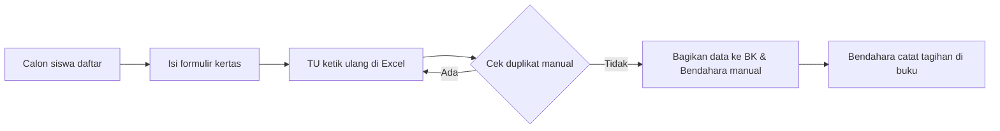
**Masalah:** duplikasi input, data tidak sinkron antar bagian, lambat.

### 2.2 To-Be (Sistem)
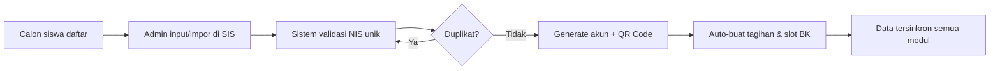
**Manfaat:** sekali input, data menyebar ke BK, keuangan, presensi; QR otomatis.

## 3. Proses 2 — Input Nilai & Cetak Rapor

### 3.1 As-Is
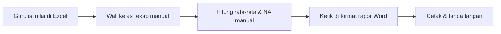

### 3.2 To-Be
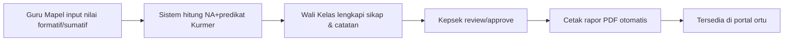

## 4. Proses 3 — Presensi Kehadiran Siswa

### 4.1 As-Is
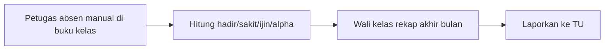

### 4.2 To-Be
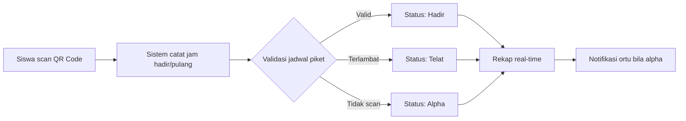

## 5. Proses 4 — Pembayaran SPP & Tunggakan

### 5.1 As-Is
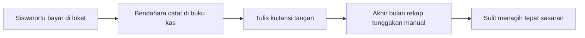

### 5.2 To-Be
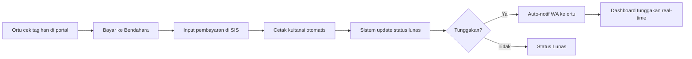

## 6. Proses 5 — Pencatatan Pelanggaran & BK

### 6.1 As-Is
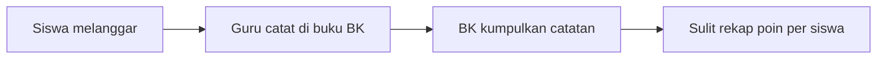

### 6.2 To-Be
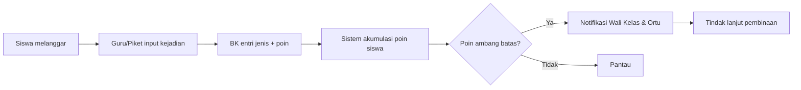

## 7. Perbandingan As-Is vs To-Be (Ringkas)

| Proses | Waktu As-Is | Waktu To-Be | Risiko Kesalahan As-Is | To-Be |
|--------|-------------|-------------|------------------------|-------|
| Entri Siswa Baru | 30–45 mnt | 5–10 mnt | Duplikasi tinggi | Validasi otomatis |
| Input Nilai & Rapor | Berhari-hari | ≤ 1 hari | Salah hitung | Otomatis Kurmer |
| Presensi | 15 mnt/kelas | Real-time | Manipulatif | QR terverifikasi |
| Pembayaran SPP | Manual, rekap lama | Seketika + WA | Salah catat | Auto kuitansi |
| Pelanggaran BK | Tersebar | Terkonsolidasi | Sulit rekap | Akumulasi poin |

## 8. BPMN Tingkat Tinggi (To-Be — Input Nilai)

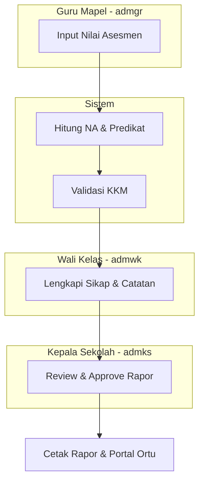

## 9. Penutup

Lima proses inti di atas menunjukkan bahwa otomatisasi via SIS menghemat waktu signifikan, mengurangi kesalahan, dan meningkatkan transparansi serta keterlibatan orang tua.
