# 08 — Use Case & User Story
### Proyek: Sistem Informasi Sekolah SMP Islam Terpadu

## 1. Aktor (Actor)

| Aktor | Tipe | Keterangan |
|-------|------|-----------|
| Admin/TU | Primer | Master data & konfigurasi |
| Kepala Sekolah | Primer | Approval & monitoring |
| Wali Kelas | Primer | Nilai & rapor kelas |
| Guru Mapel | Primer | Input nilai mapel |
| Guru BK | Primer | Modul BK |
| Bendahara | Primer | Keuangan siswa |
| Petugas Piket | Primer | Presensi |
| Sarpras | Primer | Inventaris |
| Siswa | Sekunder | Portal pribadi |
| Orang Tua | Sekunder | Pantau anak |
| Sistem (Scheduler) | Sekunder | WA notifikasi otomatis |

## 2. Use Case Diagram

```mermaid
flowchart LR
    Admin((Admin/TU))
    KS((Kepala Sekolah))
    WK((Wali Kelas))
    GM((Guru Mapel))
    BK((Guru BK))
    BDH((Bendahara))
    PKT((Petugas Piket))
    SIS((Siswa))
    ORT((Orang Tua))
    SYS{{Sistem}}

    subgraph SISF[SISTEM INFORMASI SEKOLAH]
      UC1((UC01 Login))
      UC2((UC02 Kelola Master Data))
      UC3((UC03 Input Nilai))
      UC4((UC04 Hitung NA))
      UC5((UC05 Cetak Rapor))
      UC6((UC06 Presensi QR))
      UC7((UC07 Rekap Absensi))
      UC8((UC08 Kelola Tagihan))
      UC9((UC09 Input Pembayaran))
      UC10((UC10 Cetak Kuitansi))
      UC11((UC11 Notifikasi WA))
      UC12((UC12 Catat Pelanggaran))
      UC13((UC13 Kelola Inventaris))
      UC14((UC14 Pantau Portal))
      UC15((UC15 Approval Rapor))
      UC16((UC16 Unggah RPP))
      UC17((UC17 Ganti Password))
      UC18((UC18 Dashboard Rekap))
    end

    Admin---UC1 & UC2 & UC13 & UC17
    KS---UC1 & UC15 & UC18
    WK---UC1 & UC3 & UC4 & UC5 & UC7
    GM---UC1 & UC3 & UC16
    BK---UC1 & UC12
    BDH---UC1 & UC8 & UC9 & UC10 & UC11
    PKT---UC1 & UC6
    SIS---UC1 & UC6 & UC14 & UC17
    ORT---UC1 & UC14
    SYS---UC11
```

## 3. Daftar Use Case (≥12)

| Kode | Nama Use Case | Aktor Utama | Deskripsi Singkat | Prioritas |
|------|---------------|-------------|-------------------|-----------|
| UC-01 | Login & Logout | Semua | Autentikasi & sesi per peran | High |
| UC-02 | Kelola Master Data (Siswa/Pegawai/Kelas/Mapel/Tapel) | Admin | CRUD + impor Excel | High |
| UC-03 | Input Nilai Asesmen (Formatif/Sumatif) | Guru/WK | Entri nilai Kurmer per mapel | High |
| UC-04 | Hitung Nilai Akhir (NA) & Predikat | WK/Sistem | Hitung otomatis NA + predikat | High |
| UC-05 | Cetak Rapor | WK/KS | Generate rapor lengkap | High |
| UC-06 | Presensi Siswa via QR Code | Siswa/Piket | Scan QR tercatat | High |
| UC-07 | Rekap Absensi Kelas | WK/Piket | Laporan hadir/sakit/ijin/alpha | High |
| UC-08 | Kelola Tagihan Siswa | Bendahara | Buat & atur tagihan per item | High |
| UC-09 | Input Pembayaran & Cetak Kuitansi | Bendahara | Catat bayar + cetak | High |
| UC-10 | Rekap Tunggakan | Bendahara/KS | Status tunggakan real-time | High |
| UC-11 | Notifikasi Tagihan WhatsApp | Bendahara/Sistem | Kirim WA otomatis | Medium |
| UC-12 | Catat Pelanggaran & Poin BK | Guru BK | Entri jenis + poin siswa | Medium |
| UC-13 | Kelola Inventaris KIB | Sarpras | CRUD aset + cetak kartu | Medium |
| UC-14 | Pantau Portal (Siswa/Ortu) | Siswa/Ortu | Lihat nilai/tagihan/jadwal | High |
| UC-15 | Approval Rapor & RPP | Kepsek | Review & setujui | Medium |
| UC-16 | Unggah RPP/Silabus | Guru | Upload filebox + approval | Medium |
| UC-17 | Ganti Password | Semua | Self-service password | Medium |
| UC-18 | Lihat Dashboard Rekap Sekolah | Kepsek | Ringkasan seluruh bidang | High |
| UC-19 | Entri Jurnal Mengajar | Guru | Agenda harian mengajar | Low |
| UC-20 | Kelola Tabungan Siswa | Bendahara | Setor/tarik tabungan | Low |

## 4. Spesifikasi Detail Use Case (Contoh: UC-05 Cetak Rapor)

| Field | Isi |
|-------|-----|
| **Kode** | UC-05 |
| **Nama** | Cetak Rapor |
| **Aktor** | Wali Kelas (primer), Kepala Sekolah (approver) |
| **Pre-kondisi** | Nilai semua mapel terisi, NA terhitung, sikap & catatan lengkap |
| **Post-kondisi** | Rapor tercetak/PDF; tersedia di portal ortu |
| **Alur Utama** | 1) WK buka menu Rapor → 2) Pilih kelas & siswa → 3) Sistem kumpulkan nilai/absensi/sikap → 4) WK review → 5) Submit approval → 6) KS approve → 7) Cetak/PDF |
| **Alur Alternatif** | 4a) Data belum lengkap → tampilkan peringatan mapel kosong |
| **Aturan Bisnis** | BR-R01 (NA otomatis), BR-R06 (approval KS) |
| **Non-Fungsional** | NFR-01 respon ≤ 3 dtk |

## 5. User Story (Format Agile)

| ID | Sebagai... | Saya ingin... | Sehingga... | Prioritas |
|----|-----------|---------------|-------------|-----------|
| US-01 | Admin | Mengimpor data siswa via Excel | Tidak perlu input satu per satu | High |
| US-02 | Guru Mapel | Memasukkan nilai formatif & sumatif dari HP | Input cepat di mana saja | High |
| US-03 | Wali Kelas | Mencetak rapor otomatis | Menghemat waktu rekap | High |
| US-04 | Bendahara | Melihat daftar tunggakan real-time | Menagih tepat sasaran | High |
| US-05 | Orang Tua | Melihat tagihan & status via portal | Tahu kewajiban tepat waktu | High |
| US-06 | Siswa | Memeriksa QR untuk presensi | Tidak perlu absen manual | High |
| US-07 | Kepsek | Melihat dashboard rekap sekolah | Mengambil keputusan berbasis data | High |
| US-08 | Guru BK | Mencatat poin pelanggaran | Memantau perilaku siswa | Medium |
| US-09 | Petugas Piket | Memindai presensi siswa cepat | Menyelesaikan piket tepat waktu | High |
| US-10 | Sarpras | Merekam aset inventaris | Aset terlacak & tidak hilang | Medium |
| US-11 | Orang Tua | Menerima notifikasi WA tagihan | Tidak lupa bayar SPP | Medium |
| US-12 | Siswa | Melihat jadwal pelajaran | Tahu jam pelajaran | Medium |

## 6. Kriteria Penerimaan (Acceptance Criteria) — Contoh US-03

1. Rapor memuat seluruh mapel dengan NA & predikat.
2. Jika ada mapel kosong, sistem memblokir cetak & memberi peringatan.
3. Rapor dapat diekspor PDF.
4. Setelah approval Kepsek, rapor muncul di portal orang tua.
5. Waktu cetak ≤ 3 detik.

## 7. Penutup

Dua puluh use case dan dua belas user story di atas mencakup seluruh fungsi inti sistem dan menjadi dasar penyusunan **Product Backlog (Dokumen 09)** serta **Test Case (Dokumen 22)**.
