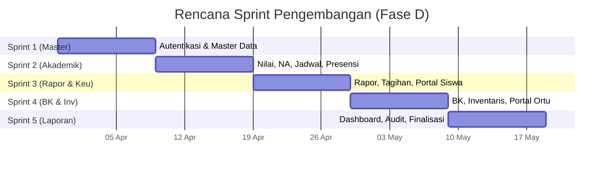

# 09 — Product Backlog
### Proyek: Sistem Informasi Sekolah SMP Islam Terpadu

## 1. Pendahuluan

Product Backlog ini disusun mengikuti pendekatan Agile (Scrum) dengan prioritas **MoSCoW** dan estimasi **Story Point (SP)** menggunakan deret Fibonacci. Setiap item (Epic/Story) dipetakan ke use case (Dokumen 08) dan modul SISFOKOL.

## 2. Legenda Prioritas

| Kode | Prioritas | Arti |
|------|-----------|------|
| H | High (Must) | Wajib untuk go-live |
| M | Medium (Should) | Penting, idealnya hadir saat go-live |
| L | Low (Could/Won't) | Nice-to-have / Fase 2 |

## 3. Tabel Product Backlog

| ID | Epic | User Story / Backlog Item | Modul SISFOKOL | UC | Prioritas | SP | Sprint |
|----|------|---------------------------|----------------|----|-----------|----|--------|
| PB-01 | Autentikasi | Login/logout multi-peran + sesi 3600 dtk | `login.php` | UC-01 | H | 3 | 1 |
| PB-02 | Autentikasi | Ganti password self-service | `*/h` | UC-17 | H | 2 | 1 |
| PB-03 | Master Data | CRUD + impor/ekspor data siswa | `adm/m` | UC-02 | H | 8 | 1 |
| PB-04 | Master Data | CRUD data pegawai & jabatan | `adm/m` | UC-02 | H | 5 | 1 |
| PB-05 | Master Data | CRUD kelas, tapel, mapel, KKM | `adm/m` | UC-02 | H | 5 | 1 |
| PB-06 | Master Data | Penugasan walikelas & petugas piket | `adm/m`,`adm/ph` | UC-02 | H | 3 | 2 |
| PB-07 | Akademik | Input nilai formatif & sumatif (Kurmer) | `admgr/kurmer` | UC-03 | H | 8 | 2 |
| PB-08 | Akademik | Hitung NA & predikat otomatis | `admwk/kurmer` | UC-04 | H | 5 | 2 |
| PB-09 | Akademik | Cetak rapor + ekspor PDF | `admwk/nil` | UC-05 | H | 8 | 3 |
| PB-10 | Akademik | Approval rapor oleh Kepsek | `admks/nil` | UC-15 | M | 3 | 3 |
| PB-11 | Akademik | Pengaturan jadwal pelajaran | `adm/jw` | UC-02 | H | 5 | 2 |
| PB-12 | Akademik | Jurnal mengajar guru | `admgr/pm` | UC-19 | L | 3 | 4 |
| PB-13 | Akademik | Filebox RPP/Silabus + approval | `admgr`,`admks/im` | UC-16 | M | 5 | 4 |
| PB-14 | Kesiswaan | Presensi siswa QR Code | `adm/ab`,`admpiket/ab` | UC-06 | H | 8 | 2 |
| PB-15 | Kesiswaan | Presensi pegawai hadir/pulang | `admpiket/ab` | UC-06 | H | 5 | 2 |
| PB-16 | Kesiswaan | Rekap absensi harian/bulanan | `adm/ab` | UC-07 | H | 5 | 3 |
| PB-17 | Kesiswaan | Catatan kejadian & ijin guru | `admpiket`,`user_ijin` | UC-12 | M | 3 | 3 |
| PB-18 | BK | Entri poin & jenis pelanggaran | `admbk/pl` | UC-12 | M | 5 | 3 |
| PB-19 | BK | Entri prestasi & pembinaan | `admbk/ps` | UC-12 | M | 3 | 3 |
| PB-20 | Keuangan | Buat tagihan siswa per item | `admbdh/keu` | UC-08 | H | 5 | 3 |
| PB-21 | Keuangan | Input pembayaran + cetak kuitansi | `admbdh/keu` | UC-09 | H | 5 | 3 |
| PB-22 | Keuangan | Rekap tunggakan real-time | `siswa_bayar*` | UC-10 | H | 5 | 3 |
| PB-23 | Keuangan | Notifikasi WA tagihan | `wa_tagihan_siswa` | UC-11 | M | 5 | 4 |
| PB-24 | Keuangan | Tabungan siswa (setor/tarik) | `admbdh/nabung` | UC-20 | L | 5 | 4 |
| PB-25 | Inventaris | CRUD KIB A–F + impor/ekspor | `adminv/inv` | UC-13 | M | 8 | 4 |
| PB-26 | Inventaris | Cetak kartu siswa/pegawai (QR) | `adm/m` | UC-13 | L | 3 | 5 |
| PB-27 | Siswa | Portal siswa (nilai/jadwal/tagihan) | `admsw` | UC-14 | H | 8 | 3 |
| PB-28 | Ortu | Portal orang tua (pantau anak) | `passwordx_ortu` | UC-14 | H | 5 | 4 |
| PB-29 | Laporan | Dashboard rekap sekolah | `admks` | UC-18 | H | 8 | 5 |
| PB-30 | Sistem | Konfigurasi profil & tampilan | `adm/s`,`inc/config.php` | UC-02 | M | 3 | 1 |
| PB-31 | Keamanan | Audit log login & entri | `user_log_*` | – | M | 5 | 5 |
| PB-32 | Sistem | Adaptasi identitas Islam (label/tema) | *custom* | – | M | 5 | 1 |

## 4. Rencana Sprint (Periode Pengembangan 7 Minggu)

## 5. Definisi Selesai (Definition of Done)

Backlog item dianggap selesai bila:
1. Kode sesuai standar (PSR, komentar).
2. Lulus unit test & *smoke test* terkait.
3. Ditinjau (code review) oleh Lead Developer.
4. Memenuhi kriteria penerimaan use case.
5. Didokumentasikan (manual/changelog).

## 6. Penutup

Backlog ini bersifat hidup (*living document*) dan dapat diprioritas ulang setiap Sprint Planning. Total estimasi awal **±143 SP** dipecah ke 5 sprint selama Fase Pengembangan.
