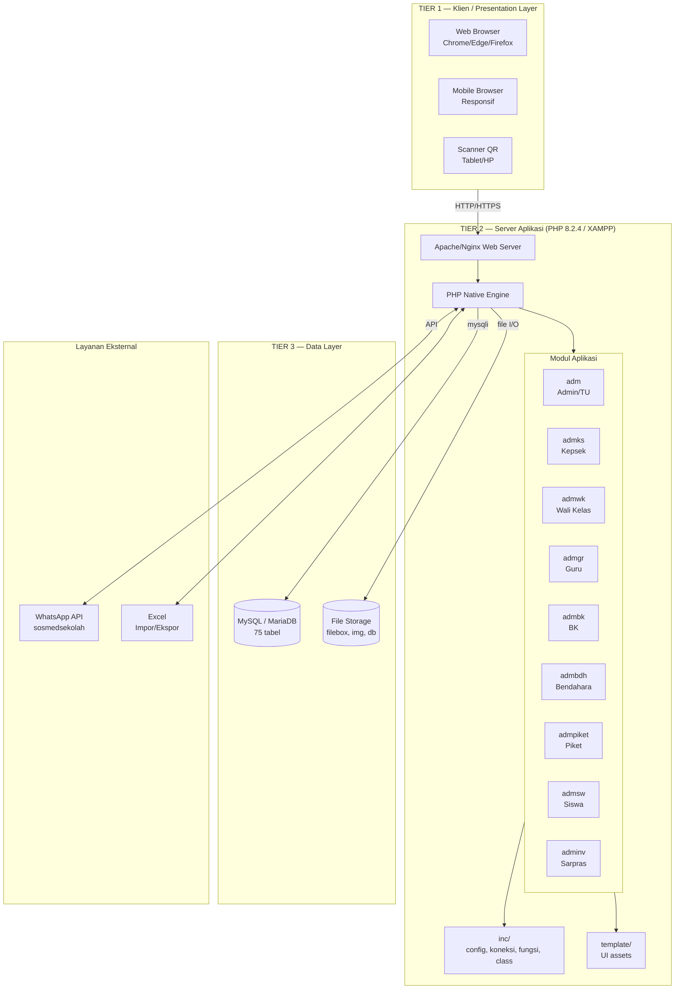
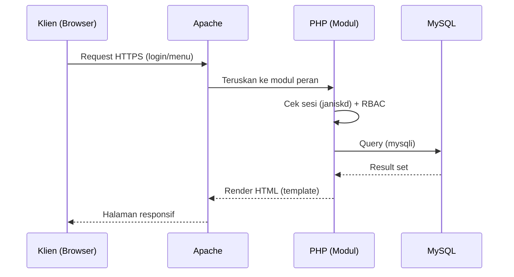
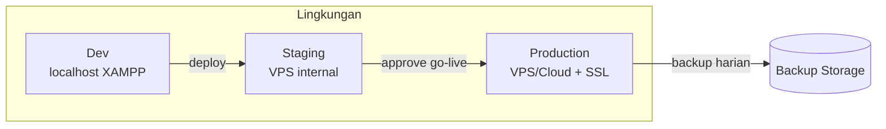

# 11 — Arsitektur Sistem
### Proyek: Sistem Informasi Sekolah SMP Islam Terpadu

## 1. Pendahuluan

Dokumen ini menjelaskan arsitektur sistem yang diimplementasikan dari basis SISFOKOL v7.00. Sistem menggunakan arsitektur **Client-Server 3-Tier** dengan aplikasi web monolitik PHP Native yang berjalan di atas server XAMPP/LAMP.

## 2. Pola Arsitektur

- **3-Tier Architecture**: Presentasi (Browser) → Logika Aplikasi (PHP) → Data (MySQL).
- **Monolitik modular**: Satu basis kode, tetapi terpisah per modul peran (`adm`, `admks`, `admwk`, `admgr`, `admbk`, `admbdh`, `admpiket`, `admsw`, `adminv`).
- **Shared library**: Komponen umum (koneksi, konfigurasi, fungsi, template) berada di folder `inc/` dan `template/`.
- **Deployment**: On-premise (XAMPP) atau VPS/Cloud (LAMP).

## 3. Diagram Arsitektur Sistem (3-Tier)

## 4. Deskripsi Komponen

| Komponen | Teknologi | Fungsi |
|----------|-----------|--------|
| Klien | Browser web/mobile, scanner QR | Antarmuka pengguna & input |
| Web Server | Apache (XAMPP) / Nginx | Melayani permintaan HTTP/HTTPS |
| Application Server | PHP 8.2.4 (native) | Logika bisnis, modul per peran |
| Library Bersama | `inc/` (config, koneksi, fungsi) | Konektivitas DB, fungsi umum |
| Template/UI | `template/` (CSS/JS) | Tampilan & aset antarmuka |
| Database | MySQL/MariaDB | Penyimpanan 75 tabel |
| File Storage | `filebox/`, `img/`, `db/` | RPP, foto, QR, backup SQL |
| WhatsApp API | sosmedsekolah (opsional) | Notifikasi tagihan |
| Ekspor/Impor | Excel (.xls) | Migrasi & laporan |

## 5. Alur Permintaan (Request Flow)

## 6. Arsitektur Deployment

## 7. Teknologi yang Digunakan (Ringkas)

| Lapisan | Teknologi | Versi |
|---------|-----------|-------|
| Bahasa | PHP (Native) | 8.2.4 |
| Database | MySQL / MariaDB | 5.7+ / 10.x |
| Web Server | Apache (XAMPP) | 2.4 |
| Frontend | HTML5, CSS3, JavaScript, jQuery | — |
| Template | Template bawaan SISFOKOL | v7 |
| Integrasi | WhatsApp API (sosmedsekolah) | opsional |
| Versioning | Git / GitLab | — |

> Detail lengkap teknologi ada di **Dokumen 17 — Spesifikasi Teknologi**.

## 8. Pertimbangan Arsitektural (Non-Fungsional)

- **Skalabilitas**: stateless PHP, mudah vertikal-scaling; dapat dipindah ke VPS lebih besar.
- **Keamanan**: HTTPS, RBAC per modul, hash password, prepared statement.
- **Ketersediaan**: backup harian + prosedur restore (lihat Dokumen 28).
- **Pemeliharaan**: kode terstruktur per modul & library bersama memudahkan pemeliharaan.

## 9. Penutup

Arsitektur 3-tier monolitik-modular dipilih karena sesuai platform SISFOKOL, ringan, murah, dan mudah dirawat oleh SDM IT sekolah. Sistem dapat dikembangkan ke arah layanan terpisah (microservices) jika beban tumbuh signifikan di masa depan.
