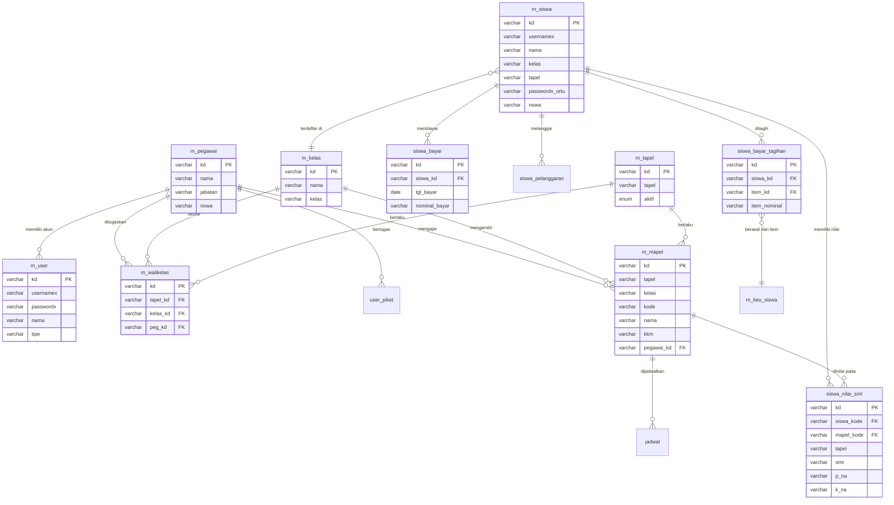

# 12 — Desain Database (ERD)
### Proyek: Sistem Informasi Sekolah SMP Islam Terpadu

## 1. Pendahuluan

Dokumen ini menyajikan **Entity Relationship Diagram (ERD)** sistem berdasarkan basis data `sisfokol_v7.sql` (75 tabel). Karena SISFOKOL memakai engine **MyISAM** yang tidak menegakkan *foreign key* secara fisik, relasi ditandai secara **logis** melalui kolom penunjuk (mis. `siswa_kd`, `pegawai_kd`, `tapel_kd`, `kelas_kd`). Untuk keterbacaan, ERD ini memetakan 20+ entitas inti (memenuhi syarat minimal 10 tabel).

## 2. Daftar Entitas Inti (≥10 Tabel)

| No | Entitas | Tabel SISFOKOL | Keterangan |
|----|---------|----------------|------------|
| 1 | Pengguna (pegawai/akun) | `m_user`, `adminx` | Akun login & profil |
| 2 | Pegawai/Guru | `m_pegawai` | Data tenaga pendidik & kependidikan |
| 3 | Siswa | `m_siswa` | Data peserta didik |
| 4 | Kelas | `m_kelas` | Master kelas |
| 5 | Tahun Pelajaran | `m_tapel` | Master tapel |
| 6 | Mata Pelajaran | `m_mapel` | Master mapel + KKM |
| 7 | Wali Kelas | `m_walikelas` | Penugasan wali kelas |
| 8 | Petugas Piket | `user_piket` | Penugasan piket |
| 9 | Jadwal | `jadwal` | Jadwal pelajaran |
| 10 | Nilai Semester | `siswa_nilai_smt` | Nilai Kurmer per mapel |
| 11 | Asesmen Formatif/Sumatif | `kurmer_nilai_*` | Detail nilai Kurmer |
| 12 | Rapor Kenaikan | `siswa_raport_kenaikan` | Status naik/tidak |
| 13 | Rapor Sikap/Catatan | `siswa_raport_sikap` | Sikap & catatan |
| 14 | Presensi Siswa | `siswa_mapel_absensi` | Absensi per mapel |
| 15 | Presensi Pegawai | `user_presensi` | Hadir/pulang pegawai |
| 16 | Tagihan Siswa | `siswa_bayar_tagihan` | Item tagihan |
| 17 | Pembayaran | `siswa_bayar` | Transaksi pembayaran |
| 18 | Item Keuangan | `m_keu_siswa` | Master item tagihan |
| 19 | Tabungan Siswa | `siswa_bayar_rincian` | Mutasi tabungan |
| 20 | Pelanggaran BK | `siswa_pelanggaran`, `m_bk_point` | Poin & pelanggaran |
| 21 | Prestasi | `siswa_prestasi` | Prestasi siswa |
| 22 | Inventaris | `inv_kib_a..f`, `m_kib_*` | Aset sarana prasarana |

## 3. ERD (Entity Relationship Diagram)

## 4. Kardinalitas Relasi (Penjelasan)

| Entitas A | Relasi | Entitas B | Kardinalitas | Keterangan |
|-----------|--------|-----------|--------------|------------|
| m_pegawai | memiliki | m_user | 1 : N | Satu pegawai bisa beberapa akun |
| m_pegawai | ditugaskan | m_walikelas | 1 : N | Pegawai wali beberapa kelas/tapel |
| m_pegawai | mengajar | m_mapel | 1 : N | Satu guru banyak mapel |
| m_siswa | terdaftar | m_kelas | N : 1 | Banyak siswa satu kelas |
| m_siswa | memiliki | siswa_nilai_smt | 1 : N | Satu siswa banyak nilai mapel |
| m_mapel | dinilai pada | siswa_nilai_smt | 1 : N | Satu mapel banyak record nilai |
| m_siswa | ditagih | siswa_bayar_tagihan | 1 : N | Satu siswa banyak item tagihan |
| m_keu_siswa | item dari | siswa_bayar_tagihan | 1 : N | Satu item banyak tagihan siswa |
| m_siswa | membayar | siswa_bayar | 1 : N | Satu siswa banyak transaksi |
| m_kelas | dibina | m_walikelas | 1 : N | Satu kelas bisa beberapa tapel |
| m_siswa | melanggar | siswa_pelanggaran | 1 : N | Satu siswa banyak pelanggaran |
| m_mapel | dijadwalkan | jadwal | 1 : N | Satu mapel banyak slot jadwal |

## 5. Konvensi Penamaan & Tipe Data

| Pola | Contoh | Arti |
|------|--------|------|
| `m_*` | `m_siswa`, `m_mapel` | Master data |
| `siswa_*` | `siswa_nilai_smt` | Data transaksi terkait siswa |
| `user_*` | `user_presensi`, `user_log_*` | Data terkait pegawai/akun |
| `kurmer_*` | `kurmer_nilai_*` | Spesifik Kurikulum Merdeka |
| `inv_kib_*` | `inv_kib_a` | Inventaris per Kategori Inventaris Barang |
| `*_kd` | `siswa_kd`, `peg_kd` | Kolom kunci relasi (foreign key logis) |
| `postdate` | — | Timestamp entri data |

## 6. Aturan Integritas Data (Logis)

1. **Referential integrity**: penghapusan master siswa harus memperbarui/mencegah data transaksi (`siswa_nilai_*`, `siswa_bayar*`) — dikelola via modul admin.
2. **Uniqueness**: `m_siswa.kd` (NIS), `m_user.usernamex` harus unik.
3. **Tapel aktif**: hanya satu `m_tapel.aktif='true'` pada satu waktu.
4. **Validasi numerik**: kolom nominal/nilai bertipe `varchar` → aplikasi wajib memvalidasi angka sebelum simpan.

## 7. Catatan Migrasi (Rekomendasi)

- Pertimbangkan migrasi engine ke **InnoDB** untuk dukungan FK fisik & transaksi (ACID).
- Normalisasi kolom redundan (mis. `siswa_nama` di tabel transaksi) bila ingin normalisasi penuh — namun pertahankan pola saat ini bila performa baca lebih diutamakan.
- Tambahkan **index** pada kolom relasi (`siswa_kd`, `mapel_kode`, `tapel`) untuk percepatan query.

## 8. Penutup

ERD ini menunjukkan struktur data terintegrasi yang menghubungkan akademik, kesiswaan, keuangan, BK, dan inventaris dalam satu basis data. Detail tiap kolom tersedia pada **Dokumen 13 — Data Dictionary**.
